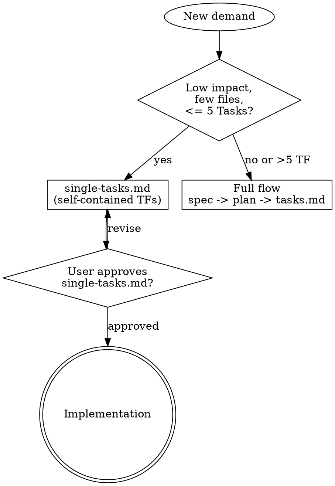
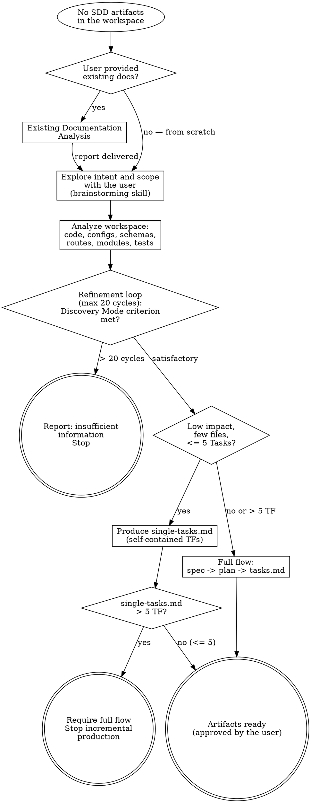
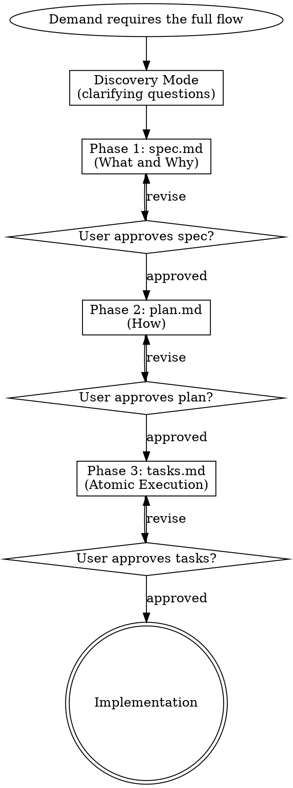
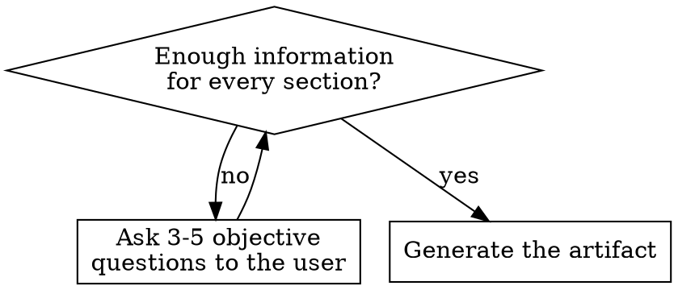

# Spec-Driven Development (SDD)

## Directive

**Do not write a single line of production code before intent, architecture and execution are specified and approved by the user.** The specification is the contract and the code implements it — if they diverge, record it as documentation debt and fix the artifact.

In the **incremental flow** (`single-tasks.md`), the approved file itself is the contract: each **Task** (TF) carries the specification it needs (no separate `spec.md` / `plan.md`).

> Foundations and non-negotiable principles: [philosophy.md](philosophy.md).

## Language

Write the produced artifacts (`spec.md`, `plan.md`, `tasks.md`, `single-tasks.md`) and reports in the language of the project's existing documentation. If the project has no documentation to infer it from, ask the user before writing the first artifact. Keep established technical terms in English (endpoint, deploy, commit, branch, cache, middleware, DTO, pipeline, sprint, backlog) without italics or quotes.

## Referenced Skills

| Skill | When to invoke |
|---|---|
| /scrapup:communication | Register and form of every artifact — specs, plans and task descriptions |
| /scrapup:brainstorming | Artifact production without prior SDD (explore intent and scope with the user) |
| /scrapup:expert-plantuml | C4 and Sequence diagrams in Phase 2 (`plan.md`) and Phase 3 (`tasks.md`) |

## References

| Topic | Reference | Load when |
|---|---|---|
| Existing documentation analysis | [references/document-analysis.md](references/document-analysis.md) | The user provides pre-existing docs (PRDs, PM specs, loose requirements, Notion exports, spreadsheets) or asks for a diagnosis/review of them |
| Per-phase checklists | [references/checklists.md](references/checklists.md) | Starting any phase — create the todos from it |
| Engineering philosophy | [philosophy.md](philosophy.md) | Designing architecture (Phase 2) or checking a proposal against the Ironclad principles |
| Flow diagram | [blueprint-flow.puml](blueprint-flow.puml) | Explaining the end-to-end flow to the user |

## When to Use

**Full flow (spec + plan + tasks.md):**
- New feature with relevant impact
- Domain refactoring or architecture migration
- Integration with external or legacy systems
- New queue consumers/workers
- Any change that broadly affects API contracts (business impact: REST or messaging) — the concrete contract specification (OpenAPI/AsyncAPI) lives in Phase 2
- Any demand that needs **more than 5 Tasks** in the backlog

**Incremental flow (`single-tasks.md` only):**
- **Low-impact** code changes: add a test, change a constant, localized adjustments in **few snippets** and a **restricted number of files**
- When neither `spec.md` nor `plan.md` is needed — everything fits in the TF descriptions (same format as `tasks.md`)

**Cut rule (non-negotiable):** if the demand needs **more than 5 Tasks** (`#### TF-`), do **not** use `single-tasks.md`. Use the **full flow** with `spec.md`, `plan.md` and `tasks.md`.

**Do not use for:** trivial hotfixes without a record, pure typo fixes, untracked configuration tweaks — when not even the incremental flow makes sense, treat it as operational work outside SDD (team's call).

## Choosing the Flow



## Existing Documentation Analysis

Entry point when the user provides pre-existing documentation and wants a diagnosis before SDD artifacts are generated. This step is **diagnosis only** — it never produces SDD artifacts. Follow [references/document-analysis.md](references/document-analysis.md): inventory → classification per SDD phase → critical analysis (consistency, Ironclad, gaps) → report → questions → recommended next steps.

## Artifact Production (no prior SDD)

Entry point when there are **no SDD artifacts** in the workspace (`tasks.md`, `single-tasks.md`, `spec.md`, `plan.md`) and documentation must be produced from scratch. /scrapup:forge delegates here when it finds no artifacts.

**Responsibility:** this skill is the only producer of SDD artifacts. Consuming skills (such as /scrapup:forge) delegate here and wait for artifacts approved by the user.



### Steps

0. **Docs analysis (if provided):** run **Existing Documentation Analysis**. Its report feeds brainstorming — do not repeat questions the diagnosis already answered.
1. **Brainstorming:** explore intent and scope via /scrapup:brainstorming. When step 0 produced a report, pass its coverage and gaps as input.
2. **Workspace analysis:** existing code, configs, schemas, routes, modules, tests — to understand what exists and avoid duplication.
3. **Refinement loop** (max 20 cycles):
   - On doubts or inconsistencies: ask the user
   - Receive the answer and re-evaluate
   - Increment the cycle
   - **Exit criterion (observable):** planning is "satisfactory" when the **Discovery Mode** criterion is met — every section of the target artifact's template has enough information and no blocking placeholders remain (`[INSERT_VALUE]` in a business rule, value, range or critical limit). Only then move to triage.
4. After **20 cycles** without meeting the exit criterion: tell the user the information is insufficient and **stop**.
5. **Impact triage** (criteria from **When to Use**):
   - Low impact and <= 5 TF: produce `single-tasks.md` (incremental flow)
   - High impact or > 5 TF: start the full flow (Phase 1 → 2 → 3)
6. **Incremental flow:**
   - If `single-tasks.md` already exists: **add** the new TF with sequential `YY` inside the existing US; for a **new** US, ask for the first User Story ID (see **User Story Identifiers**)
   - Otherwise: **create** `single-tasks.md` (US + TF templates; specification inside the TFs; no `spec.md`/`plan.md` required). Ask for the first User Story ID before writing the first new User Story
7. **Limit gate:** after creating/updating `single-tasks.md`, count the `#### TF-` blocks. If **> 5**: tell the user, require the full flow and **stop** incremental production (do not proceed to implementation).
8. **Full flow:** follow Phases 1 → 2 → 3 below, each with user approval. In Phase 3, ask for the first User Story ID before writing `tasks.md`.

**Discovery Mode** (below) applies inside every production step — check for sufficient information before generating each artifact.

## Full Flow — 3 Phases



**In the full flow, every phase requires explicit user approval before moving on.**

## Artifact Layout

**Full flow** — typical folder `/docs/specs/<feature-name>/`:

```
docs/specs/<feature-name>/
  spec.md      # Phase 1 — Functional Specification
  plan.md      # Phase 2 — Technical Plan
  tasks.md     # Phase 3 — Atomic Execution Backlog
```

**Incremental flow** — may coexist with an already specified feature or live as a standalone increment:

```
docs/specs/<context>/single-tasks.md   # the only required file in this flow
```

**`tasks.md` vs `single-tasks.md`:**

| Artifact | Prerequisites | Content |
|---|---|---|
| **`tasks.md`** | `spec.md` and `plan.md` approved | User Stories + Tasks; per-US diagrams proportional to scope (see **Full backlog**); DoD and Execution Guidance. |
| **`single-tasks.md`** | **No** `spec.md` / `plan.md` required | Same markup **format** as `tasks.md` (`## US-XX`, `#### TF-XX-YY`, US/TF templates). **All** the specification lives in the **Tasks** (plus brief context in the US). **Max 5 Tasks** per file; beyond that, migrate to the full flow. PlantUML diagrams **optional** (only if they remove ambiguity). |

## Phase 1 — Functional Specification (`spec.md`)

Answers **"What"** and **"Why"**. Business intent only, no infrastructure or technology detail.

Required content:
- Overview and goal (problem, solution, value)
- User journeys (step-by-step narrative flow)
- Business rules and constraints
- Edge cases and exception flows (Zero Trust)
- Success criteria and SLAs

**FORBIDDEN in this phase:** mentioning databases, languages, frameworks or libraries. Technology belongs to Phase 2.

For the full template, read [templates/spec-template.md](templates/spec-template.md).

## Phase 2 — Technical Plan (`plan.md`)

Answers **"How"**. Translates `spec.md` into real architecture.

Required content:
- Architecture overview and main decision
- Solution diagrams in PlantUML (via /scrapup:expert-plantuml):
  - **C4 Level 2 (Containers)** — system containers, external integrations and infrastructure
  - **C4 Level 3 (Components)** — internal components of the main container
  - **Sequence Diagram** — success and failure paths, including database and messaging calls
  - **Envelope/Traceability Diagram** (when there is a queue/messaging) — message format on the queue, logs emitted at each step, wide events/spans, and how to trace the flow in the project's observability stack
- Data modeling and persistence (schemas, indexes)
- Integration contracts (OpenAPI for REST, AsyncAPI for queues)
- Resilience, security and error handling
- Rationale and trade-offs

**Prerequisite:** approved `spec.md`. If volume, bottlenecks or SLAs are missing, ask before choosing a synchronous vs asynchronous approach.

For the full template, read [templates/plan-template.md](templates/plan-template.md).

## Phase 3 — Atomic Execution

### Backlog Hierarchy (Scrum)

| Level | Owner | Description |
|---|---|---|
| **Epic** | Product management | Macro context received by the engineering team. The engineering team **does not create** epics. |
| **User Story** | Engineering team (refinement) | Value deliverable to the product, registered during technical refinement. Groups related Tasks. |
| **Task** | Engineering team (breakdown) | Atomic unit of work — holds every detail needed for the developer to execute and validate it. |

---

### User Story Identifiers

The first User Story ID (`US-XX`) is **provided by the user**. Before writing the first new User Story of a `tasks.md` or `single-tasks.md`, **ask the user for the first User Story ID** and wait for the answer. The remaining new User Stories of the same run follow **sequentially** from it (`N`, `N+1`, `N+2`...).

**ID format from the provided number:**

| Number | Final ID | Rule |
|---|---|---|
| 1 to 9 | `US-01` ... `US-09` | Zero-padded (minimum 2 digits) |
| 10 to 99 | `US-10` ... `US-99` | No extra padding |
| >= 100 | `US-100`, `US-1234` | No extra padding, the ID grows naturally |

**Tasks (`TF-XX-YY`):** the Task's `XX` **inherits exactly** the parent User Story ID. `YY` is **locally sequential** inside the User Story (`01`, `02`, `03`...), restarting for each US.

**Example in a backlog file (`tasks.md` or `single-tasks.md`):**

```
User provides first User Story ID = 79
  US-79 (TF-79-01, TF-79-02)
  US-80 (TF-80-01)
  US-81 (TF-81-01, TF-81-02, TF-81-03)
```

**Operational rules:**

- **FORBIDDEN** to choose or infer the first User Story ID — always ask the user before writing the first new US.
- With **N** new User Stories in `tasks.md` or `single-tasks.md`, ask **once** (the first ID) and derive the **N** IDs sequentially. Write the IDs down before drafting, so they do not get mixed up.
- In `single-tasks.md`, even with a **single** US, the ID **also** comes from the user (do not default to `US-01`).
- Applies to both flows: full (`tasks.md`) and incremental (`single-tasks.md`).
- **Exception:** when **reviewing** a pre-existing artifact (US already recorded in the file), **keep** the assigned IDs — ask only for **new** User Stories.

---

### Full backlog — `tasks.md`

The **step-by-step** for implementation after `plan.md` is approved. Slices the plan into User Stories (value deliverables) made of atomic Tasks.

**Prerequisite:** `spec.md` and `plan.md` approved.

**Required content (`tasks.md`):**
- Topological sequencing (schemas/DB -> connectors/consumers -> use cases -> controllers)
- User Stories grouping Tasks in the standard format
- **Per-User-Story diagrams, proportional to scope** — each US includes the relevant `plan.md` diagrams, adapted to the story's scope:
  - **C4 Level 2 + Sequence (success + failure) are required** when the US involves **more than one container**, a **non-trivial failure flow** (retry, DLQ, compensation, rollback) or **messaging** (queue publish/consume)
  - A **single-flow US** (one container, no messaging, trivial failure) needs only a **Sequence Diagram**; C4 L2 is optional
  - Additional diagrams as the context requires (messaging envelope, traceability, etc.)
  - Generate them with /scrapup:expert-plantuml
- Definition of Done per Task
- Execution Guidance per Task (section 4 of the Task template)

**Atomicity rule:** each Task must be implementable and testable in isolation. Never mix different domains in the same Task.

---

### Incremental — `single-tasks.md`

An artifact **without** `spec.md` and **without** `plan.md`, for **low-impact** changes (e.g., a new test, a constant tweak, changes in few files and few snippets). It follows the **same structure** as `tasks.md` (`## US-XX`, `#### TF-XX-YY` headers, Task template fields), but **all** the specification needed to implement and validate lives **inside each TF** (context, touched files, acceptance criteria, DoD, local risks).

**Limit:** **at most 5 Tasks** (`#### TF-`) per file. From the **6th** Task on (or if the demand grows), **stop** and redirect to the **full flow** (`spec.md` + `plan.md` + `tasks.md`).

**Not incremental:** broad new API contracts, new queue consumers/publishers, multi-service data model changes, domain refactors — use the full flow.

**Diagrams:** **optional**; include PlantUML only when it reduces ambiguity.

For the template and criteria, read [templates/tasks-template.md](templates/tasks-template.md).
For the User Story format, read [templates/user-story-template.md](templates/user-story-template.md).
For the Task format (incl. self-contained TF), read [templates/task-template.md](templates/task-template.md).

---

## Discovery Mode

Before generating any artifact, check that you have enough information. If critical data is missing:

1. List 3 to 5 direct, objective questions
2. Prioritize questions about edge cases, business rules, SLAs, volume
3. Generate the artifact **only** once the context is adequate



**Never assume critical business rules** (values, ranges, limits) without user confirmation. Use explicit placeholders such as `[INSERT_VALUE]` when needed.

## Negative Constraints (Summary)

The most critical constraints — full list in [philosophy.md](philosophy.md):

- FORBIDDEN to start production code **in the full flow** without approved `spec.md` and `plan.md`. **Exception:** incremental flow with an approved **`single-tasks.md`**, **up to 5 Tasks**, within the low-impact criteria (see **Incremental — `single-tasks.md`**)
- FORBIDDEN to skip phases **in the full flow** — each phase is completed and approved in order. The incremental flow does **not** replace spec/plan when the demand exceeds 5 TFs or the impact is not local
- FORBIDDEN to use `single-tasks.md` with **more than 5 Tasks** — redistribute into `spec.md` + `plan.md` + `tasks.md`
- FORBIDDEN to choose or infer the first User Story ID (`US-XX`) — always ask the user (see **User Story Identifiers**)
- FORBIDDEN to use `any` in TypeScript — use strict typing or `unknown` with type guards
- FORBIDDEN to generate code without DTO validation in the Controller or Consumer layer
- NEVER assume infrastructure (Redis, RabbitMQ, database) is immune to outages
- NEVER write generic specifications — use real names when the context provides them

## Engineering Philosophy

Apply the **Ironclad Philosophy** ([philosophy.md](philosophy.md)) to every artifact:
1. **Pragmatic Trade-off** — solidity and sustainability over fragile elegance
2. **Zero Trust** — validate everything at the edge, fail fast on dirty data
3. **Resilience by Default** — systems will fail, design for it
4. **Decoupled Architecture** — event-driven first, CQRS/ODS for low latency

## Default Stack

| Layer | Technology |
|---|---|
| Runtime | Node.js (strict TypeScript) |
| Frameworks | NestJS or Fastify (per project) |
| Messaging | RabbitMQ |
| Main database | MongoDB (Mongoose) or MySQL (Prisma/Sequelize) |
| Cache | Redis |
| Validation | Zod (Fastify) or class-validator (NestJS) |
| Logger | The project's structured logger |
| Observability | OpenTelemetry |
