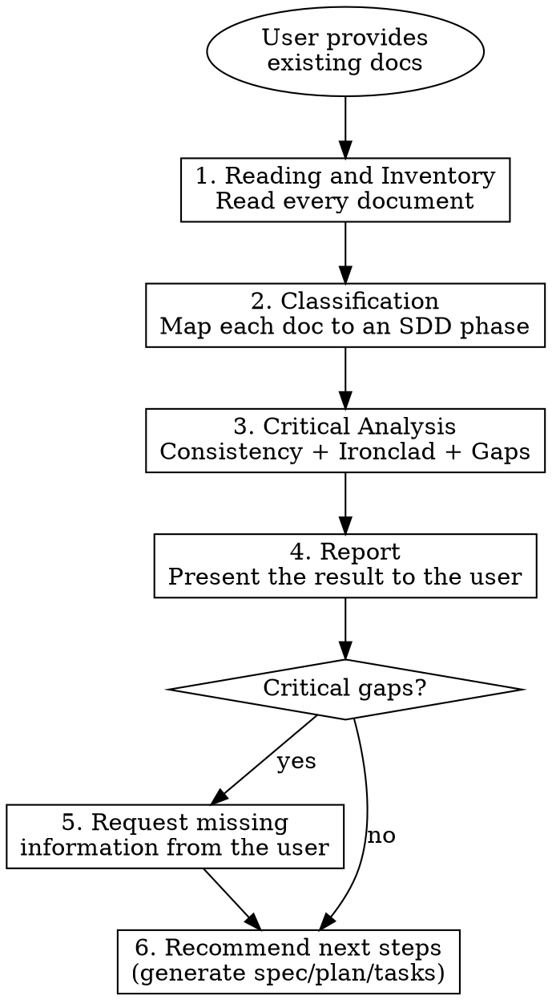

# Existing Documentation Analysis

Entry point when the user provides pre-existing documentation (PRDs, PM specs, loose requirements, Notion exports, spreadsheets — any format) and wants a diagnosis before SDD artifacts are generated.

**Trigger:** the user provides documents with keywords such as "SDD analysis", "review spec", "analyze documentation", "review feature", "assess requirements", or simply points to a folder/files with documentation.

**Constraint:** this step is diagnosis only — it never produces SDD artifacts. Production happens in the next steps (Artifact Production or the full flow).



## 1. Reading and Inventory

Read **every** file in the given folder. For each file:

- Identify the type (markdown, text, JSON, YAML, etc.)
- Extract the main content
- Record the file name and path

Inventory format:

| File | Type | Main Content |
|---|---|---|
| `requirements.md` | Markdown | Functional description of the feature |
| `api-contract.json` | JSON | Partial OpenAPI contract |
| `flow.md` | Markdown | User journey |

## 2. Classification (Mapping to SDD)

For each document, classify which SDD phase it feeds:

| Content found | SDD Phase | Coverage |
|---|---|---|
| Problem, solution, business value | Phase 1 (spec.md) | Partial/Complete |
| User journeys | Phase 1 (spec.md) | Partial/Complete |
| Business rules | Phase 1 (spec.md) | Partial/Complete |
| Architecture diagrams | Phase 2 (plan.md) | Partial/Complete |
| Database schemas | Phase 2 (plan.md) | Partial/Complete |
| API contract impact (business: which consumers/operations are affected, no schema) | Phase 1 (spec.md) | Partial/Complete |
| API contract specification (OpenAPI/REST, AsyncAPI/queue — concrete schema) | Phase 2 (plan.md) | Partial/Complete |
| Task/story list | Phase 3 (tasks.md) | Partial/Complete |

If a document fits no phase, classify it as **additional context**.

## 3. Critical Analysis

Run 3 levels of analysis:

### 3.1 Internal Consistency

Check that the documents **do not contradict** each other:

- Conflicting business rules
- Flows that diverge between documents
- Names/terms used inconsistently (glossary)
- Diverging numbers (SLAs, limits, volumes)

### 3.2 Ironclad Validation

For each principle of the Ironclad Philosophy ([philosophy.md](../philosophy.md)), check whether the documentation **violates or ignores** it:

| Principle | What to check |
|---|---|
| **Pragmatic Trade-off** | Is the proposed solution maintainable by a mid-level developer? Is there over-engineering? |
| **Zero Trust** | Are exception flows mapped? Is external data validated? |
| **Resilience by Default** | Is there a plan for dependency failure? Are timeout, retry and DLQ covered? |
| **Decoupled Architecture** | Is there synchronous communication between services that should be asynchronous? |

### 3.3 Gap Detection

Check whether **critical information is missing** for each SDD phase:

**For spec.md (Phase 1):**
- Is the business problem clear?
- Are actors/personas identified?
- Are user journeys complete?
- Are business rules listed with concrete limits?
- Are edge cases mapped?
- Are SLAs and volume defined?
- Is there a glossary of domain terms?

**For plan.md (Phase 2):**
- Are the affected repositories identified?
- Are schemas/models detailed?
- Is the concrete API contract specification (OpenAPI for REST, AsyncAPI for queues) defined? (the business impact of the contract belongs to Phase 1)
- Is the resilience strategy mapped?
- Is observability (metrics, logs, traces) planned?

**For tasks.md (Phase 3):**
- Do User Stories represent demonstrable value deliverables?
- Are Tasks atomic (1 domain per task)?
- Does the sequencing respect dependencies?

## 4. Analysis Report

Present a structured report to the user:

```markdown
# SDD Analysis Report: [Feature Name]

## Document Inventory
[Table from step 1]

## Coverage per SDD Phase

| Phase | Coverage | Source Documents |
|---|---|---|
| Phase 1 (spec.md) | [X]% | [list of docs] |
| Phase 2 (plan.md) | [X]% | [list of docs] |
| Phase 3 (tasks.md) | [X]% | [list of docs] |

## Inconsistencies Found

| # | Type | Description | Affected Documents | Severity |
|---|---|---|---|---|
| 1 | [Conflict/Ambiguity/Divergence] | [description] | [docs] | [Critical/High/Medium] |

## Ironclad Violations

| # | Violated Principle | Description | Recommendation |
|---|---|---|---|
| 1 | [Principle] | [what is wrong] | [how to fix it] |

## Knowledge Gaps

| # | Phase | Missing Information | Impact | Question to the User |
|---|---|---|---|---|
| 1 | [Phase X] | [what is missing] | [blocking/partial] | [direct question] |

## Recommended Next Steps

[Which SDD phase to start and what needs to be done]
```

## 5. Request Information (if there are gaps)

For each **blocking** gap, write a direct, objective question to the user. Group questions by SDD phase. Limit: **5 questions at a time** — if there are more, prioritize the blocking ones and iterate.

## 6. Recommend Next Steps

Based on the identified coverage:

- Phase 1 coverage >= 80%: "Documentation is sufficient to generate `spec.md`. Should I generate it?"
- Phase 1 coverage < 80%: "Critical information for the spec is missing. Answer the questions above before moving on."
- Phase 1 complete and Phase 2 coverage >= 60%: "`plan.md` can be generated after the spec is approved."
- SDD artifacts already exist in the folder: "Existing SDD documents found. I recommend reviewing them before generating new ones."

## Analysis Constraints

- **NEVER** generate SDD artifacts (spec/plan/tasks) during the analysis — diagnosis only
- **NEVER** assume business rules that are not explicit in the documents
- **NEVER** skip inconsistencies for being "minor" — record all of them
- If a document is empty or unreadable, record it in the inventory and proceed
- Write the report in the language defined in the **Language** section of `SKILL.md`
- To assess coverage, use each phase's template as the reference: `templates/spec-template.md`, `templates/plan-template.md`, `templates/tasks-template.md`
