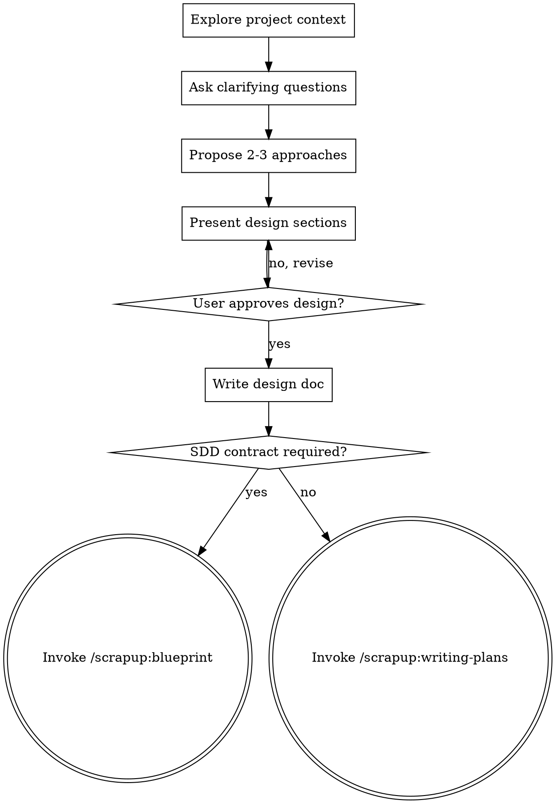

# Brainstorming Ideas Into Designs

## Overview

Help turn ideas into fully formed designs and specs through natural collaborative dialogue.

Start by understanding the current project context, then ask questions one at a time to refine the idea. Once you understand what you're building, present the design and get user approval.

<HARD-GATE>
Do NOT invoke any implementation skill, write any code, scaffold any project, or take any implementation action until you have presented a design and the user has approved it. This applies to EVERY project regardless of perceived simplicity.
</HARD-GATE>

## Anti-Pattern: "This Is Too Simple To Need A Design"

Every project goes through this process. A todo list, a single-function utility, a config change — all of them. "Simple" projects are where unexamined assumptions cause the most wasted work. The design can be short (a few sentences for truly simple projects), but you MUST present it and get approval.

## Checklist

You MUST create a task for each of these items and complete them in order:

1. **Explore project context** — check files, docs, recent commits. When brainstorming over **existing** JS/TS code (brownfield), use /scrapup:expert-lsp as an exploration input: R1 for the real shape of the symbol(s) to change, R2 for the dependents (blast radius). Greenfield/conceptual: skip the LSP (no target symbol).
2. **Ask clarifying questions** — one at a time, understand purpose/constraints/success criteria
3. **Propose 2-3 approaches** — with trade-offs and your recommendation
4. **Present design** — in sections scaled to their complexity, get user approval after each section; the design is "approved" only after the user has explicitly approved the consolidated design (every section approved, no open question) — this approval is the gate before writing the doc
5. **Write design doc** — save to `docs/plans/YYYY-MM-DD-<topic>-design.md` and commit
6. **Transition to implementation** — branch on the work type:
   - When the feature requires an SDD contract (spec/plan/tasks), invoke /scrapup:blueprint
   - For direct work without an SDD contract, invoke /scrapup:writing-plans
   - In either case, invoke NO other implementation skill

## Process Flow

**The terminal state is invoking /scrapup:blueprint (when an SDD contract is required) or /scrapup:writing-plans (for direct work).** Do NOT invoke frontend-design, mcp-builder, or any other implementation skill. After brainstorming, the ONLY skills you invoke are /scrapup:blueprint or /scrapup:writing-plans.

## The Process

**Understanding the idea:**
- Check out the current project state first (files, docs, recent commits)
- Brownfield JS/TS: ground the approaches with /scrapup:expert-lsp (R1 symbol shape, R2 dependents) instead of inferring the structure from shallow reading — the *how* is canonical in expert-lsp; here it is only consumed. It is an optional context input, not a mandatory step; MCP unavailability does not block the brainstorm (it degrades to plain reading)
- Ask questions one at a time to refine the idea
- Prefer multiple choice questions when possible, but open-ended is fine too
- Only one question per message - if a topic needs more exploration, break it into multiple questions
- Focus on understanding: purpose, constraints, success criteria

**Exploring approaches:**
- Propose 2-3 different approaches with trade-offs
- Present options conversationally with your recommendation and reasoning
- Lead with your recommended option and explain why

**Presenting the design:**
- Once you believe you understand what you're building, present the design
- Scale each section to its complexity: a few sentences if straightforward, up to 200-300 words if nuanced
- Ask after each section whether it looks right so far
- Cover: architecture, components, data flow, error handling, testing
- Be ready to go back and clarify if something doesn't make sense

## After the Design

**Documentation:**
- Only write the doc after the consolidated design has been explicitly approved by the user (the gate from checklist item 4)
- Write the validated design to `docs/plans/YYYY-MM-DD-<topic>-design.md`, with at least these sections (scaled to complexity, drop a section only when it is genuinely not applicable):
  - **Context / Problem** — what is being built and why
  - **Approach** — the chosen option and the trade-offs that decided it
  - **Architecture & components** — the moving parts and their responsibilities
  - **Data flow** — how data moves through the components
  - **Error handling** — failure modes and how they are handled
  - **Testing** — how the design is verified
- Write clearly and concisely: short sentences, no filler, one idea per paragraph
- Commit the design document to git

**Implementation:**
- Branch on the work type: invoke /scrapup:blueprint when an SDD contract is required, otherwise /scrapup:writing-plans
- Do NOT invoke any other skill. /scrapup:blueprint or /scrapup:writing-plans is the next step.

## Key Principles

- **One question at a time** - Don't overwhelm with multiple questions
- **Multiple choice preferred** - Easier to answer than open-ended when possible
- **YAGNI ruthlessly** - Remove unnecessary features from all designs
- **Explore alternatives** - Always propose 2-3 approaches before settling
- **Incremental validation** - Present design, get approval before moving on
- **Be flexible** - Go back and clarify when something doesn't make sense
