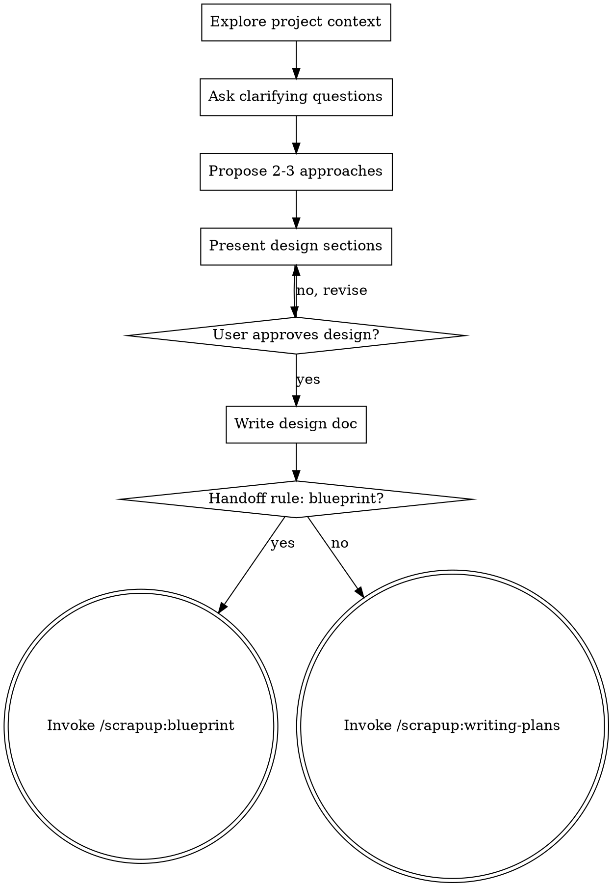

# Brainstorming Ideas Into Designs

Turn an idea into an approved design through collaborative dialogue: understand the project context, ask one question at a time, propose approaches, present the design, and get explicit approval from the user (Architect-Validator) before anything is implemented.

<HARD-GATE>
Do NOT invoke any implementation skill, write any code, scaffold any project, or take any implementation action until you have presented a design and the user has approved it. This applies to EVERY project regardless of perceived simplicity.

- If the user explicitly declines the design step, state the risk in one line, record the decision, and stop — do not implement.
- After 3 rejected revisions of the same section, ask the user which constraint is wrong before revising again.
</HARD-GATE>

## Anti-Pattern: "This Is Too Simple To Need A Design"

Every project goes through this process. A todo list, a single-function utility, a config change — all of them. "Simple" projects are where unexamined assumptions cause the most wasted work. The design can be short (a few sentences for truly simple projects), but you MUST present it and get approval.

## Checklist

Track each item below in the agent's task/todo list tool (or, if none is available, as a copyable `- [ ]` checklist in the conversation) and complete them in order:

1. **Explore project context** — check files, docs, recent commits.
   - If `brief.md` or `docs/specs/` artifacts exist, treat them as fixed input; brainstorm only the open design questions.
   - If the user only has raw scraps and no clear intent, route to /scrapup:inception.
   - Brownfield JS/TS: use /scrapup:expert-lsp as an exploration input — R1 for the real shape of the symbol(s) to change, R2 for the dependents (blast radius). Greenfield/conceptual: skip the LSP (no target symbol).
2. **Ask clarifying questions** — one at a time, understand purpose/constraints/success criteria
3. **Propose 2-3 approaches** — with trade-offs and your recommendation
4. **Present design** — in sections scaled to their complexity, get user approval after each section; the design is "approved" only after the user has explicitly approved the consolidated design (every section approved, no open question) — this approval is the gate before writing the doc
5. **Write design doc** — save to `docs/plans/YYYY-MM-DD-<topic>-design.md` and commit it (see [After the Design](#after-the-design))
6. **Transition to implementation** — apply the [Handoff rule](#handoff-rule)

## Process Flow

```dot
digraph brainstorming {
    "Explore project context" [shape=box];
    "Ask clarifying questions" [shape=box];
    "Propose 2-3 approaches" [shape=box];
    "Present design sections" [shape=box];
    "User approves design?" [shape=diamond];
    "Write design doc" [shape=box];
    "Handoff rule: blueprint?" [shape=diamond];
    "Invoke /scrapup:blueprint" [shape=doublecircle];
    "Invoke /scrapup:writing-plans" [shape=doublecircle];

    "Explore project context" -> "Ask clarifying questions";
    "Ask clarifying questions" -> "Propose 2-3 approaches";
    "Propose 2-3 approaches" -> "Present design sections";
    "Present design sections" -> "User approves design?";
    "User approves design?" -> "Present design sections" [label="no, revise"];
    "User approves design?" -> "Write design doc" [label="yes"];
    "Write design doc" -> "Handoff rule: blueprint?";
    "Handoff rule: blueprint?" -> "Invoke /scrapup:blueprint" [label="yes"];
    "Handoff rule: blueprint?" -> "Invoke /scrapup:writing-plans" [label="no"];
}
```

### Handoff rule

The terminal state is exactly one handoff skill, chosen once:

- **≥5 tasks / high impact, or a versioned spec contract (spec/plan/tasks) is required** → invoke /scrapup:blueprint
- **Otherwise** → invoke /scrapup:writing-plans

Do NOT invoke any other skill — /scrapup:inception (routing in step 1) and /scrapup:expert-lsp (exploration input) are the only exceptions before the handoff.

## The Process

**Understanding the idea:**
- Brownfield JS/TS: ground the approaches with /scrapup:expert-lsp (R1 symbol shape, R2 dependents) instead of inferring the structure from shallow reading — the *how* is canonical in expert-lsp; here it is only consumed. It is an optional context input, not a mandatory step; MCP unavailability does not block the brainstorm (it degrades to plain reading)
- Ask one question per message; if a topic needs more exploration, break it into multiple questions
- Prefer multiple-choice questions; open-ended is fine when the options are unknown
- Focus on understanding: purpose, constraints, success criteria

BAD — several questions, no options:
> How should auth work, where do tokens live, and do we need refresh?

GOOD — one question, concrete options, a recommendation:
> Where should session tokens live? (a) httpOnly cookie — recommended, no JS access; (b) localStorage — simpler, XSS-exposed; (c) in-memory only — lost on reload.

**Exploring approaches:**
- Propose 2-3 different approaches with trade-offs; lead with your recommended option and explain why
- Cite the files/symbols each approach touches; mark unverified assumptions as such
- Apply YAGNI ruthlessly — remove unnecessary features from every approach

**Presenting the design:**
- Scale each section to its complexity: a few sentences if straightforward, up to 200-300 words if nuanced
- Ask after each section whether it looks right so far
- Cover: architecture, components, data flow, error handling, testing
- Go back and clarify when something doesn't make sense

## After the Design

**Documentation:**
- Only write the doc after the consolidated design has been explicitly approved by the user (the gate from checklist item 4)
- Write the validated design to `docs/plans/YYYY-MM-DD-<topic>-design.md`, with at least these sections (scaled to complexity, drop a section only when it is genuinely not applicable):
  - **Context / Problem** — what is being built and why
  - **Approach** — the chosen option and the trade-offs that decided it
  - **Architecture & components** — the moving parts and their responsibilities
  - **Data flow** — how data moves through the components
  - **Error handling** — failure modes and how they are handled
  - **Testing** — how the design is verified
- Write clearly and concisely: short sentences, no filler, one idea per paragraph
- Commit the design doc: stage only that file explicitly (`git add <path>`, never `git add .`/`-A`); add no agent co-author trailer. If the directory is not a git repo, skip the commit and report the path.

**Implementation:**
- Apply the [Handoff rule](#handoff-rule).
