# Test-Driven Agentic Development (TDAD)

## Objetivo

Identifique quais testes a mudança afeta. Execute-os. Auto-corrija antes de commitar.

**Princípio central:** agentes não precisam que lhes digam *como* fazer TDD — precisam saber *quais testes verificar*.

**Cumprir a letra sem o espírito é contornar o ciclo. Contornos criam regressão.**

## Escopo

Aplique TDAD como a disciplina única de testes no scrapup. Cubra as duas frentes necessárias antes de qualquer commit:

- **Verificação de regressão** (IMPACT → VERIFY → CORRECT): grafo de impacto define quais testes existentes rodar para cada alteração.
- **Autoria de testes novos**: quando IMPACT retorna zero ou quando comportamento adicionado neste patch precisa de cobertura — ver secção "Autoria de Testes Novos" abaixo (AAA, naming, anti-patterns, quando escrever antes vs depois).

Princípio operacional: **implemente → descubra testes impactados → verifique → corrija → cubra o que é novo**. Tokens gastos em contexto do repositório, não em procedimento prescritivo.

### Escalação quando o ciclo não converge

Se IMPACT-VERIFY-CORRECT executar **>3 iterações de CORRECT** sem convergência (testes continuam a falhar ou regressões reaparecem):

1. Parar o ciclo inline: o contexto está provavelmente obsoleto ou a causa raiz não é local
2. Accionar a skill /scrapup:systematic-debugging para isolar a causa raiz antes de tentar novas correções
3. Se após /scrapup:systematic-debugging o ciclo ainda não converge em **>5 iterações totais** de CORRECT: reportar DEFER ao controlador

Regra: TDAD é ciclo rápido (minutos). Se o ciclo passou da terceira tentativa, o problema é de contexto ou de diagnóstico, não de digitação.

## Quando Usar

**Sempre:**
- Correção de bugs
- Features novas
- Refactoring
- Mudanças de comportamento
- Qualquer patch que será commitado

**Exceções (pergunte ao seu human partner):**
- Protótipos descartáveis
- Mudanças exclusivamente de configuração sem impacto em comportamento executável
- Greenfield em projeto sem runner de testes configurado: combinar com o utilizador antes de introduzir infra de teste e primeiros testes no mesmo patch

Pensando "pular a análise de impacto só desta vez"? Pare. Isso é racionalização.

## A Lei de Ferro

```
NENHUM PATCH SUBMETIDO SEM VERIFICAR OS TESTES IMPACTADOS ANTES
```

Submeteu antes de verificar? Reverta. Execute os testes impactados. Corrija regressões. Resubmeta.

**Sem exceções:**
- Não assuma "é uma mudança pequena, nada vai quebrar"
- Não rode a suite inteira como atalho para pular IMPACT (suite inteira pode ser válida em refactor explicitamente amplo e acordado; não substitui análise direcionada)
- Não pule verificação porque a mudança "parece segura"
- Não submeta e "veja o CI depois"

## O Paradoxo do TDD Prompting

Instruções procedurais de TDD ("escreva o teste primeiro, red, green, refactor") **aumentam regressões** quando dadas a agentes de IA sem contexto direcionado. Evidência empírica (arXiv:2603.17973):

| Abordagem | Regressões |
|-----------|------------|
| Sem intervenção (vanilla) | 6,08% |
| Instruções procedurais de TDD | **9,94%** (pior) |
| TDAD (contexto de impacto via grafo) | **1,82%** (redução de 70%) |

**Por que o procedimento falha:** prompts procedurais verbosos consomem tokens de contexto, empurram para fora o contexto do repositório que o modelo precisa, e encorajam mudanças ambiciosas sem consciência do que quebra. Contexto supera procedimento.

## Impact-Verify-Correct

```dot
digraph tdad_cycle {
    rankdir=LR;
    implement [label="IMPLEMENT\nFaça a mudança", shape=box, style=filled, fillcolor="#ccffcc"];
    impact [label="IMPACT\nDescubra testes afetados", shape=box, style=filled, fillcolor="#ffffcc"];
    has_tests [label="Encontrou\ntestes?", shape=diamond];
    note_gap [label="ESCREVER TESTES\nCódigo sem cobertura", shape=box, style=filled, fillcolor="#cce5ff"];
    verify [label="VERIFY\nExecute testes impactados", shape=diamond];
    correct [label="CORRECT\nCorrija regressões", shape=box, style=filled, fillcolor="#ffcccc"];
    coverage [label="COBERTURA\nMeta atingida?", shape=diamond];
    write_cov [label="Escrever testes\n(happy + error paths)", shape=box, style=filled, fillcolor="#cce5ff"];
    submit [label="SUBMIT\nPatch seguro", shape=doublecircle];

    implement -> impact;
    impact -> has_tests;
    has_tests -> verify [label="sim"];
    has_tests -> note_gap [label="nenhum"];
    note_gap -> verify [label="testes escritos"];
    verify -> coverage [label="todos passam"];
    verify -> correct [label="falhas"];
    correct -> verify [label="re-executar"];
    coverage -> submit [label="sim, 100%"];
    coverage -> write_cov [label="não"];
    write_cov -> verify [label="rodar novos\ntestes"];
}
```



### Quando Rodar o Ciclo (Granularidade)

- **Por TF/tarefa:** rode IMPACT ao concluir cada tarefa funcional (TF) ou unidade lógica de trabalho.
- **Por commit lógico:** se uma tarefa altera múltiplos módulos independentes, rode IMPACT após completar cada módulo antes de seguir para o próximo.
- **Nunca:** apenas ao final de todas as mudanças. Mudanças acumuladas obscurecem qual edição causou a regressão.

Regra prática: se um `git diff --stat` mostraria mais de 3-4 arquivos em módulos diferentes, rode IMPACT antes de continuar para o próximo módulo, usando os métodos da tabela de prioridade em "IMPACT — Descubra Testes Afetados" abaixo.

### IMPLEMENT — Faça a Mudança

Leia o código-fonte, identifique a causa-raiz ou localização da feature, faça a mudança mínima necessária.

Em JS/TS, localize a causa-raiz/feature pela **receita R1 da /scrapup:expert-lsp** (navegar por símbolos em vez de ler arquivos inteiros), edite por **R3** (edição cirúrgica em nível de símbolo) e valide por **R4** (diagnósticos pós-edição).

Foque na correção. Não adicione melhorias não relacionadas. Cada arquivo alterado expande a superfície de impacto.

### IMPACT — Descubra Testes Afetados

Para **cada arquivo que você alterou**, encontre os testes que o exercitam.

**Priorização de impacto** (baseada nos pesos do paper — use para decidir ordem de execução e triagem quando houver muitos testes):

| Tipo de relação | Prioridade | Descrição |
|-----------------|------------|-----------|
| **Direto** | Máxima | Teste que importa/testa diretamente o código alterado |
| **Cobertura** | Alta | Teste no mesmo módulo/feature que exercita o código por via indireta |
| **Transitivo** | Média | Teste que chama código que chama o código alterado (1-3 hops) |
| **Import** | Baixa | Teste em módulo que importa o arquivo alterado mas pode não exercitá-lo |

Métodos de descoberta em ordem de prioridade (preferir o semântico quando disponível):

**Método 0: Navegação semântica via LSP (preferido para JS/TS)**

Quando o projeto é JS/TS e o command `/scrapup:serena` está disponível, descubra o impacto pela **receita R2 da /scrapup:expert-lsp** (referências reais resolvidas pelo language server) — o *como* (tools, passos, pré-condição de projeto ativo) é daquela skill; aqui fica só a **política**:

- Aplicar R2 para **cada símbolo público alterado**; o resultado filtrado por testes é o conjunto impactado.
- Mapeamento para a tabela de prioridade acima:

| Prioridade | Fonte (R2) |
|------------|------------|
| Direto | referenciadores diretos do símbolo alterado |
| Transitivo | referenciadores em profundidade (hops) |
| Cobertura | referenciadores filtrados por arquivos de teste |

- **Fallback:** conforme a secção "Indisponibilidade do MCP e fallback" da /scrapup:expert-lsp — linguagem não suportada cai automaticamente para os Métodos 1-3; **MCP não responsivo num repo JS/TS exige consultar o utilizador antes de seguir sem o LSP** (não degradar silenciosamente).

Preferir R2 ao `rg` (Métodos 2-3): elimina falsos positivos (homônimos → testes a mais) e falsos negativos (re-exports/barrel → transitivos perdidos). Em JS/TS, também **supera o test map indexado** (Método 1), por ser vivo e dispensar reindexação.

**Método 1: TDAD test map (fallback indexado)**

Se `.tdad/test_map.txt` existir (gerado por `tdad index .`):

```bash
rg 'path/to/changed_file' .tdad/test_map.txt
```

Output: `source_file.ts: test_a.spec.ts test_b.spec.ts test_c.e2e-spec.ts`

Colete todos os arquivos de teste únicos de cada arquivo-fonte alterado.

**Método 2: Descoberta via rg/imports**

Quando não há test map, trace dependências manualmente:

```bash
# TypeScript / NestJS
rg "from.*changed-module|import.*ChangedService" --glob '*.spec.ts' --glob '*.e2e-spec.ts' -l

# JavaScript puro
rg "require.*changed-module|from.*changed-module" --glob '*.test.js' --glob '*.spec.js' -l
```

**Método 3: Fallback por convenção**

Mapear caminhos de source para caminhos de teste. A convenção varia por projeto — identifique o padrão do repositório antes de assumir:

| Padrão | Arquivo-fonte | Testes prováveis |
|--------|---------------|------------------|
| **NestJS** | `src/payment/payment.service.ts` | `src/payment/payment.service.spec.ts`, `test/payment.e2e-spec.ts` |
| **NestJS** | `src/common/guards/auth.guard.ts` | `src/common/guards/auth.guard.spec.ts` |
| **Node.js puro** | `src/services/payment.js` | `test/services/payment.test.js`, `__tests__/payment.test.js` |
| **Node.js puro** | `lib/utils.js` | `test/utils.test.js`, `lib/__tests__/utils.test.js` |
| **Monorepo** | `packages/core/src/calc.ts` | `packages/core/test/calc.spec.ts`, `packages/core/src/__tests__/calc.test.ts` |

Para descobrir a convenção de um projeto desconhecido:

```bash
# Onde ficam os testes neste repo?
rg --files --glob '*.test.*' --glob '*.spec.*' --glob '*.e2e-spec.*' | head -20
```

**Propagação via NestJS modules (quando aplicável):** em NestJS, alterar um provider exportado por um module impacta **todos os modules que o importam**. Ex.: alterar `AuthService` no `AuthModule` → qualquer module com `imports: [AuthModule]` que injete `AuthService` tem seus testes em risco. Verifique:

```bash
rg "AuthModule" --glob '*.module.ts' -l    # modules que importam AuthModule
rg "AuthService" --glob '*.spec.ts' -l     # testes que injetam AuthService
```

Em projetos **Node.js sem DI framework**, a propagação é via `require`/`import` direto — trace com rg quem importa o módulo alterado.

**Requisitos:**
- Verifique TODOS os arquivos alterados, não apenas o "principal"
- Inclua dependências transitivas quando óbvias (arquivo A importa arquivo B, você alterou B → testes de A estão em risco também)
- Na dúvida se um teste é impactado, inclua — falsos positivos são baratos, falsos negativos causam regressões

**Se IMPACT retornar zero testes:** isso **não significa** que a mudança é segura. Significa que não há cobertura de teste para o código alterado — e esse gap **deve ser preenchido** (ver secção "Cobertura de Testes" abaixo). Nunca use "zero testes encontrados" como validação de que nada quebra.

### VERIFY — Execute Testes Impactados

**OBRIGATÓRIO. Nunca pule.**

**Antes de executar qualquer teste, leia o `package.json` do projeto** para descobrir os scripts de teste disponíveis e qual runner/configuração é usado. Cada projeto define seus próprios scripts — nunca assuma um comando fixo.

```bash
# 1. Descubra os scripts de teste do projeto
cat package.json | jq '.scripts | to_entries[] | select(.key | test("test")) | "\(.key): \(.value)"'

# 2. Execute os testes impactados usando o script do projeto
#    Adapte o comando ao que o package.json define. Exemplos comuns:
npm test -- <test_files>                 # quando "test" usa jest/vitest
npm run test:unit -- <test_files>        # projetos com scripts separados
npm run test:e2e -- <test_files>         # testes e2e com config própria
```

Se o projeto usa scripts customizados (ex.: `test:integration`, `test:unit`, `test:e2e`), use o script correspondente ao tipo de teste impactado. Se não há scripts específicos e apenas um `test` genérico, passe os arquivos como argumento diretamente ao runner que o script invoca.

#### Primeira execução vs re-verificação

- **Primeira execução (VERIFY inicial):** rodar **sem** `--bail`. Ver todas as falhas em um único passe diagnostica múltiplas regressões de uma vez e acelera CORRECT.
- **Re-execução durante CORRECT:** rodar **com** `--bail` para iterar rapidamente sobre a primeira falha enquanto corrige; remover `--bail` no passe final antes de SUBMIT para confirmar que nenhuma regressão ficou oculta.

Confirme:
- Todos os testes impactados passam
- Sem warnings ou erros novos no output
- Output limpo

**Todos passam?** Prossiga para submit.

**Alguma falha?** Entre na fase CORRECT. NÃO submeta.

### CORRECT — Corrija Regressões

Diagnostique e corrija cada teste falhando:

1. Leia a mensagem de falha — entenda *o que* quebrou
2. Trace de volta até a sua mudança — qual edição causou?
3. Corrija a regressão — prefira ajustar sua implementação a modificar testes
4. Re-execute os testes impactados — o conjunto completo, não apenas o que você corrigiu

**Regras durante a correção:**
- Corrigir uma regressão pode alterar arquivos adicionais → re-execute IMPACT para esses também
- Nunca enfraqueça um teste para fazê-lo passar (remover assertions, afrouxar expectations)
- Se a correção exigir redesign significativo, reconsidere sua abordagem

### SUBMIT — Patch Seguro

Somente após todos os testes impactados passarem **e** a cobertura do código alterado atingir 100% das linhas e branches novos ou modificados sem regredir o gate global do projeto (meta detalhada em "Cobertura de Testes" abaixo). O patch está pronto para commit.

## Cobertura de Testes

TDAD garante que testes **existentes** não quebram. Mas isso não é suficiente: código **adicionado ou alterado neste patch** deve ser coberto por testes em todas as frentes que o projeto define.

**Meta:** atender o gate de cobertura do projeto aplicado aos arquivos alterados ou adicionados neste patch, atingindo no mínimo **100% das linhas e branches efetivamente novos ou modificados**. O gate global do projeto (ex.: 80%, 90%) continua válido e não pode regredir; esta skill exige cobertura completa apenas das linhas que o patch introduz ou altera. Código pré-existente sem cobertura não é responsabilidade deste patch e não deve receber testes, a menos que o utilizador solicite explicitamente.

### Como verificar

1. **Leia o `package.json`** para descobrir o script de cobertura do projeto (ex.: `test:cov`, `test:coverage`, `coverage`)
2. Execute o script de cobertura **restrito aos arquivos alterados ou adicionados**. Antes de assumir uma flag, identifique o runner e use o filtro equivalente: Jest → `--collectCoverageFrom`; Vitest → `--coverage.include`; outros (c8/nyc, mocha) → consulte a doc do runner para o filtro de arquivos antes de rodar a suíte completa
3. Verifique que as linhas/branches/funções novas ou alteradas estão cobertas
4. Se a cobertura não atingir a meta nos arquivos do patch, escreva os testes necessários antes de submeter
5. **Não** escreva testes para código pré-existente que não foi tocado neste patch

### O que cobrir

| Frente de teste | Quando exigida | O que verificar |
|-----------------|----------------|-----------------|
| **Unitário** | Sempre (se o projeto define) | Cada função/método **novo ou alterado** tem spec correspondente |
| **E2E** | Quando endpoints ou fluxos são **adicionados ou alterados** | Rotas novas/alteradas têm e2e-spec correspondente |
| **Integração** | Quando interações entre módulos **mudam neste patch** | Integrações novas/alteradas entre services/modules têm teste |

### Profundidade dos testes: happy path não basta

Cada teste escrito deve cobrir **no mínimo** três dimensões:

| Dimensão | O que testar | Exemplo |
|----------|-------------|---------|
| **Happy path** | Fluxo principal com inputs válidos | `calculateTotal([item], 0.1)` retorna valor correto com desconto |
| **Error paths** | Inputs inválidos, nulos, vazios, fora de range | `calculateTotal(null)` lança exceção, `calculateTotal([], -1)` rejeita desconto negativo |
| **Tratamento de erros** | Exceções, timeouts, falhas de dependência, respostas inesperadas | Service retorna erro quando repositório lança, controller retorna 500 quando service falha |

**Regra:** se o código tem um `throw`, `catch`, `if (!x)`, guard clause, ou retorno de erro — existe um cenário de falha que **deve** ter teste correspondente.

Testes que cobrem apenas o happy path dão falsa sensação de cobertura. Um arquivo com 100% de linhas cobertas mas zero testes de erro **não atinge a meta de cobertura real**.

**Ao escrever testes, pergunte:**
- O que acontece se o input for `null`, `undefined`, vazio, ou do tipo errado?
- O que acontece se a dependência injetada falhar (lança exceção, retorna `null`, timeout)?
- O que acontece com valores de fronteira (zero, negativo, máximo, string vazia)?
- Cada branch/guard clause do código tem pelo menos um teste que o exercita?

### Fluxo quando IMPACT retorna zero

Zero testes encontrados significa gap de cobertura, não ausência de risco. Escrever testes apenas para o código que você tocou (unitário e, quando aplicável, e2e), rodá-los, verificar cobertura com o script do projeto e só então submeter.

## Autoria de Testes Novos

TDAD verifica testes **existentes** pelo grafo de impacto. Quando é necessário **criar** testes novos (IMPACT retornou zero, feature nova sem cobertura, branch não exercitado), não inflar o prompt do agente com red-green-refactor verboso. O efeito é o do paradoxo do TDD Prompting acima: mais tokens de procedimento, menos contexto do repositório, mais regressão. Em vez disso, aplicar as regras mínimas abaixo.

### Quando escrever o teste antes ou depois

| Cenário | Recomendação |
|---------|--------------|
| Feature nova, comportamento observável claro (ex.: endpoint novo, regra de cálculo documentada) | Escrever **antes** o teste da especificação, implementar até passar. Evita over-engineering. |
| Correção de bug reproduzível | Escrever **antes** um teste que falha reproduzindo o bug; o fix é o que muda o teste para verde. |
| Refactor sem mudança de comportamento | Escrever **depois** apenas se a cobertura atual for insuficiente; os testes existentes já são o contrato. |
| Código com efeito colateral complexo (integração, tempo, I/O) | Implementar um esqueleto mínimo **antes**, escrever teste **depois** focado no contrato observável, não na implementação. |
| Código de configuração ou cola entre libs sem lógica própria | Teste **depois**, em E2E ou integração, não inventar unit test para cascata de chamadas. |

Regra: a ordem temporal é menos importante do que garantir **teste escrito + passando + cobertura atingida antes do commit**.

### Estrutura AAA (Arrange, Act, Assert)

Cada teste tem três blocos visualmente separados:

```typescript
it('retorna subtotal com desconto quando discount > 0', () => {
  const items = [{ price: 100, quantity: 2 }];

  const total = service.calculateTotal(items, 0.1);

  expect(total).toBe(180);
});
```

- **Arrange:** prepara dados, dependências e mocks. Se o bloco ficar maior que corpo + assert, extrair para factory/fixture.
- **Act:** uma única chamada ao sujeito do teste. Dois acts num mesmo `it` significam dois testes diferentes disfarçados.
- **Assert:** afirma contrato observável. Preferir igualdade de valor (`toBe`, `toEqual`) a `toBeTruthy`/`toBeDefined` em objetos.

### Naming

| Padrão | Exemplo |
|--------|---------|
| `it('<resultado esperado> quando <condição>')` | `it('retorna 0 quando carrinho esta vazio')` |
| `describe('<unidade ou comportamento>', () => { ... })` | `describe('PaymentService.calculateTotal', ...)` |
| Português do Brasil consistente com o resto do codebase | Verificar o que o projeto já usa antes de forçar inglês ou português |

Nomes proibidos: `should work`, `teste 1`, `deve funcionar`, `caso 1`. Se o nome não descreve o contrato, o teste não descreve o contrato.

### Um teste, um comportamento

Cada `it` cobre **um caminho** observável. Para cobrir três cenários (happy, error, fronteira), três testes separados. Evitar `it.each` com lógica dentro do corpo diferente por caso; usar `it.each` apenas para mesmo act com inputs/outputs variados.

### Anti-patterns na criação de testes

| Anti-pattern | Por que evitar |
|--------------|----------------|
| Testar implementação (spy em método privado, verificar ordem de `map`/`filter` internos) | Quebra em qualquer refactor legítimo. Testar contrato observável. |
| Mock sobre mock até o teste não exercitar código real | Sinal de dependências mal desenhadas ou de teste no nível errado — subir para integração. |
| Assertion fraca (`toBeTruthy` num objeto complexo, `toBeDefined`) | Passa com valor errado. Afirmar o valor exato ou campos concretos. |
| Setup gigante repetido em cada `it` | Extrair para `beforeEach` **apenas** quando o setup é idêntico; caso contrário, factory explícita no Arrange. |
| Teste que só existe para subir cobertura de linha | Se o teste não pode falhar por regressão real, ele não é teste. Remover ou substituir por cenário significativo. |
| Depender de ordem entre `it`s | Cada teste deve ser independente. Ordem de execução pode mudar. |
| Tempo real, `setTimeout` real, data real (`new Date()`) em assertions | Usar fake timers, injetar clock, fixar data. Flaky garantido caso contrário. |
| Estado global compartilhado entre testes (singleton, variável no módulo, `TestingModule` reutilizado entre `describe`s) | Testes deixam de ser independentes. Recriar fixture/module por `describe`, resetar mocks em `beforeEach` (`jest.clearAllMocks()`), evitar singletons com estado mutável. |

### Validação da assertion (mutação manual)

Depois de escrever um teste que passa, inverter a assertion e rodar novamente:

- `expect(total).toBe(180)` vira `expect(total).toBe(0)`
- `expect(result).toHaveLength(3)` vira `expect(result).toHaveLength(0)`

Se o teste **continua a passar** com a assertion invertida, ele não está a medir o que diz. Corrigir antes de considerá-lo válido. Restaurar a assertion correta após o sanity check. Custo: 30 segundos; benefício: eliminar assertion morta que inflaria cobertura sem cobrir.

### Relação com o ciclo IMPACT-VERIFY-CORRECT

Testes novos entram no ciclo normalmente: depois de escrever, voltar ao VERIFY e rodá-los junto com os testes impactados. Se o teste novo falha, é CORRECT na implementação, não no teste. O único momento em que se "ajusta" o teste novo é quando ele está a medir algo diferente do contrato pretendido.

## Descoberta de Testes por Stack

Para projetos **Node.js/TypeScript** (NestJS, Express, JS puro — o caso comum), sempre usar Método 2 (rg) ou Método 3 (convenção do projeto). Não há ferramenta `tdad` para JS/TS — o princípio é o mesmo, a descoberta é manual via rg e leitura do `package.json`.

Para projetos **Python**, a ferramenta `tdad` constrói o grafo automaticamente: `pip install tdad && tdad index .` gera `.tdad/test_map.txt`.

## Boa Análise de Impacto

| Qualidade | Bom | Ruim |
|-----------|-----|------|
| **Direcionada** | Executar 5 testes que exercitam o código alterado | Executar suite inteira (2000 testes, 10 min) |
| **Completa** | Verificar todos os arquivos alterados, incluindo transitivos e propagação de módulos | Verificar só o arquivo "principal" que editou |
| **Eficiente** | rg → executar → pronto | Re-indexar todo o repo antes de cada mudança |
| **Honesta** | Incluir testes incertos (falsos positivos OK) | Pular testes que "provavelmente" não são afetados |

## Racionalizações Comuns

| Desculpa | Realidade |
|----------|-----------|
| "Mudança pequena, não vai quebrar nada" | Mudanças pequenas causaram 562 falhas de teste no estudo. Verifique. |
| "Vou checar os testes depois de todas as edições" | Mudanças acumuladas obscurecem qual edição quebrou o quê. Verifique incrementalmente. |
| "Não tem test map disponível" | Use rg + convenção do projeto. Não há desculpa para pular. |
| "Suite inteira é mais completa" | Suite inteira é ruído. Testes direcionados são sinal. |
| "O CI vai pegar" | CI é pós-submissão. TDAD é pré-submissão. Corrigir antes custa 30 segundos; no CI custa um ciclo inteiro de review. |
| "Testes não estão relacionados à minha mudança" | Você não sabe disso. O grafo de dependências sabe. Verifique. |
| "Só dessa vez, estou confiante" | Confiança sem verificação é a definição de risco de regressão. |
| "Testes impactados demais para rodar" | Rode mesmo assim. 50 testes em 30 segundos valem mais que 1 regressão em produção. |
| "TDD teria prevenido isso" | Dados dizem o contrário para agentes. Contexto > procedimento. |
| "Vou escrever testes novos para cobrir isso" | Ótimo, mas verifique os testes *existentes* primeiro. Testes novos não previnem regressões em comportamento antigo. |
| "Escrever um teste primeiro pegaria os mesmos bugs" | Empiricamente falso para agentes (6,08% → 9,94%). Agentes precisam de *contexto sobre testes existentes*, não de *instruções para escrever testes novos primeiro*. |
| "IMPACT retornou zero testes, então está safe" | Zero testes = zero cobertura, não zero risco. Escreva testes antes de submeter. |
| "Eu sei que essa mudança é segura" | O paper mediu 562 testes quebrados em 100 patches de um agente que "sabia" que era seguro. |

## Red Flags — sinais observáveis no próprio trabalho

Use como checklist de autovalidação antes do SUBMIT. Cada item abaixo é um estado observável que contradiz a Lei de Ferro, complementando a tabela de "Racionalizações" (que cobre as desculpas verbais).

- Diff pronto e `npm test` (ou equivalente) não foi executado desde a última edição
- Apenas o teste que você acabou de escrever foi rodado; testes existentes impactados ficaram de fora
- Teste existente foi modificado no mesmo diff que a implementação, com a assertion enfraquecida
- Cobertura reportada acima da meta, mas nenhum teste exercita branch novo (`if (!x)`, `throw`, `catch`) adicionado neste patch
- IMPACT retornou zero e o patch está pronto para commit sem teste novo

**Qualquer um significa:** pare, execute IMPACT, verifique, corrija, depois submeta.

## Exemplo: Correção de Bug (NestJS + Jest)

**Bug:** cálculo de pagamento ignora campo de desconto

**IMPLEMENT**
```typescript
// src/payment/payment.service.ts
@Injectable()
export class PaymentService {
  calculateTotal(items: CartItem[], discount = 0): number {
    const subtotal = items.reduce((sum, item) => sum + item.price * item.quantity, 0);
    return subtotal * (1 - discount); // era: return subtotal
  }
}
```

**IMPACT**
```bash
$ rg "PaymentService|payment.service" --glob '*.spec.ts' --glob '*.e2e-spec.ts' -l
src/payment/payment.service.spec.ts
src/checkout/checkout.service.spec.ts
test/payment.e2e-spec.ts
```

Três arquivos de teste impactados.

**VERIFY** (package.json tem `"test": "jest"`)
```bash
$ npm test -- src/payment/payment.service.spec.ts src/checkout/checkout.service.spec.ts test/payment.e2e-spec.ts --bail
 PASS  src/payment/payment.service.spec.ts
  ✓ should calculate total without discount
  ✓ should apply discount correctly
 FAIL  src/checkout/checkout.service.spec.ts
  ✕ should return 0 for empty cart    # regressão!
 PASS  test/payment.e2e-spec.ts
```

**CORRECT**
```typescript
calculateTotal(items: CartItem[], discount = 0): number {
  if (!items.length) return 0;
  const subtotal = items.reduce((sum, item) => sum + item.price * item.quantity, 0);
  return subtotal * (1 - discount);
}
```

**Re-VERIFY**
```bash
$ npm test -- src/payment/payment.service.spec.ts src/checkout/checkout.service.spec.ts test/payment.e2e-spec.ts --bail
 PASS  src/payment/payment.service.spec.ts (3 tests)
 PASS  src/checkout/checkout.service.spec.ts (5 tests)
 PASS  test/payment.e2e-spec.ts (2 tests)
```

**COBERTURA** (package.json tem `"test:cov": "jest --coverage"`)
```bash
$ npm run test:cov -- src/payment/payment.service.spec.ts --collectCoverageFrom='src/payment/payment.service.ts'
 PASS  src/payment/payment.service.spec.ts
----------|---------|----------|---------|---------|
File      | % Stmts | % Branch | % Funcs | % Lines |
----------|---------|----------|---------|---------|
payment.service.ts | 100 | 100 | 100 | 100 |
----------|---------|----------|---------|---------|
```

O novo branch `if (!items.length)` está coberto. Meta atingida.

**SUBMIT** — testes green + cobertura 100%.

## Exemplo: Feature com Propagação Via Module (NestJS + Jest)

Demonstra propagação via `AppModule` e re-IMPACT quando CORRECT cria novo arquivo.

**Feature:** adicionar rate limiting global via guard registado como `APP_GUARD` no `AppModule`.

**IMPACT** (guard global afeta todos os e2e que passam pelo `AppModule`):
```bash
$ rg "AppModule|APP_GUARD" --glob '*.spec.ts' --glob '*.e2e-spec.ts' -l
src/app.module.spec.ts
test/app.e2e-spec.ts
test/auth.e2e-spec.ts
test/health.e2e-spec.ts
```

**VERIFY inicial** (sem `--bail`): `test/auth.e2e-spec.ts` falha com 429 (rate limit bloqueando login legítimo).

**CORRECT**: adicionar `excludedPaths` no guard para `/auth/login` e `/health`. Alterar `rate-limit.guard.ts` exige **re-IMPACT** para esse arquivo:
```bash
$ rg "RateLimitGuard|rate-limit.guard" --glob '*.spec.ts' -l
src/common/guards/rate-limit.guard.spec.ts
```

**Re-VERIFY** (com `--bail` enquanto itera; sem `--bail` no passe final): todos os 5 arquivos impactados passam (2 unit + 3 e2e).

**COBERTURA**: `npm run test:cov --collectCoverageFrom='src/common/guards/rate-limit.guard.ts'` confirma 100% nas linhas novas, incluindo o branch `excludedPaths.includes(request.path)`.

**SUBMIT** — regressão corrigida, testes green, cobertura do código novo em 100%, gate global do projeto mantido.

## Checklist de Verificação

Antes de marcar o trabalho como completo:

- [ ] Todo arquivo alterado foi consultado via LSP (receita R2 da /scrapup:expert-lsp, preferida em JS/TS), rg, test map ou convenção do projeto
- [ ] Propagação via module imports foi verificada quando aplicável (NestJS modules, cadeias `require`/`import`)
- [ ] Todos os testes impactados foram executados (não apenas testes novos)
- [ ] Primeiro VERIFY rodou sem `--bail` para expor todas as regressões
- [ ] Todos os testes impactados passam no passe final (sem `--bail`)
- [ ] Output está limpo (sem erros, sem warnings novos)
- [ ] Regressões foram corrigidas na implementação, não enfraquecendo testes
- [ ] Se a fase de correção alterou arquivos adicionais, re-executou IMPACT para esses
- [ ] Código novo ou alterado neste patch está coberto por testes (sem adicionar testes a código pré-existente não tocado)
- [ ] Cobertura do código novo/alterado atingiu 100% de linhas e branches; gate global do projeto permanece verde (verificado via `bash "$BASELINE_PLUGIN_DIR/skills/utilitarios/baseline-assessment/scripts/baseline-check.sh" report` com `BASELINE_PLUGIN_DIR="${BASELINE_PLUGIN_DIR:-$HOME/.claude/plugins/local/scrapup}"` — comparar com `baseline_current.coverage_global` e reportar delta em `baseline_comparison.coverage_global_delta`; nunca usar heurística inline)
- [ ] Assertions dos testes novos passaram na verificação por mutação manual
- [ ] Se o ciclo de CORRECT passou de 3 iterações: /scrapup:systematic-debugging foi acionado
- [ ] Se o ciclo passou de 5 iterações totais: escalado via /scrapup:scrapup-forge ao /scrapup:mimic-loop
- [ ] Nota de execução gravada em `test-graph:{repo}` no saga (quando disponível)
- [ ] Patch está pronto para submeter

Não consegue marcar todas as caixas? Você pulou TDAD. Execute a análise de impacto agora.

## Quando Travado

| Problema | Solução |
|----------|---------|
| Sem test map e sem ferramenta `tdad` | Leia o `package.json` para scripts de teste, use rg + convenção do projeto. |
| Testes impactados demais (>50) | Rode mesmo assim. Ou priorize: direto > cobertura > transitivo > import. |
| Falha de teste não relacionada à mudança | Verifique revertendo sua mudança e re-executando. Se ainda falhar, é pré-existente — anote e prossiga. |
| IMPACT retorna zero testes | Escreva testes para o código que **você** alterou/adicionou (unitário + e2e conforme o projeto). Zero testes ≠ zero risco. |
| Não consegue determinar impacto | Na dúvida, rode mais amplo. Falsos positivos custam segundos. Falsos negativos causam regressões. |
| Teste flaky | Re-execute 2-3 vezes. Se inconsistente, anote como teste flaky pré-existente e prossiga. |
| Ciclo CORRECT travado | Após 3 iterações sem convergência: acionar /scrapup:systematic-debugging. Após 5 iterações totais: DEFER para /scrapup:mimic-loop via /scrapup:scrapup-forge. |

## Integração com skills scrapup

| Skill | Quando integrar |
|-------|-----------------|
| /scrapup:scrapup-forge | Orquestrador do ciclo TDAD quando rodar dentro de TF ou US; recebe sinais DEFER e GUTTER, coordena commit e PR |
| /scrapup:mimic-loop | Iteração com contexto limpo após DEFER; isola cada tentativa de correção quando o contexto inline degradou |
| /scrapup:systematic-debugging | Diagnóstico da causa raiz quando CORRECT não converge em 3 iterações, antes de DEFER para /scrapup:mimic-loop |
| agent scrapup:reviewer-testing | Crítica da qualidade dos testes escritos ou alterados; complementa esta skill (que é disciplina de execução) com lente de revisão; mantém grafo em `test-graph:{repo}` no saga |
| /scrapup:baseline-assessment | Fonte do `baseline_current` (último estado verde) consultado via dispatcher `bash "$BASELINE_PLUGIN_DIR/skills/utilitarios/baseline-assessment/scripts/baseline-check.sh" report` (`BASELINE_PLUGIN_DIR="${BASELINE_PLUGIN_DIR:-$HOME/.claude/plugins/local/scrapup}"`) antes de SUBMIT. TDAD lê apenas; nunca escreve em `test-config:{repo}` (coleção da baseline). O campo `baseline_comparison.coverage_global_delta` retornado por `verify-diff` substitui heurísticas inline de "gate global verde" |
| /scrapup:saga-session | Fonte canônica das convenções de persistência: nomes de projeto, note types, lifecycle, queries cross-skill |

## Persistência via saga

Quando o MCP `mcp-saga` estiver disponível, TDAD lê e escreve no mesmo projeto que o agent scrapup:reviewer-testing já mantém: `test-graph:{repo}`. Reutilizar a mesma coleção evita duplicação e permite que a execução seja consultada depois (por esta skill, pelo agent scrapup:reviewer-testing ou pelo utilizador durante review).

### Leitura: acelerar IMPACT com mapeamentos cacheados

Antes de rodar `rg` manualmente, consultar mapeamentos source→tests já confirmados em execuções anteriores:

1. `project_list` e filtrar por `test-graph:{repo}`
2. Se existir, `note_list` recupera mapeamentos recentes (arquivo-fonte e testes que o exercitam)
3. Se o mapeamento cobre o arquivo alterado, usar como ponto de partida e validar com uma única execução dos testes listados
4. Caso contrário, seguir o fluxo normal (rg, convenção do projeto) e registrar o mapeamento confirmado ao final

Se o projeto `test-graph:{repo}` não existir, prosseguir com a descoberta de impacto normal (LSP/rg) sem bloquear. A persistência é aceleradora, não pré-requisito.

### Escrita: registrar execução para consulta posterior

Ao final de um ciclo TDAD significativo (feature nova, bugfix com regressão observada, mudança em módulo compartilhado, refactor com re-IMPACT), gravar uma nota `execution` em `test-graph:{repo}` com pelo menos:

| Campo | Tipo | Valores permitidos / Conteúdo |
|-------|------|-------------------------------|
| `sources_changed` | `string[]` | Lista de arquivos alterados neste patch |
| `impact_method` | enum fechado | exatamente um de: `lsp` (Serena `find_referencing_symbols`), `test-map`, `rg`, `convention` |
| `tests_run` | `string[]` | Lista de arquivos de teste executados (impactados + novos) |
| `outcome` | enum fechado | exatamente um de: `green`, `green-after-correct`, `flaky-observed` |
| `coverage_new_lines` | `number` (0–100) | Percentual atingido nas linhas e branches introduzidos ou modificados |
| `iterations` | `integer` (≥0) | Número de ciclos CORRECT antes de convergir |
| `escalations` | enum fechado | exatamente um de: `none`, `systematic-debugging`, `mimic-loop`, `gutter` |
| `patch_ref` | `string` | Identificador do patch: commit hash, PR, branch ou número da TF |

Benefício operacional:
- Ao final da execução, o grafo no saga responde "quais testes foram executados para validar este patch?"
- Durante code review, é possível consultar "este ciclo convergiu rápido ou custou muitas iterações?"

## Regra Final

```
Testes impactados identificados → executados → todos green → cobertura 100% do código novo →
  bash "$BASELINE_PLUGIN_DIR/skills/utilitarios/baseline-assessment/scripts/baseline-check.sh" report
  (BASELINE_PLUGIN_DIR="${BASELINE_PLUGIN_DIR:-$HOME/.claude/plugins/local/scrapup}") confirma baseline_current presente e coverage_global estável → ENTÃO submeta
Caso contrário → não é TDAD
```

A referência de "gate global verde" é sempre o `baseline_current` da skill /scrapup:baseline-assessment, consultado via o dispatcher `report` acima. Nunca decidir com base em heurística inline ou comparação ad-hoc.

Sem exceções sem permissão do seu human partner.

## Referências

- Alonso, P., Yovine, S., Braberman, V. A. (2026). *TDAD: Test-Driven Agentic Development — Reducing Code Regressions in AI Coding Agents via Graph-Based Impact Analysis*. [arXiv:2603.17973](https://arxiv.org/abs/2603.17973)
- Tool: [github.com/pepealonso95/TDAD](https://github.com/pepealonso95/TDAD) (MIT, `pip install tdad`)
