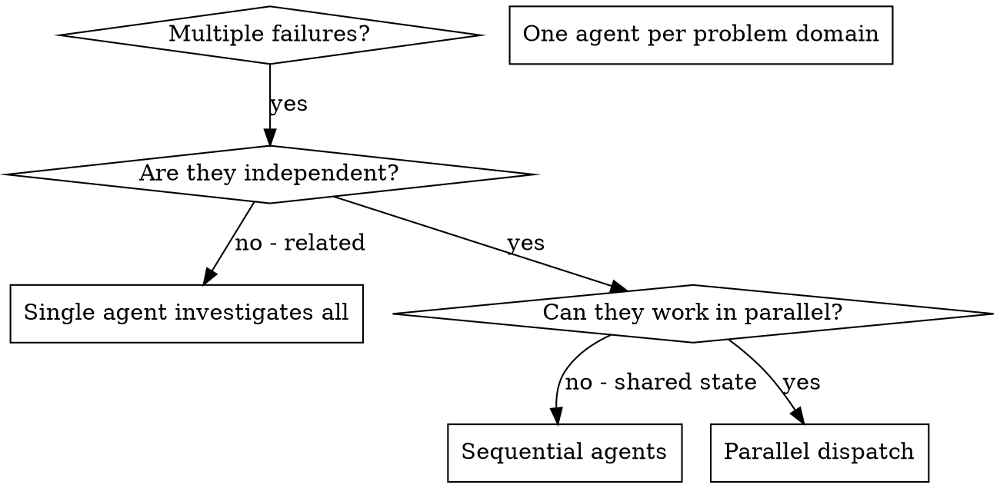

# Dispatching Parallel Agents

## Overview

When you have multiple independent tasks or problem domains (failing tests, review targets, subsystem investigations, separate bugs), working them sequentially wastes time. Each can be handled without context from the others, so dispatch one agent per domain and let them run concurrently.

**Core principle:** Dispatch one agent per independent task/problem domain. Run them concurrently.

**What produces real concurrency:** Emit all agent calls (Task/Agent) in the SAME turn/message, without waiting for any to return before issuing the next. Agent calls made across separate turns — issuing one, reading its result, then issuing the next — run in series, not in parallel, regardless of intent.

## When to Use



**Use when:**
- 2+ independent tasks or problem domains: failing tests, review targets, subsystem investigations, separate bugs
- Each domain can be understood without context from the others
- No shared state between the agents (no overlapping files or resources)

**Don't use when:**
- Domains are related (handling one might resolve or alter others)
- You need to understand full system state first
- Agents would interfere with each other (same files, same resources)

## The Pattern

### 1. Identify Independent Domains

Group the work by what is independent. Examples:
- Failing tests grouped by root cause (tool approval flow, batch completion, abort functionality)
- Review targets (auth module, payment module, API contract)
- Subsystem investigations (queue consumer, cache layer, DB migrations)

Each domain must be independent — handling one does not affect another, and they touch no shared files.

### 2. Create Focused Agent Tasks

Each agent gets:
- **Specific scope:** One domain (test file, review target, or subsystem)
- **Clear goal:** The concrete outcome expected
- **Constraints:** Files/resources it must not touch (preserve isolation)
- **Expected output:** A return summary with the minimum fields below

### 3. Dispatch in Parallel

```typescript
// In Claude Code / AI environment.
// All three calls MUST be emitted in the SAME turn/message, with no wait between them.
Task("Investigate auth subsystem failure")
Task("Review payment module diff")
Task("Fix tool-approval-race-conditions.test.ts failures")
// Concurrent only because they were dispatched together in one turn.
// Issuing them across separate turns would serialize them.
```

### 4. Review and Integrate

Require each agent's return summary to carry these minimum fields, so the integration step can check for conflicts:
- **Root cause** — what the agent found
- **Files changed** — exact paths touched
- **Change** — what was modified
- **Residual risks** — anything left unverified or potentially affecting other domains

When agents return:
- Read each summary
- Cross-check the "Files changed" sets for overlap (same path edited by two agents = conflict)
- Run the full test suite
- Integrate all changes

**Degraded path:**
- **Edit conflict** (two agents touched the same file) — discard the conflicting edits and re-run the affected domains in sequence so the second sees the first's result.
- **Agent does not return** (no summary, timeout, error) — re-dispatch that single domain; if it fails again, drop it from the parallel batch and handle it sequentially or escalate to the user.

## Agent Prompt Structure

Good agent prompts are:
1. **Focused** - One clear problem domain
2. **Self-contained** - All context needed to understand the problem
3. **Specific about output** - What should the agent return?

```markdown
Fix the 3 failing tests in src/agents/agent-tool-abort.test.ts:

1. "should abort tool with partial output capture" - expects 'interrupted at' in message
2. "should handle mixed completed and aborted tools" - fast tool aborted instead of completed
3. "should properly track pendingToolCount" - expects 3 results but gets 0

These are timing/race condition issues. Your task:

1. Read the test file and understand what each test verifies
2. Identify root cause - timing issues or actual bugs?
3. Fix by:
   - Replacing arbitrary timeouts with event-based waiting
   - Fixing bugs in abort implementation if found
   - Adjusting test expectations if testing changed behavior

Do NOT just increase timeouts - find the real issue.

Return: Summary of what you found and what you fixed.
```

## Common Mistakes

**❌ Too broad:** "Fix all the tests" - agent gets lost
**✅ Specific:** "Fix agent-tool-abort.test.ts" - focused scope

**❌ No context:** "Fix the race condition" - agent doesn't know where
**✅ Context:** Paste the error messages and test names

**❌ No constraints:** Agent might refactor everything
**✅ Constraints:** "Do NOT change production code" or "Fix tests only"

**❌ Vague output:** "Fix it" - you don't know what changed
**✅ Specific:** "Return summary of root cause and changes"

## When NOT to Use

**Related failures:** Fixing one might fix others - investigate together first
**Need full context:** Understanding requires seeing entire system
**Exploratory debugging:** You don't know what's broken yet
**Shared state:** Agents would interfere (editing same files, using same resources)

## Real Example (illustration — test debugging)

One concrete domain among many; the pattern applies equally to review targets and subsystem investigations.

**Scenario:** 6 test failures across 3 files after major refactoring

**Failures:**
- agent-tool-abort.test.ts: 3 failures (timing issues)
- batch-completion-behavior.test.ts: 2 failures (tools not executing)
- tool-approval-race-conditions.test.ts: 1 failure (execution count = 0)

**Decision:** Independent domains - abort logic separate from batch completion separate from race conditions

**Dispatch:**
```
Agent 1 → Fix agent-tool-abort.test.ts
Agent 2 → Fix batch-completion-behavior.test.ts
Agent 3 → Fix tool-approval-race-conditions.test.ts
```

**Results:**
- Agent 1: Replaced timeouts with event-based waiting
- Agent 2: Fixed event structure bug (threadId in wrong place)
- Agent 3: Added wait for async tool execution to complete

**Integration:** All fixes independent, no conflicts, full suite green

**Time saved:** 3 problems solved in parallel vs sequentially

## Verification

After agents return:
1. **Review each summary** - Confirm root cause, files changed, change, and residual risks are present
2. **Check for conflicts** - Cross-check "Files changed" sets; same path edited twice = conflict (apply the degraded path)
3. **Run full suite** - Verify all changes work together
4. **Spot check** - Agents can make systematic errors
