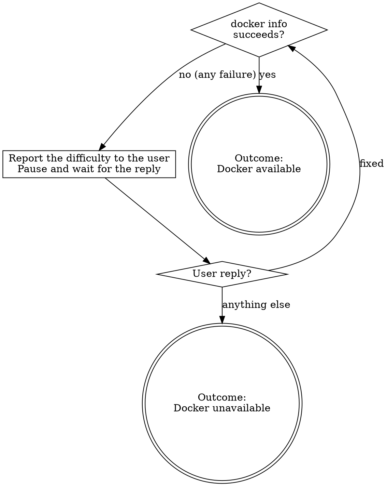

# Enable Docker Server

Make sure Docker is usable before a Docker-dependent step runs. **Detect and ask** — never start, install or configure the container runtime yourself, because how Docker is started depends on the user's OS and runtime (Docker Desktop, Rancher Desktop, colima, OrbStack, a systemd service...). The user owns that action.

## Outcome

End with exactly one outcome, reported to the caller (the user or the invoking skill):

| Outcome | Meaning |
|---|---|
| **Docker available** | `docker info` succeeded — the caller proceeds |
| **Docker unavailable** | The user did not confirm Docker is fixed — the caller adapts |

What happens next is **the caller's decision** — do not make it here. For example, a skill that needs Docker to run tests, on receiving *Docker unavailable*, decides for itself whether to tell the user it cannot continue, skip those tests, or take another path.

## Flow

1. **Check.** Run `docker info`. If it succeeds, the outcome is **Docker available**.
2. **Any failure is a usage difficulty.** Whatever the cause — CLI not installed, daemon not running, permission denied, wrong context or host — do not diagnose or fix it. Tell the user, in one short message, that Docker is not usable, which step needs it, and the error output; ask them to resolve it and reply. Then **pause and wait** for the reply — do not poll, sleep, retry in a loop, or attempt to start, install or configure anything yourself.
3. **Act on the reply.**
   - The user says it is fixed: return to step 1. If it still fails, go back to step 2 with the new error.
   - Any other reply — Docker cannot be restored (not installed, not allowed on this machine), "later", "skip it", or anything that is not a confirmation that it is fixed: the outcome is **Docker unavailable** at this moment. Report it to the caller and stop — do not run any Docker command.
4. **The outcome is a snapshot.** It states Docker's condition at the moment of the check, not for the rest of the session. Once it is reported, stop — whether to rely on it, act on it, or invoke this skill again is up to the caller or the user.
