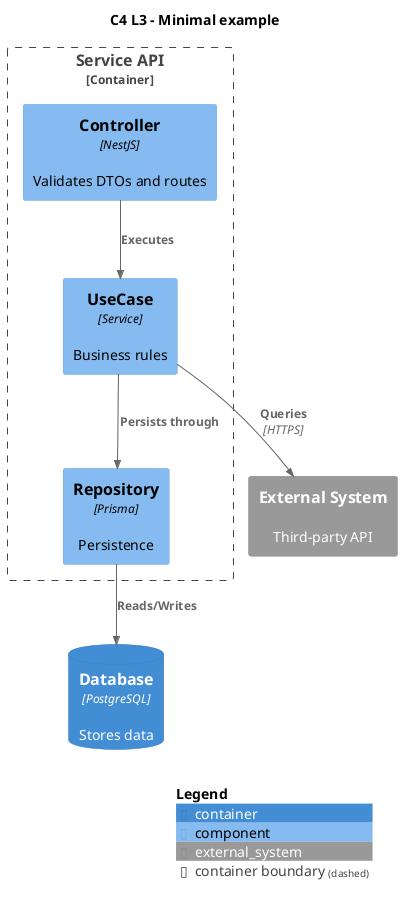

# Expert PlantUML — PlantUML and C4 diagrams

## Purpose

Author diagrams in PlantUML notation — classic UML and the C4 model via C4-PlantUML: pick the diagram type, write valid syntax, and deliver it as a `plantuml` code block or a `.puml` file.

Deliver PlantUML source only — never images.

## When to use

- Architecture documentation (`plan.md`, ADRs).
- `tasks.md` when a task needs a flow or component diagram.
- Fixing a PlantUML/C4 diagram that fails to compile.

**Triggers:** "PlantUML diagram", "C4 diagram", "sequence diagram", "class/component/architecture diagram", "activity diagram", "fix this PlantUML", "Some diagram description contains errors", or a /scrapup:blueprint request for solution diagrams.

## Grounding

Derive every element — actors, systems, containers, components, technologies, messages — from the provided spec, plan, code, or user input. Do not invent elements or technologies. If no spec, plan or code is in context, ask the user before drawing. If context exists but a single element or technology is missing, draw it with `TBD` in the label and list the TBDs after the diagram.

## Choosing the diagram type

| Type | When to use |
|------|-------------|
| **Sequence** | Messages between actors/systems over time; success and failure paths. |
| **Use case** | Actors and system functionality (include/extend). |
| **Class** | Classes, interfaces and their relationships. |
| **Object** | Instances and their links at a point in time. |
| **Activity** | Process flows, decisions, parallelism, swimlanes. |
| **State** | State machines and transitions. |
| **Timing** | Signals over time (robust, binary, clock). |
| **C4 Context** | Actors and systems in context (highest level). |
| **C4 Container** | Containers inside a system. |
| **C4 Component** | Components inside a container (C4 Level 3). |
| **C4 Deployment** | Deployment onto nodes/infrastructure. |
| **C4 Dynamic** | Numbered interactions between C4 elements. |
| **UML Component / Deployment** | Only when the user explicitly asks for UML notation. |

**Tie-breakers:**
- Architecture views (system, containers, components, deployment) → C4 macros by default; UML component/deployment only on explicit request.
- Behavior over time between named parties → sequence; behavior of one process with decisions → activity.
- Message envelope / traceability (queue payload, logs, spans per step) → sequence diagram with `note` blocks carrying the payload and emitted logs.

## Minimal syntax per type

Every diagram starts with `@startuml` and ends with `@enduml`.

- **Sequence:** `participant` or `actor`; messages `->` (solid) and `-->` (dashed); blocks `alt`/`else`/`end`, `opt`/`end`, `loop`/`end`.
- **Use case:** `(use case)`, `:actor:`, association `-->`; include `(A) .> (B) : <<include>>`; extend `(B) .> (A) : <<extend>>`.
- **Class:** `class Name { }`, visibility `+` `-` `#`; `<|--` inheritance, `..|>` realization, `*--` composition, `o--` aggregation, `-->` association, `..>` dependency.
- **Component (UML):** `[component]`, `() interface`, `..>` use, `--` link.
- **Deployment (UML):** `node`, `cloud`, `database`, `artifact`, nesting with `{ }`.
- **State:** `[*]` start/end, `state Name { }`, transitions `-->` with a label.
- **Activity (beta syntax):** `:action;`, `start`/`stop`, `if`/`then`/`else`/`endif`, `fork`/`fork again`/`end fork`, `partition`, swimlanes `|name|`.
- **Timing:** `concise`/`robust`/`binary`/`clock`, `@0`/`@100`, `is State`.

### Supporting files

| Topic | File | Load when |
|-------|------|-----------|
| Detailed syntax per type | [reference.md](reference.md) | The minimal syntax above does not cover the construct you need |
| C4 Level 3 (Component) | [examples/c4-component.puml](examples/c4-component.puml) | Writing a C4 component diagram |
| C4 Level 2 (Container) | [examples/c4-container.puml](examples/c4-container.puml) | Writing a C4 container diagram |
| Sequence with success/failure | [examples/sequence.puml](examples/sequence.puml) | Writing a sequence diagram with `alt` paths |
| Class | [examples/class.puml](examples/class.puml) | Writing a class diagram |
| Activity | [examples/activity.puml](examples/activity.puml) | Writing an activity diagram |

## C4-PlantUML

### Include

- **Stdlib (default, no network):** `!include <C4/C4_Context>`, `C4_Container`, `C4_Component`, `C4_Deployment`, `C4_Dynamic` or `C4_Sequence`.
- **URL (only when the stdlib is unavailable):** pin a release tag, never `master` — `!include https://raw.githubusercontent.com/plantuml-stdlib/C4-PlantUML/v2.14.0/C4_Container.puml`.

### C4 levels

- **L1 (Context):** `!include <C4/C4_Context>` + `Person`, `System`, `System_Ext`, `Rel`.
- **L2 (Container):** `!include <C4/C4_Container>` + `Container`, `ContainerDb`, `System_Boundary`, `Rel`.
- **L3 (Component):** `!include <C4/C4_Component>` + `Component`, `Container_Boundary`, `Rel`.
- **L4 (Code):** do not use C4-PlantUML; use UML class or sequence diagrams.

### Minimal boilerplate (C4 L3)



### Main macros

| Element | Macro (example) |
|---------|-----------------|
| Person | `Person(alias, "Label", "?description")` |
| System | `System(alias, "Label", "?description")` |
| External system | `System_Ext(...)` |
| System boundary | `System_Boundary(alias, "Label") { ... }` |
| Container | `Container(alias, "Label", "?technology", "?description")` |
| Container DB | `ContainerDb(alias, "Label", "?technology", "?description")` |
| Container boundary | `Container_Boundary(alias, "Label") { ... }` |
| Component | `Component(alias, "Label", "?technology", "?description")` |
| Relationship | `Rel(from, to, "label", "?technology")` |
| Directional relationship | `Rel_R`, `Rel_L`, `Rel_U`, `Rel_D` |

### C4 rules

- Always add `title` and `SHOW_LEGEND()`.
- Use unique aliases (`api`, `db`, `ext`) and reuse them in relationships.
- Never mix C4 macros with UML structural elements (`rectangle`, `node`, `component`) in the same diagram.
- Use `Rel(...)` for relationships, never manual arrows (`-->`).
- Use `System_Ext` / `Container_Ext` for anything outside the system under design.

## Output contract

- **Target is a markdown document** (`plan.md`, `tasks.md`, ADR) **or the chat** → fenced ` ```plantuml ` block inline.
- **User asks for a file, or the diagram is reused by several documents** → `.puml` file. Default path: `docs/diagrams/<kebab-name>.puml`, unless the repository already has a diagrams folder — then use it. If the target file exists, edit it in place only when the request is to update that diagram; otherwise ask before overwriting.
- Never link to external images.

**Done when:**
1. The diagram starts with `@startuml` and ends with `@enduml`.
2. It has a `title`.
3. C4 only: the include matches the level, and `SHOW_LEGEND()` is present.
4. Every relationship/arrow references a declared alias; no alias is duplicated.
5. Run `plantuml -checkonly <file>` when the CLI is available and report "checked with plantuml -checkonly"; otherwise re-check items 1-4 plus the "General syntax errors" list manually and report "syntax not validated locally".

## Troubleshooting

### General syntax errors

- Missing `@startuml` / `@enduml`.
- Unescaped quotes or special characters in labels — wrap labels in `"..."`.
- Aliases with hyphens or spaces — use `snake_case`.
- Legacy and beta activity syntax mixed in the same diagram — use only the beta syntax (`:action;`).
- Sequence blocks closed with `endif` — close `alt`/`opt`/`loop` with `end`.

### Common mistakes (BAD → GOOD)

| Wrong | Right |
|-------|-------|
| `api --> db : reads` (in C4) | `Rel(api, db, "Reads")` |
| `alt Success` … `endif` (sequence) | `alt Success` … `end` |
| `Container(api, …)` declared twice | One declaration per alias; reuse it in every `Rel` |
| `Component(order-service, …)` | `Component(order_service, …)` — aliases without hyphens or spaces |
| `(A) <|-- (B)` for extend | `(B) .> (A) : <<extend>>` |

### C4 errors (`Some diagram description contains errors`)

1. Confirm the include matches the level (`C4_Context`, `C4_Container`, `C4_Component`).
2. Run `plantuml -checkonly <file>.puml` to find the exact line (if the CLI is not in PATH, go through the C4 checklist below manually).
3. Check that every `Rel` uses existing aliases.
4. Reduce to the minimal boilerplate and reintroduce elements one at a time.
5. If the local stdlib fails, switch to the pinned URL include.

**C4 checklist:**
- `!include <C4/C4_*>` is available in the current environment.
- Macros match the chosen level (L1/L2/L3).
- `@startuml` and `@enduml` are present.
- No duplicated alias.

## Integration

- **/scrapup:blueprint** (consumer): when invoked from Phase 2 (`plan.md`) or Phase 3 (`tasks.md`), produce the diagrams the plan template requests. Do not invoke /scrapup:blueprint back.

## References

- Official documentation: [plantuml.com](https://plantuml.com/).
- C4-PlantUML: [plantuml-stdlib.github.io/C4-PlantUML](https://plantuml-stdlib.github.io/C4-PlantUML/).
- Evaluation scenarios: [evals/scenarios.md](evals/scenarios.md).
