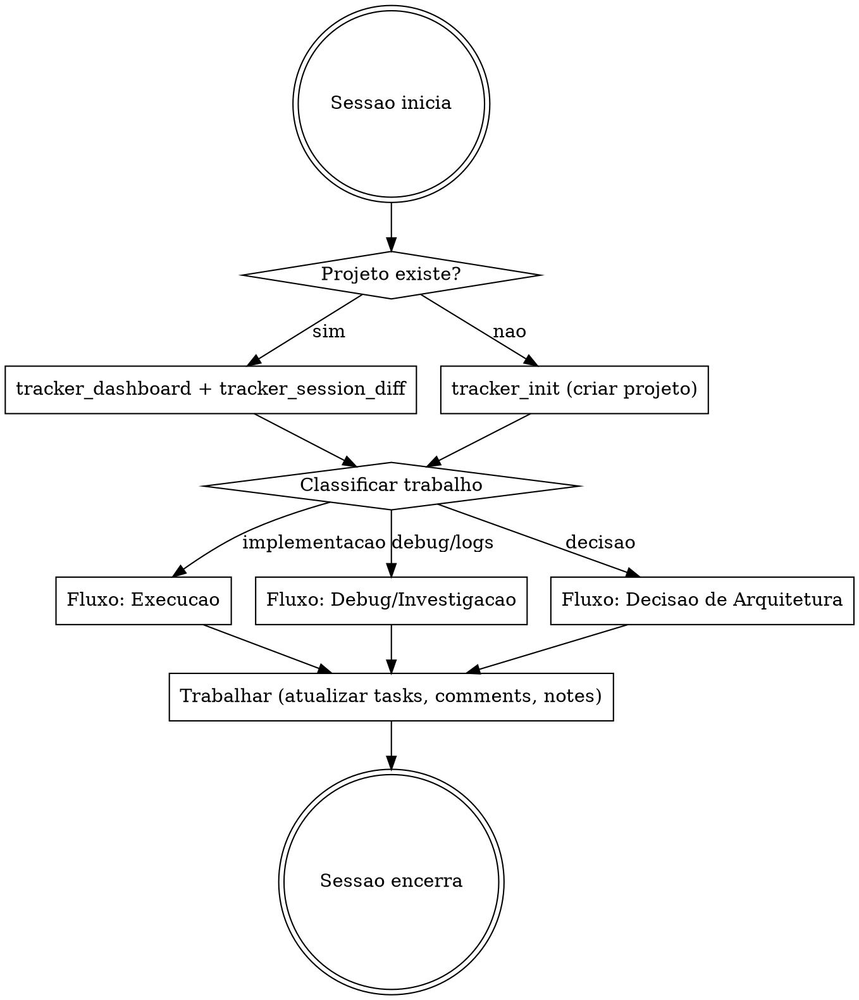

# Session Tracker (saga-mcp)

Rastreia progresso, decisoes e contexto entre sessoes usando o MCP server `mcp-saga` (saga-mcp com SQLite local). Skill isolada — ativa-se por declaracao explicita do utilizador ou por gatilho de outra skill.

## Quando usar

- Utilizador declara "saga-session", "rastrear progresso", "usar o saga", ou equivalente de tracking explicito
- Debug longo com analise de logs (multi-servico, multi-sessao)
- Investigacao de incidentes com multiplas hipoteses
- Registrar decisao de arquitetura cross-project (padroes NestJS, Fastify, etc.)
- Retomar trabalho iniciado em sessao anterior

## Quando NAO usar

- Sessoes curtas e pontuais (uma pergunta, um fix rapido)
- Trabalho que nao sera retomado em outra sessao
- Quando o utilizador nao declarou tracking

## MCP Server

| Parametro | Valor |
|---|---|
| **Server** | `mcp-saga` |
| **Invocacao** | as tools do MCP `mcp-saga` (`mcp__mcp-saga__*`) |
| **DB** | `~/.claude/.tracker.db` (auto-criado no primeiro uso) |

**Nota:** skills e documentacao podem referir-se ao conceito como "mcp-saga" ou "saga". O nome do MCP server é `mcp-saga`; as tools aparecem como `mcp__mcp-saga__<tool>`.

## Tools de referencia rapida

| Tool | Leitura | Descricao |
|---|---|---|
| `tracker_init` | | Inicializar tracker e criar primeiro projeto |
| `tracker_dashboard` | ro | Visao geral do projeto com resumo |
| `tracker_session_diff` | ro | O que mudou desde um timestamp |
| `tracker_search` | ro | Busca cross-entity (projetos, epicos, tasks, notes) |
| `activity_log` | ro | Historico de mudancas com filtros |
| `project_create` | | Criar projeto |
| `project_list` | ro | Listar projetos |
| `project_update` | | Atualizar projeto. **Destrutivo** quando muda status para `archived` (remove projeto temporario do fluxo ativo) |
| `epic_create` | | Criar epico dentro de projeto |
| `epic_list` | ro | Listar epicos |
| `task_create` | | Criar task com dependencias opcionais |
| `task_list` | ro | Listar/filtrar tasks |
| `task_get` | ro | Task com subtasks, notes, comments, deps |
| `task_update` | | Atualizar task (auto-logs, auto-block/unblock) |
| `task_batch_update` | | Atualizar multiplas tasks |
| `subtask_create` | | Criar subtask(s) — suporta batch |
| `subtask_update` | | Atualizar subtask |
| `comment_add` | | Adicionar comment a uma task |
| `comment_list` | ro | Listar comments de uma task |
| `note_save` | | Criar ou atualizar note (upsert) |
| `note_list` | ro | Listar notes com filtros |
| `note_search` | ro | Busca full-text em notes |
| `note_delete` | | Remover note. **Destrutivo e irreversivel** — so notes de trabalho de projeto temporario, sob guardrail (ver "Regras de lifecycle") |
| `template_create` | | Criar template reutilizavel |
| `template_apply` | | Aplicar template com substituicao de variaveis |
| `tracker_export` | ro | Exportar projeto como JSON |
| `tracker_import` | | Importar projeto de JSON |

**ro** = read-only (seguro para consulta).

## Ciclo de vida da sessao



### 1. Inicio de sessao

1. `project_list` — verificar se ja existe projeto relevante
2. Se existe: `tracker_dashboard` para visao geral + `tracker_session_diff`. Obter o baseline do `since` a partir da ultima note `progress` (`note_list` filtrando tipo `progress`, pegar a mais recente — ver "Fim de sessao", passo 2), aplicando a armadilha de timezone (ver "Timezone em `tracker_session_diff`": usar o dia anterior como baseline seguro em vez de hora local exata)
3. Se nao existe: `tracker_init` com nome e descricao do trabalho

### 2. Durante a sessao

| Evento | Acao no mcp-saga |
|---|---|
| Iniciar uma tarefa | `task_update` → status `in_progress` |
| Concluir uma tarefa | `task_update` → status `done` |
| Descoberta relevante | `comment_add` na task ativa |
| Decisao tomada | `note_save` com tipo `decision` |
| Bloqueio encontrado | `note_save` com tipo `blocker` |
| Contexto para proxima sessao | `note_save` com tipo `context` |

### 3. Fim de sessao

1. Atualizar status das tasks em andamento
2. `note_save` tipo `progress` com resumo do que foi feito e o que falta
3. Se ha proximos passos claros, criar tasks para a proxima sessao

## Fluxo: Debug / Investigacao de logs

Quando a sessao envolve debug longo ou analise de logs (Loki, Grafana), estruturar o tracking assim:

1. **Criar epic** `debug: <descricao do problema>` no projeto
2. **Criar tasks** para cada hipotese ou linha de investigacao
3. **Registrar achados** como comments nas tasks correspondentes:
   - Queries LogQL executadas e resultados
   - Trace IDs relevantes
   - Timestamps de eventos criticos
4. **Registrar conclusao** como note tipo `technical`:
   - Root cause identificado
   - Servicos afetados
   - Correcao aplicada ou proposta
5. **Se nao resolvido**: note tipo `blocker` com estado atual e proximos passos

### Modelo de comment para investigacao

```
Hipotese: [descricao]
Query: {app="servico"} |= "erro" | json
Resultado: [X entries encontradas, padrao Y observado]
Conclusao: [confirmada/descartada/parcial — motivo]
```

## Fluxo: Decisoes de arquitetura cross-project

Para decisoes que afetam multiplos projetos (padroes NestJS, convencoes Fastify, estrategias de mensageria, etc.):

1. **Projeto dedicado**: manter um projeto `architecture-decisions` no mcp-saga para decisoes transversais
2. **Note tipo `decision`** com estrutura:

```
Titulo: [nome da decisao]
Contexto: [por que essa decisao foi necessaria]
Opcoes consideradas: [lista]
Decisao: [o que foi escolhido]
Consequencias: [impacto nos projetos]
Projetos afetados: [lista]
```

3. **Tags via titulo**: prefixar com dominio — `[nestjs]`, `[fastify]`, `[rabbitmq]`, `[observability]`
4. **Busca posterior**: `note_search` com keyword do dominio ou `tracker_search` para localizar decisoes

### Exemplos de decisoes cross-project

- `[nestjs] Padrao de interceptors para wide events`
- `[fastify] Plugin structure para autenticacao`
- `[rabbitmq] Estrategia de DLQ e reprocessamento`
- `[observability] Convencao de exception.slug`
- `[testing] Estrategia de mocks para o broker RabbitMQ`

## Fluxo: Execucao de tarefas (com SDD)

Quando usado em conjunto com a skill /scrapup:forge ou planos SDD:

1. Importar a estrutura do `tasks.md` como Project > Epics > Tasks
2. Manter dependencias entre tasks (`depends_on`)
3. Atualizar status conforme executa: `todo` → `in_progress` → `done`
4. Comments para breadcrumbs de implementacao
5. Dashboard como checkpoint entre tasks

#### Integracao com a execucao em contexto limpo

Durante a execucao de TFs via /scrapup:forge (secao 5):

- Projeto saga: `exec:{repo}:{TF-XX-YY|US-XX}` (temporario, lifecycle da execucao)
- Cada executor: `task_update` (status in_progress) + `comment_add` (breadcrumb com o hash do commit)
- Notes de contexto do projeto: `toolchain` e `baseline` (tipo `context`), guardrails (tipo `technical`, prefixo `guardrail:`), `metrics`, `lesson`, `progress`: ver a tabela "Tipos de note e quando usar" — fonte unica de definicao

## Regras

1. **Nao iniciar tracking sem declaracao** — o utilizador deve ativar esta skill explicitamente ou outra skill deve referencia-la
2. **Nao duplicar projetos** — sempre verificar `project_list` antes de criar
3. **Comments > notes para contexto de task** — comments ficam vinculados a task, notes sao independentes
4. **Notes para conhecimento transversal** — decisoes, padroes, blockers que transcendem uma task
5. **Minimo overhead** — nao rastrear micro-acoes; focar em mudancas de status, descobertas e decisoes
6. **Timestamps em notes de progresso** — incluir data/hora para facilitar `tracker_session_diff`

## Tipos de note e quando usar

| Tipo | Quando | Usado por |
|---|---|---|
| `decision` | Escolha de arquitetura, padrao, lib, abordagem. Precedentes de contradicao entre specs | saga-session, multi-spec-review |
| `context` | Informacao que o proximo agente precisa para retomar. Notas `toolchain` e `baseline` da execucao | saga-session, forge |
| `technical` | Detalhes tecnicos: root cause, mecanismo, comportamento. Findings de self-review. Baseline de homogeneidade. Grafo source-to-test | saga-session, forge, multi-spec-review (via saga_writes de reviewer-homogeneity e reviewer-testing) |
| `blocker` | Impedimento ativo que precisa de resolucao | saga-session |
| `progress` | Resumo de sessao — o que foi feito, o que falta. Resumo de consolidacao e execucao | saga-session, forge |
| `override` | Decisao do utilizador para pular validacao (10 ciclos esgotados, --no-verify autorizado) | forge |
| `metrics` | Dados quantitativos pos-execucao (tempo total, ciclos, rotacoes de contexto, taxa de sucesso). Metricas de performance dos agents reviewer-* | forge, multi-spec-review |
| `lesson` | Licao aprendida qualitativa (padroes de falha, o que funcionou, sugestoes recorrentes do self-review) | forge |
| `guardrail` | Instrucoes acumulativas derivadas de falhas de iteracao. No MCP, gravar como `technical` com prefixo `guardrail:` no titulo | forge |
| `meeting` | Notas de reuniao relevantes ao trabalho | saga-session |
| `general` | Qualquer coisa que nao se encaixa nos acima | saga-session |

O uso de `technical` para baseline de homogeneidade (schema de tags `D{n}`, meta-note, templates) e definido em [`baseline-saga.md`](./baseline-saga.md) — fonte canonica para esse fluxo.

## Registro de Colecoes (projetos saga)

Fonte canonica de todos os projetos que vivem no SQLite do saga. Skills consumidoras (forge, multi-spec-review) referenciam esta secao para convencoes — nao definem regras proprias de persistencia. Agents reviewer-* operam em readonly e declaram escritas via `saga_writes` que o multi-spec-review executa.

### Colecoes persistentes

Projetos que acumulam dados entre sessoes. **NUNCA arquivar, NUNCA deletar notes.**

| Projeto | Padrao de nome | Criado por | Proposito |
|---|---|---|---|
| Baseline de homogeneidade | `homogeneity:{repo}` | multi-spec-review (via saga_writes de /reviewer-homogeneity) | Padroes do legado por dimensao (D1-D10) com confidence %. Protocolo completo em [`baseline-saga.md`](./baseline-saga.md) |
| Precedentes de contradicao | `contradiction-precedents:{repo}` | multi-spec-review (Layer 3) | Decisoes do utilizador sobre contradicoes entre specs. Isolado por repositorio — mesma contradicao pode ter resolucao diferente entre repos |
| Decisoes de arquitetura | `architecture-decisions` | saga-session (manual) | Decisoes cross-project (padroes NestJS, Fastify, mensageria). Projeto unico global |
| Grafo de testes | `test-graph:{repo}` | multi-spec-review (via saga_writes de /reviewer-testing) | Mapeamento source-to-test por modulo, construido incrementalmente a cada review. Notes tipo `technical` com titulo `map:{directorio}` |
| Telemetria multi-spec-review | `scrapup` | multi-spec-review (orquestrador, Layer 3) | Consumo de tokens e limitacoes declaradas por execucao. Projeto unico global; notes `telemetry:{repo}:{ts}`. Schema em `skills/multi-spec-review/references/telemetry-schema.md`. Escrita exclusiva do orquestrador — agents nunca escrevem aqui |

### Colecoes temporarias

Projetos criados para uma execucao e arquivados apos conclusao.

| Projeto | Padrao de nome | Criado por | Cleanup |
|---|---|---|---|
| Review multi-spec | `review:{repo}:{timestamp}` | multi-spec-review (Layer 1) | `project_update` → archived + `note_delete` de notes `findings:*` |
| Execucao TF/US | `exec:{repo}:{TF-XX-YY\|US-XX}` | forge §4.2 | `project_update` → archived apos a validacao funcional confirmada pelo utilizador |
| Debug/Investigacao | `debug:{repo}:{slug}` | saga-session (manual) | Arquivar quando investigacao conclui |

### Convencao de nomes de projeto

| Prefixo | Quando usar | Persistencia |
|---|---|---|
| `homogeneity:` | Baseline de padroes do legado por repo | Persistente |
| `contradiction-precedents:` | Decisoes de contradicao entre specs por repo | Persistente |
| `architecture-decisions` | Projeto unico global de decisoes cross-project | Persistente |
| `test-graph:` | Grafo incremental source-to-test por repo | Persistente |
| `scrapup` | Telemetria global do multi-spec-review (consumo + limitacoes) | Persistente |
| `review:` | Review temporario do multi-spec-review | Temporario |
| `exec:` | Execucao de tarefa/US pelo forge | Temporario |
| `debug:` | Sessao de debug/investigacao | Temporario |

Usar **sempre** o prefixo correspondente ao criar projetos. Permite queries via `project_list` filtrando por prefixo de nome.

### Regras de lifecycle

1. **Persistentes** (`homogeneity:`, `contradiction-precedents:`, `architecture-decisions`, `test-graph:`, `scrapup`): NUNCA arquivar, NUNCA deletar notes. Atualizar via upsert (`note_save` com `id` existente)
2. **Temporarios** (`review:`, `exec:`, `debug:`): arquivar (`project_update` status `"archived"`) apos conclusao. Notes de trabalho podem ser deletadas no cleanup
3. **Nao tocar projetos de outras skills** — cada skill gerencia apenas os seus projetos. Regra critica para multi-spec-review: cleanup so toca `review:*`, nunca `homogeneity:*` nem `contradiction-precedents:*`
4. **Verificar antes de criar** — sempre `project_list` antes de `project_create` para evitar duplicatas
5. **Guardrail de operacao destrutiva** — antes de `note_delete` ou de `project_update` para `archived`, confirmar via `project_list` que (a) o nome do projeto casa com um prefixo temporario (`review:`, `exec:`, `debug:`) **e** (b) esta skill e a owner do projeto (criou-o no fluxo atual). Em duvida de ownership, **abster-se** da operacao destrutiva e reportar ao utilizador — nunca deletar/arquivar por inferencia

## Padroes de consulta cross-skill

Queries que qualquer skill pode usar para encontrar dados de outras skills no saga.

| Objetivo | Query |
|---|---|
| Encontrar baseline de homogeneidade | `project_list` → filtrar por nome `homogeneity:{repo}` |
| Buscar precedente de contradicao | `project_list` → filtrar `contradiction-precedents:{repo}` → `note_search` no projeto |
| Verificar execucao anterior de TF | `tracker_search` com keyword da TF (ex: "TF-01-03") |
| Obter metricas de execucoes passadas | `note_search` tipo `metrics` |
| Recuperar licoes aprendidas | `note_search` tipo `lesson` + keywords tecnologicas |
| Verificar toolchain e baseline da execucao ativa | `note_search` tipo `context` no projeto `exec:*` ativo |
| Decisoes de arquitetura por dominio | `note_search` no projeto `architecture-decisions` com keyword `[nestjs]`, `[fastify]`, etc. |
| Obter grafo de testes do repo | `project_list` → filtrar `test-graph:{repo}` → `note_list` |

## Armadilhas conhecidas

### Timezone em `tracker_session_diff`

O SQLite armazena timestamps em UTC. O parametro `since` e comparado diretamente contra esses valores. Se o fuso local e BRT (UTC-3), passar `2026-03-21T15:00:00` local nao encontra registros salvos como `2026-03-21 12:00:00` UTC.

**Solucao**: usar o timestamp do dia anterior como baseline seguro (ex: `2026-03-20T00:00:00`) em vez de hora local exata. O custo e trazer atividade extra, que o resumo do diff compensa.

### `note_search` com multiplas keywords

Busca com duas ou mais palavras combinada com filtro `note_type` pode retornar vazio mesmo quando a note existe. O full-text search do SQLite trata multiplas palavras como AND implicito entre tokens indexados, e o filtro adicional pode restringir demais.

**Solucao**: buscar por keyword individual sem filtro de tipo, ou usar `tracker_search` como alternativa — este busca cross-entity sem limitacao de tipo.

### `tracker_search` — match por token exato

A busca por keyword faz match exato por token, nao por substring. Buscar "validar" nao encontra "validacao", e "nest" nao encontra "nestjs".

**Solucao**: usar a palavra completa e exata. Para decisoes de arquitetura, manter prefixos consistentes nos titulos (`[nestjs]`, `[fastify]`) e buscar pelo prefixo completo.

### `tracker_init` vs `project_create`

`tracker_init` so cria projeto se o DB estiver vazio. Se ja existe qualquer projeto (mesmo arquivado), retorna o projeto existente. Para criar projetos adicionais, usar `project_create` diretamente.
