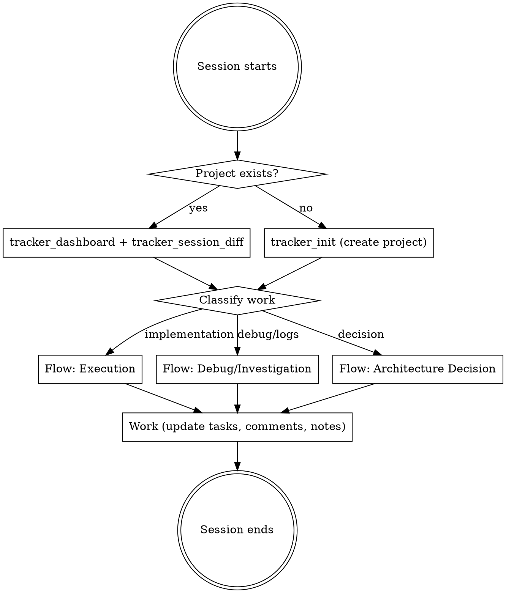

# Session Tracker (saga-mcp)

Tracks progress, decisions and context across sessions using the `mcp-saga` MCP server (saga-mcp backed by local SQLite).

## When to use

- The user says "saga-session", "track progress", "use saga", or an equivalent explicit tracking request
- Long debugging with log analysis (multi-service, multi-session)
- Incident investigation with multiple hypotheses
- Recording a cross-project architecture decision (framework conventions, messaging strategies, etc.)
- Resuming work started in an earlier session

## When NOT to use

- Short, one-off sessions (a single question, a quick fix)
- Work that will not be resumed in another session
- When the user has not asked for tracking

## MCP Server

| Parameter | Value |
|---|---|
| **Server** | `mcp-saga` |
| **Invocation** | the `mcp-saga` MCP tools (`mcp__mcp-saga__*`) |
| **DB** | `~/.claude/.tracker.db` (auto-created on first use) |

Skills and docs may call the concept "mcp-saga" or "saga". The MCP server name is `mcp-saga`; its tools appear as `mcp__mcp-saga__<tool>` (or with an equivalent plugin prefix).

### Prerequisite: saga tools available

Before any tracking action, check that the `mcp__mcp-saga__*` tools (or equivalent saga tools such as `tracker_dashboard`, `note_save`) are in your tool list.

If they are absent:

1. Tell the user that the `mcp-saga` MCP server is required and is not bundled with scrapup.
2. Stop, or proceed **without persistence** only if the user explicitly agrees.
3. Never fabricate state: do not claim a project, task or note was read or saved when no saga tool ran.

## Quick tool reference

| Tool | Read | Description |
|---|---|---|
| `tracker_init` | | Initialize the tracker and create the first project |
| `tracker_dashboard` | ro | Project overview with summary |
| `tracker_session_diff` | ro | What changed since a timestamp |
| `tracker_search` | ro | Cross-entity search (projects, epics, tasks, notes) |
| `activity_log` | ro | Change history with filters |
| `project_create` | | Create a project |
| `project_list` | ro | List projects |
| `project_update` | | Update a project. **Destructive** when setting status to `archived` (removes a temporary project from the active flow) |
| `epic_create` | | Create an epic inside a project |
| `epic_list` | ro | List epics |
| `task_create` | | Create a task with optional dependencies |
| `task_list` | ro | List/filter tasks |
| `task_get` | ro | Task with subtasks, notes, comments, deps |
| `task_update` | | Update a task (auto-logs, auto-block/unblock) |
| `task_batch_update` | | Update multiple tasks |
| `subtask_create` | | Create subtask(s) — supports batch |
| `subtask_update` | | Update a subtask |
| `comment_add` | | Add a comment to a task |
| `comment_list` | ro | List a task's comments |
| `note_save` | | Create or update a note (upsert) |
| `note_list` | ro | List notes with filters |
| `note_search` | ro | Full-text search over notes |
| `note_delete` | | Remove a note. **Destructive and irreversible** — only work notes of a temporary project, under the guardrail (see "Rules") |
| `template_create` | | Create a reusable template |
| `template_apply` | | Apply a template with variable substitution |
| `tracker_export` | ro | Export a project as JSON |
| `tracker_import` | | Import a project from JSON |

**ro** = read-only (safe to query).

## Session lifecycle


```dot
digraph session_lifecycle {
    "Session starts" [shape=doublecircle];
    "Project exists?" [shape=diamond];
    "tracker_dashboard + tracker_session_diff" [shape=box];
    "tracker_init (create project)" [shape=box];
    "Classify work" [shape=diamond];
    "Flow: Execution" [shape=box];
    "Flow: Debug/Investigation" [shape=box];
    "Flow: Architecture Decision" [shape=box];
    "Work (update tasks, comments, notes)" [shape=box];
    "Session ends" [shape=doublecircle];

    "Session starts" -> "Project exists?";
    "Project exists?" -> "tracker_dashboard + tracker_session_diff" [label="yes"];
    "Project exists?" -> "tracker_init (create project)" [label="no"];
    "tracker_init (create project)" -> "Classify work";
    "tracker_dashboard + tracker_session_diff" -> "Classify work";
    "Classify work" -> "Flow: Execution" [label="implementation"];
    "Classify work" -> "Flow: Debug/Investigation" [label="debug/logs"];
    "Classify work" -> "Flow: Architecture Decision" [label="decision"];
    "Flow: Execution" -> "Work (update tasks, comments, notes)";
    "Flow: Debug/Investigation" -> "Work (update tasks, comments, notes)";
    "Flow: Architecture Decision" -> "Work (update tasks, comments, notes)";
    "Work (update tasks, comments, notes)" -> "Session ends";
}
```

### 1. Session start

1. `project_list` — check whether a relevant project already exists
2. If it exists: `tracker_dashboard` for the overview + `tracker_session_diff`. Take the `since` baseline from the latest `progress` note (`note_list` filtered by type `progress`, most recent — see "Session end", step 2), applying the timezone pitfall (see "Timezone in `tracker_session_diff`": use the previous day as a safe baseline instead of an exact local time)
3. If it does not exist: `tracker_init` with the work's name and description (or `project_create` if the DB already has projects — see "`tracker_init` vs `project_create`")

### 2. During the session

| Event | mcp-saga action |
|---|---|
| Start a task | `task_update` → status `in_progress` |
| Finish a task | `task_update` → status `done` |
| Relevant finding | `comment_add` on the active task |
| Decision made | `note_save` with type `decision` |
| Blocker found | `note_save` with type `blocker` |
| Context for the next session | `note_save` with type `context` |

### 3. Session end

1. Update the status of in-progress tasks
2. `note_save` type `progress` summarizing what was done and what remains
3. If the next steps are clear, create tasks for the next session

### Example: resuming a session

- **User says:** "Resume last session on the payment-retry bug."
- **Actions:** `project_list` → finds `debug:{repo}:payment-retry`; `note_list` type `progress` → latest note dated 2026-03-21; `tracker_dashboard` on the project; `tracker_session_diff` with `since: 2026-03-20T00:00:00`; `task_list` → hypothesis H2 `in_progress`.
- **Result:** report to the user the last progress summary, what changed since, the open hypothesis H2 and any `blocker` notes; continue on H2 with `task_update`/`comment_add`.

## Flow: Debug / log investigation

When the session involves long debugging or log analysis (in your log backend), structure tracking like this:

1. **Create epic** `debug: <problem description>` in the project
2. **Create tasks** for each hypothesis or line of investigation
3. **Record findings** as comments on the corresponding tasks:
   - Log queries run and their results
   - Relevant trace IDs
   - Timestamps of critical events
4. **Record the conclusion** as a note of type `technical`:
   - Root cause identified
   - Affected services
   - Fix applied or proposed
5. **If unresolved**: a `blocker` note with the current state and next steps

### Investigation comment template

```
Hypothesis: [description]
Query: [log query in your log backend's syntax]
Result: [X entries found, pattern Y observed]
Conclusion: [confirmed/discarded/partial — reason]
```

## Flow: Cross-project architecture decisions

For decisions that affect multiple projects (framework conventions, messaging strategies, etc.):

1. **Dedicated project**: keep one `architecture-decisions` project in mcp-saga for cross-cutting decisions
2. **Note of type `decision`** with this structure:

```
Title: [decision name]
Context: [why this decision was needed]
Options considered: [list]
Decision: [what was chosen]
Consequences: [impact on projects]
Affected projects: [list]
```

3. **Tags via title**: prefix with the domain — e.g. `[api]`, `[messaging]`, `[observability]`, `[testing]`
4. **Later lookup**: `note_search` with the domain keyword, or `tracker_search` to locate decisions

### Example cross-project decisions

- `[api] Interceptor pattern for request logging`
- `[api] Plugin structure for authentication`
- `[messaging] Dead-letter queue and reprocessing strategy`
- `[observability] Error identifier naming convention`
- `[testing] Mocking strategy for the message broker`

## Flow: Task execution (with SDD)

Follow /scrapup:forge; project/note conventions below. forge names its project `exec:{repo}:{TF-XX-YY|US-XX}` and uses the note types defined in "Note types and when to use them".

## Note types and when to use them

| Type | When | Used by |
|---|---|---|
| `decision` | Choice of architecture, pattern, library, approach | saga-session |
| `context` | Information the next agent needs to resume. The execution's `toolchain` and `baseline` notes | saga-session, forge |
| `technical` | Technical details: root cause, mechanism, behavior. Self-review findings | saga-session, forge |
| `blocker` | Active impediment that needs resolution | saga-session |
| `progress` | Session summary — what was done, what remains. Consolidation and execution summary | saga-session, forge |
| `override` | User decision to skip validation (10 cycles exhausted, `--no-verify` authorized) | forge |
| `metrics` | Post-execution quantitative data (total time, cycles, context rotations, success rate) | forge |
| `lesson` | Qualitative lesson learned (failure patterns, what worked, recurring self-review suggestions) | forge |
| `guardrail` | Cumulative instructions derived from iteration failures. In the MCP, save as `technical` with the `guardrail:` title prefix | forge |
| `meeting` | Meeting notes relevant to the work | saga-session |
| `general` | Anything that does not fit the above | saga-session |

## Saga project registry

Projects that live in the saga SQLite DB, by owner. Owners are this skill and /scrapup:forge.

### Persistent collections

Projects that accumulate data across sessions. **NEVER archive, NEVER delete notes.**

| Project | Name pattern | Created by | Purpose |
|---|---|---|---|
| Architecture decisions | `architecture-decisions` | saga-session (manual) | Cross-project decisions (framework conventions, messaging). Single global project |

### Temporary collections

Projects created for one run and archived when it completes.

| Project | Name pattern | Created by | Cleanup |
|---|---|---|---|
| TF/US execution | `exec:{repo}:{TF-XX-YY\|US-XX}` | /scrapup:forge ("4.2 Prepare TFs") | /scrapup:forge archives it (`project_update` → archived) after the user confirms functional validation ("Final Verification") |
| Debug/Investigation | `debug:{repo}:{slug}` | saga-session (manual) | Archive when the investigation concludes |

### Project naming convention

| Prefix | When to use | Persistence |
|---|---|---|
| `architecture-decisions` | Single global project for cross-project decisions | Persistent |
| `exec:` | Task/US execution by forge | Temporary |
| `debug:` | Debug/investigation session | Temporary |

**Always** use the matching prefix when creating projects, so `project_list` can be filtered by name prefix.

## Rules

1. **Do not start tracking without a request** — the user must activate this skill explicitly, or another skill must reference it
2. **Check before creating** — always `project_list` before `project_create` to avoid duplicate projects
3. **Comments over notes for task context** — comments stay linked to the task; notes are independent
4. **Notes for cross-cutting knowledge** — decisions, patterns, blockers that outlive a single task
5. **Minimal overhead** — do not track micro-actions; focus on status changes, findings and decisions
6. **Timestamps in progress notes** — include date/time to make `tracker_session_diff` easier
7. **Persistent** (`architecture-decisions`): NEVER archive, NEVER delete notes. Update via upsert (`note_save` with an existing `id`)
8. **Temporary** (`exec:`, `debug:`): archive (`project_update` status `"archived"`) after completion. Work notes may be deleted during cleanup
9. **Do not touch other owners' projects** — each owner manages only its own projects: this skill manages `debug:` and `architecture-decisions`; /scrapup:forge manages `exec:`
10. **Destructive-operation guardrail** — before `note_delete` or `project_update` to `archived`, confirm via `project_list` that (a) the project name matches a temporary prefix (`exec:`, `debug:`) **and** (b) the prefix belongs to the acting skill per rule 9 (`exec:` → /scrapup:forge; `debug:` → this skill) — ownership is decided by prefix, not by whether the project was created in the current session, so resumed projects can still be archived. If ownership is in doubt, **refrain** from the destructive operation and report to the user — never delete/archive by inference

## Cross-skill query patterns

Queries any skill can use to find data in saga.

| Goal | Query |
|---|---|
| Check an earlier TF execution | `tracker_search` with the TF keyword (e.g. "TF-01-03") |
| Get metrics from past executions | `note_search` type `metrics` |
| Retrieve lessons learned | `note_search` type `lesson` + technology keywords |
| Check toolchain and baseline of the active execution | `note_search` type `context` in the active `exec:*` project |
| Architecture decisions by domain | `note_search` in the `architecture-decisions` project with a keyword such as `[api]`, `[messaging]` |

## Known pitfalls

### Timezone in `tracker_session_diff`

SQLite stores timestamps in UTC; convert to the user's timezone when reporting. The `since` parameter is compared directly against those values. If the local timezone is UTC-3, passing `2026-03-21T15:00:00` local does not match records saved as `2026-03-21 12:00:00` UTC.

**Solution**: use the previous day as a safe baseline (e.g. `2026-03-20T00:00:00`) instead of an exact local time. The cost is extra activity, which the diff summary absorbs.

### `note_search` with multiple keywords

A search with two or more words combined with a `note_type` filter may return empty even when the note exists. SQLite full-text search treats multiple words as an implicit AND between indexed tokens, and the extra filter can over-restrict.

**Solution**: search by a single keyword without the type filter, or use `tracker_search` — it searches cross-entity without the type restriction.

### `tracker_search` — exact token match

Keyword search matches exact tokens, not substrings. Searching "valid" does not find "validation", and "api" does not find "apis".

**Solution**: use the complete, exact word. For architecture decisions, keep consistent title prefixes (`[api]`, `[messaging]`) and search by the full prefix.

### `tracker_init` vs `project_create`

`tracker_init` only creates a project if the DB is empty. If any project already exists (even archived), it returns the existing one. To create additional projects, call `project_create` directly.
