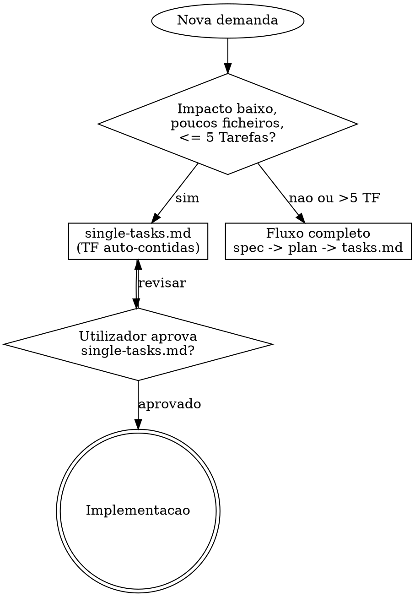
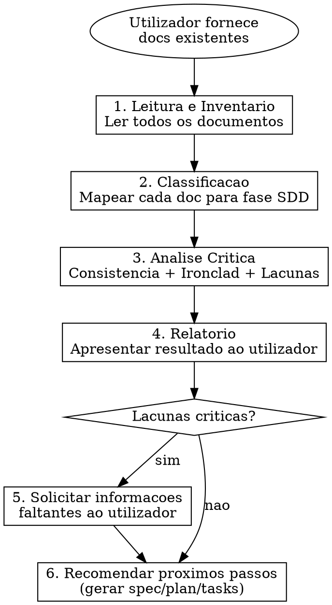
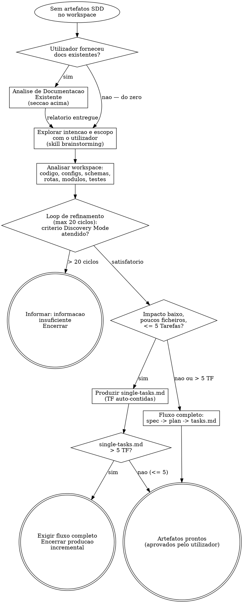
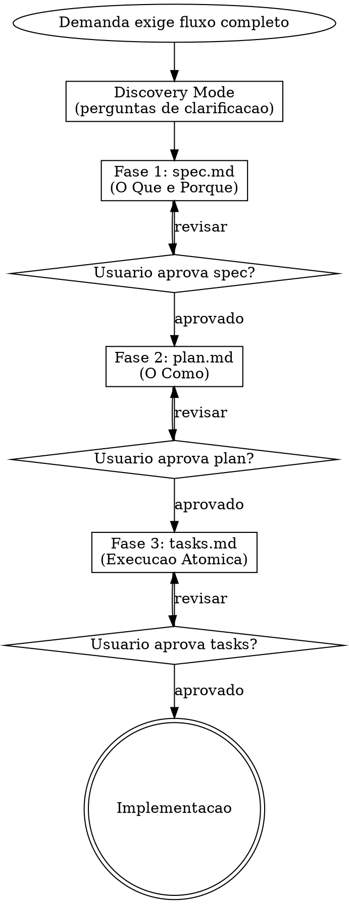
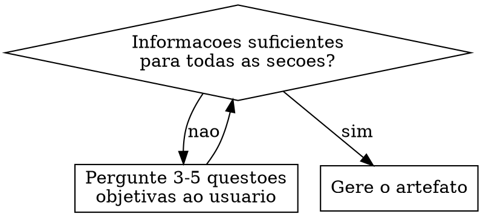

# Spec-Driven Development (SDD)

## Diretriz

**Nao gere nenhuma linha de codigo de producao antes que a intencao, a arquitetura e a execucao estejam especificadas e aprovadas pelo utilizador.** Trate a especificacao como o contrato e o codigo como a implementacao do contrato — se divergirem, registre como divida de documentacao e corrija o artefato.

No **fluxo incremental** (`single-tasks.md`), trate o proprio ficheiro aprovado como contrato: cada **Tarefa** carrega a especificacao necessaria (sem `spec.md` / `plan.md` separados).

> Fundamentos e principios inegociaveis: [philosophy.md](philosophy.md).

## Idioma

Todo o output desta skill — artefatos (`spec.md`, `plan.md`, `tasks.md`, `single-tasks.md`), relatorios, perguntas ao utilizador e diagnosticos — deve ser redigido em **Portugues do Brasil (PT-BR)**.

| Regra | Detalhe |
|-------|---------|
| **Idioma padrao** | Portugues do Brasil (PT-BR) para todo texto produzido |
| **Termos tecnicos em ingles** | Manter em ingles: endpoint, deploy, stage, commit, push, branch, merge, cache, middleware, DTO, pipeline, build, hook, draft, thread, sprint, backlog |

Termos tecnicos consagrados em ingles **nao** devem ser traduzidos — usar a forma original sem italico nem aspas (ex.: "o endpoint de healthcheck", "o deploy foi promovido para stage").

## Skills Referenciadas

Ler e seguir **obrigatoriamente** quando o contexto exigir. Nunca pular.

| Skill | Quando acionar |
|---|---|
| /scrapup:cnv | Filosofia de comunicacao (OSNP) — aplicar em especificacoes, planos e descricoes de tarefas |
| /scrapup:brainstorming | Producao de artefatos sem SDD previo (explorar intencao e escopo com utilizador) |
| /scrapup:expert-plantuml | Diagramas C4 e Sequencia na Fase 2 (plan.md) e Fase 3 (tasks.md) |
| /scrapup:expert-clickup | Sincronizar tasks.md/single-tasks.md com ClickUp |

## Quando Usar

**Fluxo completo (spec + plan + tasks.md):**
- Nova funcionalidade ou feature com impacto relevante
- Refactoring de dominio ou migracao de arquitetura
- Integracao com sistemas externos ou legados
- Criacao de consumers/workers para filas
- Qualquer mudanca que afete contratos de API (impacto em negocio: REST ou mensageria) de forma ampla — a especificacao concreta do contrato (OpenAPI/AsyncAPI) vive na Fase 2
- Qualquer demanda que exija **mais de 5 Tarefas** no backlog

**Fluxo incremental (`single-tasks.md` apenas):**
- Mudancas de **baixo impacto** em codigo: adicionar um teste, alterar uma constante, ajustes localizados em **poucos trechos** e **numero restrito de ficheiros**
- Quando **nao** houver necessidade de `spec.md` nem `plan.md` — toda a informacao necessaria cabe nas descricoes das TF (mesmo padrao de formato que em `tasks.md`)

**Regra de corte (inegociavel):** se a demanda precisar de **mais de 5 Tarefas** (`#### TF-`), **nao** use `single-tasks.md`. Use o **fluxo completo** com `spec.md`, `plan.md` e `tasks.md`.

**Nao usar para:** hotfixes triviais sem registo, correcoes de typo puras, ajustes de configuracao sem rastreio — quando nem o incremental fizer sentido, tratar como trabalho operacional fora de SDD (criterio do time).

## Escolha do fluxo



## Analise de Documentacao Existente

Ponto de entrada quando o utilizador fornece documentacao pre-existente (PRDs, specs de PM, requisitos soltos, docs do Notion, planilhas — qualquer formato) e quer diagnostico antes de gerar artefactos SDD.

**Gatilho:** utilizador fornece documentos com keywords como "analise SDD", "review spec", "analisar documentacao", "revisar feature", "avaliar requisitos", ou simplesmente aponta pasta/ficheiros com documentacao.

**Restricao:** esta fase e somente diagnostico — nunca gera artefactos SDD. A producao acontece nas fases seguintes (Producao de Artefatos ou Fluxo completo).



### 1. Leitura e Inventario

Ler **todos** os arquivos da pasta indicada. Para cada arquivo:

- Identificar o tipo (markdown, texto, JSON, YAML, etc.)
- Extrair o conteudo principal
- Registrar o nome e caminho do arquivo

Inventario no formato:

| Arquivo | Tipo | Conteudo Principal |
|---|---|---|
| `requisitos.md` | Markdown | Descricao funcional da feature |
| `api-contract.json` | JSON | Contrato OpenAPI parcial |
| `fluxo.md` | Markdown | Jornada do usuario |

### 2. Classificacao (Mapeamento para SDD)

Para cada documento, classificar qual fase SDD ele alimenta:

| Conteudo encontrado | Fase SDD | Cobertura |
|---|---|---|
| Problema, solucao, valor de negocio | Fase 1 (spec.md) | Parcial/Completa |
| Jornadas de usuario | Fase 1 (spec.md) | Parcial/Completa |
| Regras de negocio | Fase 1 (spec.md) | Parcial/Completa |
| Diagramas de arquitetura | Fase 2 (plan.md) | Parcial/Completa |
| Schemas de banco | Fase 2 (plan.md) | Parcial/Completa |
| Impacto em contrato de API (negocio: quais consumidores/operacoes afetados, sem schema) | Fase 1 (spec.md) | Parcial/Completa |
| Especificacao de contrato de API (OpenAPI/REST, AsyncAPI/fila — schema concreto) | Fase 2 (plan.md) | Parcial/Completa |
| Lista de tarefas/historias | Fase 3 (tasks.md) | Parcial/Completa |

Se o documento nao se encaixa em nenhuma fase, classificar como **contexto adicional**.

### 3. Analise Critica

Executar 3 niveis de analise:

#### 3.1 Consistencia Interna

Verificar se os documentos **nao se contradizem** entre si:

- Regras de negocio conflitantes
- Fluxos que divergem entre documentos
- Nomes/termos usados de forma inconsistente (glossario)
- Dados numericos divergentes (SLAs, limites, volumes)

#### 3.2 Validacao Ironclad

Para cada principio da Filosofia Ironclad, verificar se a documentacao **viola ou ignora**:

| Principio | O que verificar |
|---|---|
| **Trade-off Corporativo** | A solucao proposta e viavel para manutencao por um dev pleno? Existe over-engineering? |
| **Zero Trust** | Os fluxos de excecao estao mapeados? Dados externos sao validados? |
| **Resiliencia por Padrao** | Ha plano para falha de dependencias? Timeout, retry, DLQ estao previstos? |
| **Arquitetura Desacoplada** | Existe comunicacao sincrona entre servicos que deveria ser assincrona? |

#### 3.3 Deteccao de Lacunas

Verificar se **faltam informacoes criticas** para cada fase SDD:

**Para spec.md (Fase 1):**
- Problema de negocio esta claro?
- Atores/personas estao identificados?
- Jornadas do usuario estao completas?
- Regras de negocio estao listadas com limites concretos?
- Casos de borda estao mapeados?
- SLAs e volumetria estao definidos?
- Glossario de termos de dominio existe?

**Para plan.md (Fase 2):**
- Repositorio(s) afetado(s) estao identificados?
- Schemas/models estao detalhados?
- Especificacao concreta dos contratos de API (OpenAPI para REST, AsyncAPI para fila) esta definida? (o impacto em negocio do contrato pertence a Fase 1)
- Estrategia de resiliencia esta mapeada?
- Observabilidade (metricas, logs, traces) esta planejada?

**Para tasks.md (Fase 3):**
- User Stories representam entregaveis de valor demonstraveis?
- Tarefas estao atomicas (1 dominio por tarefa)?
- Sequenciamento respeita dependencias?

### 4. Relatorio de Analise

Apresentar ao utilizador um relatorio estruturado:

```markdown
# Relatorio de Analise SDD: [Nome da Feature]

## Inventario de Documentos
[Tabela do passo 1]

## Cobertura por Fase SDD

| Fase | Cobertura | Documentos Fonte |
|---|---|---|
| Fase 1 (spec.md) | [X]% | [lista de docs] |
| Fase 2 (plan.md) | [X]% | [lista de docs] |
| Fase 3 (tasks.md) | [X]% | [lista de docs] |

## Inconsistencias Encontradas

| # | Tipo | Descricao | Documentos Afetados | Severidade |
|---|---|---|---|---|
| 1 | [Conflito/Ambiguidade/Divergencia] | [descricao] | [docs] | [Critica/Alta/Media] |

## Violacoes Ironclad

| # | Principio Violado | Descricao | Recomendacao |
|---|---|---|---|
| 1 | [Principio] | [o que esta errado] | [como corrigir] |

## Lacunas de Conhecimento

| # | Fase | Informacao Faltante | Impacto | Pergunta ao Utilizador |
|---|---|---|---|---|
| 1 | [Fase X] | [o que falta] | [bloqueante/parcial] | [pergunta direta] |

## Proximos Passos Recomendados

[Recomendacao de qual fase SDD iniciar e o que precisa ser feito]
```

### 5. Solicitar Informacoes (se houver lacunas)

Para cada lacuna **bloqueante**, formular uma pergunta direta e objetiva ao utilizador. Agrupar perguntas por fase SDD. Limite de **5 perguntas por vez** — se houver mais, priorizar pelas bloqueantes e iterar.

### 6. Recomendar Proximos Passos

Com base na cobertura identificada:

- Se cobertura Fase 1 >= 80%: "Documentacao suficiente para gerar `spec.md`. Deseja que eu gere?"
- Se cobertura Fase 1 < 80%: "Faltam informacoes criticas para a spec. Responda as perguntas acima antes de avancar."
- Se Fase 1 completa e cobertura Fase 2 >= 60%: "Possivel gerar `plan.md` apos aprovacao da spec."
- Se ja existem artefatos SDD na pasta: "Documentos SDD existentes encontrados. Recomendo revisao antes de gerar novos."

### Restricoes da Analise

- **NUNCA** gerar artefactos SDD (spec/plan/tasks) durante a analise — somente diagnostico
- **NUNCA** assumir regras de negocio que nao estejam explicitas nos documentos
- **NUNCA** ignorar inconsistencias por serem "menores" — registar todas
- Se um documento estiver vazio ou ilegivel, registar no inventario e prosseguir
- O relatorio deve ser em **Portugues do Brasil (PT-BR)** (ver secao **Idioma** acima)
- Para avaliar cobertura, usar como referencia os templates de cada fase: `templates/spec-template.md`, `templates/plan-template.md`, `templates/tasks-template.md`

---

## Producao de Artefatos (sem SDD previo)

Ponto de entrada quando **nao ha artefatos SDD** no workspace (`tasks.md`, `single-tasks.md`, `spec.md`, `plan.md`) e e necessario produzir documentacao a partir do zero. Tipicamente acionado pela skill /scrapup:scrapup-forge (secao 2) quando nenhum artefato e encontrado apos busca e eventual caminho fornecido pelo utilizador.

**Responsabilidade:** esta skill (/scrapup:blueprint) e a unica responsavel por produzir artefatos SDD. Skills consumidoras (como a skill /scrapup:scrapup-forge) delegam para ca e aguardam artefatos prontos e aprovados pelo utilizador.



### Passos

0. **Analise de docs (se fornecidos):** se o utilizador forneceu documentacao existente (PRDs, specs de PM, requisitos), executar o fluxo de **Analise de Documentacao Existente** (seccao acima). O relatorio resultante alimenta o brainstorming — nao repetir perguntas que o diagnostico ja respondeu.
1. **Brainstorming:** explorar intencao e escopo com o utilizador via skill /scrapup:brainstorming — contexto, perguntas, abordagens, design aprovado. Quando o passo 0 produziu relatorio, usar a cobertura e lacunas identificadas como input.
2. **Analise de workspace:** codigo existente, configs, schemas, rotas, modulos, testes — para entender o que ja existe e evitar duplicacao
3. **Loop de refinamento** (maximo 20 ciclos):
   - Se duvidas ou inconsistencias: questionar utilizador
   - Receber resposta e re-avaliar
   - Incrementar ciclo
   - **Criterio de saida (observavel):** o planejamento e "satisfatorio" quando o criterio do **Discovery Mode** e atendido — todas as secoes do template do artefato-alvo tem informacao suficiente e nao restam placeholders bloqueantes (`[INSERIR_VALOR]` em regra de negocio, valor, faixa ou limite critico). So entao avancar para a triagem.
4. Se **20 ciclos** sem atingir o criterio de saida acima: informar utilizador que informacao e insuficiente e **encerrar**
5. **Triagem de impacto** (criterios da secao **Quando Usar** acima):
   - Baixo impacto e <= 5 TF: produzir `single-tasks.md` (fluxo incremental)
   - Alto impacto ou > 5 TF: iniciar fluxo completo (Fase 1 → 2 → 3)
6. Se **fluxo incremental**:
   - Se `single-tasks.md` ja existir: **registar** nova TF com `YY` sequencial dentro da US existente (formato padrao); para **nova** US, obter ID global via [`getNextUserStoryId.sh`](getNextUserStoryId.sh) (ver secao **Identificadores Sequenciais de User Story (Global)**)
   - Senao: **criar** `single-tasks.md` (templates US + TF; especificacao nas TF; sem `spec.md`/`plan.md` obrigatorios). Para cada User Story nova, obter o ID via [`getNextUserStoryId.sh`](getNextUserStoryId.sh) antes de redigir
7. **Gate de limite:** apos criar/atualizar `single-tasks.md`, contar blocos `#### TF-`. Se **> 5**: informar utilizador, exigir fluxo completo e **encerrar** producao incremental (nao prosseguir para implementacao)
8. Se **fluxo completo**: seguir Fases 1 → 2 → 3 conforme secoes abaixo, cada uma com aprovacao do utilizador. Na Fase 3, obter um ID via [`getNextUserStoryId.sh`](getNextUserStoryId.sh) para **cada** User Story nova antes de redigir o `tasks.md`

**Discovery Mode** (secao abaixo) aplica-se dentro de cada passo de producao — verificar informacoes suficientes antes de gerar cada artefato.

## Fluxo completo — 3 Fases



**No fluxo completo, cada fase requer aprovacao explicita do utilizador antes de avancar.**

## Estrutura de Artefatos

**Fluxo completo** — pasta tipica `/docs/specs/<nome-da-feature>/`:

```
docs/specs/<nome-da-feature>/
  spec.md      # Fase 1 — Especificacao Funcional
  plan.md      # Fase 2 — Planejamento Tecnico
  tasks.md     # Fase 3 — Backlog de Execucao Atomica
```

**Fluxo incremental** — pode coexistir com uma feature ja especificada ou viver como incremento autonomo:

```
docs/specs/<contexto>/single-tasks.md   # apenas este ficheiro obrigatorio neste fluxo
```

**`tasks.md` vs `single-tasks.md`:**

| Artefato | Pre-requisitos | Conteudo |
|---|---|---|
| **`tasks.md`** | `spec.md` e `plan.md` aprovados | User Stories + Tarefas no padrao corporativo; diagramas por US (min. C4 N2 + sequencia); DoD e prompts. |
| **`single-tasks.md`** | **Nenhum** `spec.md` / `plan.md` obrigatorio | Mesmo **formato** de marcacoes que `tasks.md` (`## US-XX`, `#### TF-XX-YY`, templates de US/TF). **Toda** a especificacao necessaria vive nas **Tarefas** (e breve contexto na US). **Maximo 5 Tarefas** no ficheiro; se exceder, migrar para fluxo completo. Diagramas PlantUML **opcionais** (usar so se remover ambiguidade). |

A skill **expert-clickup** trata ambos como fonte da verdade para sincronizacao, desde que o parseamento (US/TF) seja valido.

## Fase 1 — Especificacao Funcional (`spec.md`)

Responde ao **"O Que"** e **"Porque"**. Foco exclusivo na intencao de negocio, sem detalhes de infraestrutura ou tecnologia.

Conteudo obrigatorio:
- Visao geral e objetivo (problema, solucao, valor)
- Jornadas do usuario (fluxo narrativo passo a passo)
- Regras de negocio e restricoes
- Casos de borda e fluxos de excecao (Zero Trust)
- Criterios de sucesso e SLAs

**PROIBIDO nesta fase:** mencionar bancos de dados, linguagens, frameworks ou bibliotecas. Tecnologia pertence a Fase 2.

Para o template completo, leia [templates/spec-template.md](templates/spec-template.md).

## Fase 2 — Planejamento Tecnico (`plan.md`)

Responde ao **"Como"**. Traduz a `spec.md` em arquitetura real.

Conteudo obrigatorio:
- Visao geral da arquitetura e decisao principal
- Diagramas de solucao em PlantUML (skill /scrapup:expert-plantuml):
  - **C4 Nivel 2 (Containers)** — visao dos containers do sistema, integracoes externas e infra
  - **C4 Nivel 3 (Componentes)** — componentes internos do container principal
  - **Diagrama de Sequencia** — fluxo de sucesso e falha, incluindo chamadas de banco e mensageria
  - **Diagrama de Envelope/Rastreabilidade** (quando houver fila/mensageria) — formato da mensagem na fila, logs emitidos em cada etapa, wide events/spans e como rastrear no Grafana/Tempo
- Modelagem de dados e persistencia (schemas, indices)
- Contratos de integracao (OpenAPI para REST, AsyncAPI para filas)
- Resiliencia, seguranca e tratamento de erros
- Justificativa e trade-offs

Para sintaxe, tipos e renderizacao dos diagramas, use a skill /scrapup:expert-plantuml.

**Pre-requisito:** `spec.md` aprovada. Se faltar volumetria, gargalos ou SLAs, pergunte antes de definir abordagem sincrona vs assincrona.

Para o template completo, leia [templates/plan-template.md](templates/plan-template.md).

## Fase 3 — Execucao Atomica

### Hierarquia ClickUp (Scrum)

| Nivel | Responsavel | Descricao |
|---|---|---|
| **Epico** | Time de PM | Recebido pelo time tecnico — representa o contexto macro do que deve ser feito. O time tecnico **nao cria** epicos. |
| **User Story** | Time tecnico (refinamento) | Entregavel de valor ao produto, cadastrada no refinamento tecnico. Agrupa tarefas relacionadas. |
| **Tarefa** | Time tecnico (detalhamento) | Unidade atomica de trabalho — contem todos os detalhes para execucao e validacao pelo desenvolvedor. |

---

### Identificadores Sequenciais de User Story (Global)

IDs de User Story (`US-XX`) sao **globalmente sequenciais**: o contador atravessa **todas as execucoes e todos os projetos**. Se a execucao anterior (em qualquer projeto) emitiu `US-04`, a proxima User Story criada **em qualquer fluxo** sera `US-05`. Isso garante rastreabilidade transversal e evita colisao de identificadores entre repositorios.

**Como obter o proximo ID (inegociavel):**

```bash
bash ~/.claude/plugins/local/scrapup/skills/documentacao/blueprint/getNextUserStoryId.sh
```

O script:

- Le `LATEST_USER_STORY_ID` em `~/.claude/plugins/local/scrapup/skills/documentacao/blueprint/resources/blueprint.config.json`
- Calcula `LATEST_USER_STORY_ID + 1`, persiste o novo valor e imprime apenas o numero no stdout
- Cria o config (com `LATEST_USER_STORY_ID: 0`) se nao existir — bootstrap automatico
- Flags auxiliares: `--peek` (proximo ID sem consumir) e `--current` (ultimo ID emitido)

**Formato do identificador a partir do numero retornado:**

| Numero retornado | ID final | Regra |
|---|---|---|
| 1 a 9 | `US-01` ... `US-09` | Padding com zero a esquerda (minimo 2 digitos) |
| 10 a 99 | `US-10` ... `US-99` | Sem padding adicional |
| >= 100 | `US-100`, `US-1234` | Sem padding adicional, ID cresce naturalmente |

**Tarefas (`TF-XX-YY`):** o `XX` da Tarefa **herda exatamente** o ID da User Story pai (vindo do script). O `YY` continua **sequencial local** dentro da propria User Story (`01`, `02`, `03`...), reiniciando a cada US.

**Exemplo de aplicacao em um ficheiro de backlog (`tasks.md` ou `single-tasks.md`):**

```
1ª execucao deste projeto:
  Script retorna 1  -> US-01 (TF-01-01, TF-01-02)
  Script retorna 2  -> US-02 (TF-02-01)

Mesma execucao, mais tarde, em OUTRO projeto:
  Script retorna 3  -> US-03 (TF-03-01)

Outra execucao, qualquer projeto:
  Script retorna 4  -> US-04 (TF-04-01, TF-04-02, TF-04-03)
```

**Regras operacionais:**

- **PROIBIDO** escolher ID de User Story manualmente — invocar **sempre** [`getNextUserStoryId.sh`](getNextUserStoryId.sh) antes de redigir a US.
- **PROIBIDO** reciclar ID de US apagada — IDs sao monotonicos crescentes; um ID emitido nao volta.
- Em `tasks.md` ou `single-tasks.md` com **N** User Stories, invocar o script **N vezes** (uma por US) antes de redigir o ficheiro. Anotar os IDs obtidos antes de escrever, para nao baralhar.
- Em `single-tasks.md`, mesmo com **1 unica** US, o ID **tambem** vem do script (nao usar `US-01` por default).
- Aplica-se a ambos os fluxos: completo (`tasks.md`) e incremental (`single-tasks.md`).
- **Excecao:** quando estiver **revisando** um artefato pre-existente (US ja registadas no ficheiro), **manter** os IDs ja atribuidos — o script so e invocado para User Stories **novas**.

---

### Backlog completo — `tasks.md`

O **passo a passo** para implementacao apos `plan.md` aprovado. Fatia o plano em User Stories (entregaveis de valor) compostas por Tarefas atomicas.

**Pre-requisito:** `spec.md` e `plan.md` aprovados.

O `tasks.md` documenta **User Stories** com suas **Tarefas**. Cada User Story representa uma entrega de valor e contem Tarefas atomicas sequenciadas.

**Conteudo obrigatorio (`tasks.md`):**
- Sequenciamento topologico (schemas/DB -> conectores/consumers -> usecases -> controllers)
- User Stories agrupando Tarefas no formato padrao corporativo
- **Diagramas por User Story** (proporcionais ao escopo) — cada US deve incluir os diagramas relevantes do `plan.md`, adaptados ao escopo da historia. Criterio de proporcionalidade:
  - **C4 Nivel 2 + Sequencia (sucesso + falha) sao obrigatorios** quando a US envolve **mais de um container**, **fluxo de falha nao-trivial** (retry, DLQ, compensacao, rollback) ou **mensageria** (publicacao/consumo de fila)
  - **US de fluxo unico** (um unico container, sem mensageria, falha trivial) basta um **Diagrama de Sequencia**; o C4 N2 e dispensavel
  - Diagramas adicionais conforme o contexto (envelope de mensageria, rastreabilidade, etc.)
  - Usar a skill /scrapup:expert-plantuml para gerar os diagramas
  - Ao cadastrar no ClickUp (skill /scrapup:expert-clickup), renderizar os diagramas em PNG, fazer upload como attachment e embutir na descricao da US com titulo e descricao contextual
- Definition of Done por Tarefa
- Orientacao de Execucao por Tarefa (secao 4 do template)

**Regra de atomicidade:** cada Tarefa deve ser implementavel e testavel isoladamente. Nunca junte dominios diferentes na mesma Tarefa.

---

### Incremental — `single-tasks.md`

Artefato **sem** `spec.md` e **sem** `plan.md`. Destina-se a alteracoes de **baixo impacto** (ex.: novo teste, ajuste de constante, mudancas em poucos ficheiros e poucos trechos). E **incremental**: segue o **mesmo padrao de estrutura** que `tasks.md` (cabecalhos `## US-XX`, `#### TF-XX-YY`, campos do template de Tarefa), mas **toda a especificacao** necessaria para implementar e validar esta **dentro de cada TF** (contexto, ficheiros tocados, criterios de aceitacao, DoD, riscos locais).

**Limite:** **no maximo 5 Tarefas** (`#### TF-`) por ficheiro. A partir da **6ª** Tarefa (ou se a demanda crescer), **parar** e redirecionar para **fluxo completo** (`spec.md` + `plan.md` + `tasks.md`).

**O que nao e incremental:** novos contratos de API amplos, novos consumers/publicadores de fila, mudancas de modelo de dados multi-servico, refactors de dominio — usar fluxo completo.

**Diagramas:** **opcionais**; incluir PlantUML apenas quando reduzirem ambiguidade. Se existirem blocos `plantuml`, a **expert-clickup** trata-os como em `tasks.md`.

Para o template e criterios, leia [templates/tasks-template.md](templates/tasks-template.md).
Para o formato de User Story, leia [templates/user-story-template.md](templates/user-story-template.md).
Para o formato de Tarefa (incl. TF auto-contida), leia [templates/task-template.md](templates/task-template.md).

## Comandos

### Analise de Documentacao

Funcionalidade integrada na seccao **Analise de Documentacao Existente** acima. Nao ha comando externo — o diagnostico e executado como parte do fluxo da skill quando o utilizador fornece docs.

### Sincronizar Backlog com ClickUp (`sync-tasks`)

Apos **`tasks.md`** (Fase 3 do fluxo completo) ou **`single-tasks.md`** (fluxo incremental aprovado) estar aprovado pelo utilizador, cadastra User Stories e Tarefas no ClickUp (skill **expert-clickup**). Para `single-tasks.md`, o agente deve **validar** que o numero de TF nao excede **5** antes de sincronizar; se exceder, interromper e exigir fluxo completo.

**Gatilho:** keywords como "cadastrar historias no ClickUp", "sync ClickUp", "sincronizar tasks", "carregar backlog".

**Skill dedicada:** Esta funcionalidade e implementada pela skill /scrapup:expert-clickup.

---

## Discovery Mode

Antes de gerar qualquer artefato, verifique se possui informacoes suficientes. Se faltarem dados criticos:

1. Liste de 3 a 5 perguntas diretas e objetivas
2. Priorize perguntas sobre: casos de borda, regras de negocio, SLAs, volumetria
3. Avance para geracao do artefato **somente** quando tiver contexto adequado



**Nunca assuma regras de negocio criticas** (valores, faixas, limites) sem confirmacao do usuario. Use placeholders claros como `[INSERIR_VALOR]` se necessario.

## Restricoes Negativas (Resumo)

As restricoes mais criticas — lista completa em [philosophy.md](philosophy.md):

- PROIBIDO iniciar codigo de producao **no fluxo completo** sem `spec.md` e `plan.md` aprovados. **Excecao:** fluxo incremental com **`single-tasks.md`** aprovado, **ate 5 Tarefas**, enquadrado nos criterios de baixo impacto (secao **Incremental — single-tasks.md** acima)
- PROIBIDO pular fases no **fluxo completo** — cada fase deve ser completada e aprovada sequencialmente. O fluxo incremental **nao** substitui spec/plan quando a demanda excede o teto de 5 TF ou o impacto nao e local
- PROIBIDO usar `single-tasks.md` com **mais de 5 Tarefas** — redistribuir para `spec.md` + `plan.md` + `tasks.md`
- PROIBIDO atribuir manualmente IDs de User Story (`US-XX`) — obter **sempre** via [`getNextUserStoryId.sh`](getNextUserStoryId.sh) para manter a sequencia global (ver secao **Identificadores Sequenciais de User Story (Global)**)
- PROIBIDO usar `any` no TypeScript — use tipagem estrita ou `unknown` com Type Guards
- PROIBIDO gerar codigo sem validacao de DTO na camada de Controller ou Consumer
- NUNCA assuma que infraestrutura (Redis, RabbitMQ, Banco) esta imune a quedas
- NUNCA gere especificacoes genericas — use nomes reais quando o contexto for fornecido

## Checklist por Fase

Crie todos via TodoWrite ao iniciar cada fase:

**Analise de Documentacao Existente (se docs fornecidos):**
- [ ] Ler todos os documentos fornecidos pelo utilizador
- [ ] Criar inventario (arquivo, tipo, conteudo principal)
- [ ] Classificar conteudo por fase SDD (cobertura % por fase)
- [ ] Analisar consistencia interna (contradicoes, ambiguidades)
- [ ] Validar aderencia a Filosofia Ironclad (4 principios)
- [ ] Detectar lacunas de conhecimento por fase
- [ ] Gerar relatorio estruturado e apresentar ao utilizador
- [ ] Solicitar informacoes faltantes (max 5 perguntas por vez)
- [ ] Recomendar proximos passos (produzir spec/plan/tasks ou resolver lacunas)

**Producao de Artefatos (sem SDD previo):**
- [ ] Analise de docs (passo 0, se utilizador forneceu documentacao existente)
- [ ] Brainstorming com utilizador (skill /scrapup:brainstorming): explorar intencao, contexto, abordagens
- [ ] Analisar workspace: codigo, configs, schemas, rotas, modulos, testes
- [ ] Loop de refinamento: questionar utilizador ate informacao suficiente (max 20 ciclos)
- [ ] Triagem de impacto: decidir entre fluxo incremental (<= 5 TF) ou completo
- [ ] Produzir artefato adequado: `single-tasks.md` ou iniciar fluxo completo
- [ ] Gate de limite: verificar que `single-tasks.md` nao excede 5 TF
- [ ] Apresentar ao utilizador e aguardar aprovacao

**Fase 1 (spec.md):**
- [ ] Discovery mode — verificar informacoes suficientes
- [ ] Preencher todas as secoes do template
- [ ] Validar Zero Trust nos casos de borda
- [ ] Apresentar ao usuario e aguardar aprovacao

**Fase 2 (plan.md):**
- [ ] Verificar pre-requisitos (spec.md aprovada, volumetria definida)
- [ ] Gerar diagramas em PlantUML (skill expert-plantuml): C4 N2 (Containers), C4 N3 (Componentes), Sequencia (sucesso + falha), Envelope/Rastreabilidade (se houver fila)
- [ ] Definir contratos IDL (OpenAPI/AsyncAPI)
- [ ] Documentar estrategia de resiliencia
- [ ] Definir metricas, logs e traces de observabilidade
- [ ] Apresentar ao usuario e aguardar aprovacao

**Fase 3 — `tasks.md` (fluxo completo):**
- [ ] Verificar pre-requisitos (`plan.md` aprovada com DTOs e schemas)
- [ ] Definir User Stories (entregaveis de valor)
- [ ] Obter um ID sequencial global via [`getNextUserStoryId.sh`](getNextUserStoryId.sh) para **cada** User Story nova (ver secao **Identificadores Sequenciais de User Story (Global)**)
- [ ] Incluir diagramas por User Story proporcionais ao escopo — C4 N2 + Sequencia quando ha mais de um container, falha nao-trivial ou mensageria; US de fluxo unico basta Sequencia (reutilizar/adaptar diagramas do plan.md)
- [ ] Sequenciar Tarefas topologicamente dentro de cada User Story (`TF-XX-YY` herda `XX` da US e `YY` sequencial local)
- [ ] Gerar cada Tarefa no formato completo (template de Tarefa)
- [ ] Incluir Orientacao de Execucao por Tarefa (secao 4); avaliar necessidade de secao 4.7 (Ralph Loop) por TF
- [ ] Apresentar ao utilizador e aguardar aprovacao

**`single-tasks.md` (fluxo incremental):**
- [ ] Confirmar enquadramento: baixo impacto, poucos ficheiros/trechos; **no maximo 5 TF** — senao, mudar para fluxo completo
- [ ] Discovery minimo: esclarecer apenas duvidas bloqueantes (sem gerar `spec.md` / `plan.md`)
- [ ] Obter um ID sequencial global via [`getNextUserStoryId.sh`](getNextUserStoryId.sh) para **cada** User Story nova (mesmo se for unica) — ver secao **Identificadores Sequenciais de User Story (Global)**
- [ ] Redigir cada TF **auto-contida** (template completo): ficheiros, criterios, DoD, Orientacao de Execucao
- [ ] US com narrativa **breve**; detalhe concentrado nas TF
- [ ] Diagramas PlantUML apenas se necessarios
- [ ] Apresentar ao utilizador e aguardar aprovacao do `single-tasks.md`

## Filosofia de Engenharia

Esta skill segue a **Filosofia Ironclad** de engenharia. Para o documento completo com principios, restricoes e regras de aplicacao, leia [philosophy.md](philosophy.md).

Resumo dos principios:
1. **Trade-off Corporativo** — solidez e sustentabilidade sobre elegancia fragil
2. **Zero Trust** — validar tudo na borda, fail-fast se dado estiver sujo
3. **Resiliencia por Padrao** — sistemas vao falhar, desenhe para isso
4. **Arquitetura Desacoplada** — Event-Driven first, CQRS/ODS para baixa latencia

## Stack Padrao

| Camada | Tecnologia |
|---|---|
| Runtime | Node.js (TypeScript estrito) |
| Frameworks | NestJS ou Fastify (conforme projeto) |
| Mensageria | RabbitMQ |
| Banco principal | MongoDB (Mongoose) ou MySQL (Prisma/Sequelize) |
| Cache | Redis |
| Validacao | Zod (Fastify) ou class-validator (NestJS) |
| Logger | Logger estruturado do projeto |
| Observabilidade | OpenTelemetry |
