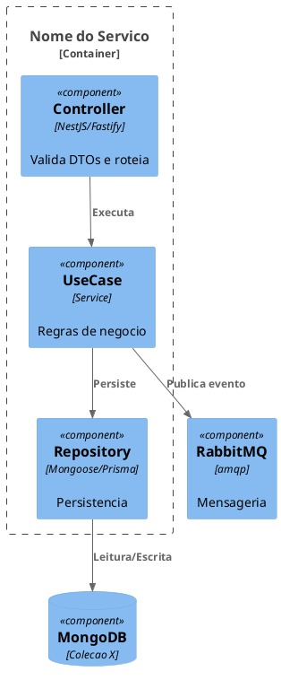
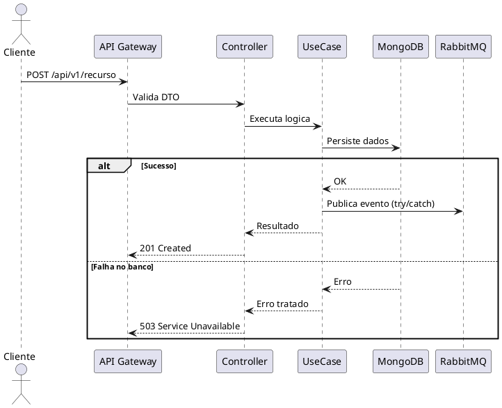

# Template: Planejamento Tecnico (plan.md) — Fase 2

## Contexto de Uso

Este template guia a criacao do artefato `plan.md`, a segunda fase do Spec-Driven Development.
O foco e na **arquitetura real**: como a especificacao sera implementada sistemicamente.

Salvar como: `/docs/specs/<nome-da-feature>/plan.md`

**Pre-requisito obrigatorio:** `spec.md` aprovada pelo usuario.

## Restricoes da Fase 2

- **PROIBIDO** escrever codigo TypeScript/JavaScript de implementacao — gere apenas Markdown, JSON schemas para DTOs e codigo PlantUML
- **NUNCA** assuma criacao de novos microsservicos sem necessidade — prefira Monolito Modular (modulos separados no mesmo deploy)
- **NUNCA** sugira `amqplib` para filas — use o cliente RabbitMQ padronizado do projeto
- **NUNCA** proponha queries `SELECT *` — restrinja aos campos necessarios
- **NUNCA** assuma protocolos de comunicacao sem documentar a IDL correspondente

## Pre-Requisitos Check

Antes de gerar o `plan.md`, verifique na `spec.md`:

1. A volumetria e gargalos de performance estao definidos?
2. Os SLAs de latencia estao claros?
3. Os casos de borda foram mapeados?

Se faltar informacao sobre volumetria ou SLAs, pergunte ao usuario **antes** de definir se a abordagem sera sincrona (HTTP) ou assincrona (Worker/Fila).

## Principios Arquiteturais

Aplique estes principios ao desenhar a solucao:

1. **Event-Driven First:** Integracoes entre sistemas legados e novos devem ser assincronas via RabbitMQ (cliente padronizado do projeto), salvo justificativa explicita
2. **Leitura Rapida (CQRS/ODS):** Se o SLA exige < 400ms, desnormalize dados em um Operational Data Store (MongoDB) para leitura, isolando writers (Workers) de readers (APIs)
3. **Resiliencia por Design:** Todo fluxo assincrono deve contemplar DLQ, politicas de Retry e Fire-and-forget. Quedas de integracoes secundarias nao podem dar rollback em operacoes principais
4. **Zero Trust:** Contratos de entrada (REST ou Filas) devem exigir validacao rigorosa (Zod ou class-validator)

---

## Template

```markdown
# Planejamento Tecnico: [Nome da Funcionalidade]

## 1. Visao Geral da Arquitetura

Resumo executivo de como a funcionalidade descrita no `spec.md` sera implementada.

- **Decisao Principal:** [Ex: Novo modulo no monorepo | Novo consumer no broker | Nova colecao no Mongo]
- **Abordagem:** [Ex: Event-Driven com ODS para leitura | REST sincrono com cache Redis]
- **Repositorio(s) Afetado(s):** [Nome exato do(s) repositorio(s)]

## 2. Diagramas de Solucao

### 2.1 Diagrama C4 — Nivel 3 (Componentes)

Mostra como as classes, services e bancos de dados interagem dentro do container.

[Gerar em PlantUML — NUNCA gerar links para imagens externas]

### 2.2 Diagrama de Sequencia

Mostra o fluxo exato incluindo chamadas de banco e despachos de mensageria.
Deve evidenciar o **caminho de sucesso** e o **caminho de falha**.

[Gerar em PlantUML]

## 3. Modelagem de Dados e Persistencia

### 3.1 Schemas/Models

[Para MongoDB — Mongoose Schema]
[Para MySQL — Tabela com campos, tipos e constraints]

| Campo | Tipo | Obrigatorio | Descricao |
|---|---|---|---|
| `_id` | ObjectId | Sim | Identificador unico |
| `[campo]` | [tipo] | [Sim/Nao] | [descricao] |
| `createdAt` | Date | Sim | Data de criacao |
| `updatedAt` | Date | Sim | Data de atualizacao |

### 3.2 Indices

| Indice | Campos | Tipo | Justificativa |
|---|---|---|---|
| `idx_[nome]` | `{ campo: 1 }` | [Unico/Composto/TTL] | [Por que este indice e necessario] |

### 3.3 Migracoes

[Descreva as migracoes necessarias se for alteracao de schema existente]

## 4. Contratos de Integracao (IDL / Interfaces)

### 4.1 APIs Sincronas (REST)

**Endpoint:** `[METHOD] /api/v1/[recurso]`

**Request:**
```json
{
  "campo": "tipo — regra de validacao"
}
```

**Response (sucesso):**
```json
{
  "campo": "tipo"
}
```

**Response (erro):**
```json
{
  "statusCode": 400,
  "error": "Bad Request",
  "message": "descricao do erro"
}
```

**Headers obrigatorios:** [Ex: `x-api-key`, `Authorization: Bearer`]

### 4.2 Mensageria (RabbitMQ)

| Propriedade | Valor |
|---|---|
| Exchange | `[nome-da-exchange]` |
| Routing Key | `[routing.key.pattern]` |
| Queue | `[nome-da-fila]` |
| DLQ | `[nome-da-fila].dlq` |
| Retry Policy | [Ex: 3 tentativas com backoff exponencial] |

**Payload (padrao do projeto):**
```json
{
  "reference": "[identificador-unico]",
  "message": {
    "campo": "tipo"
  }
}
```

## 5. Resiliencia, Seguranca e Tratamento de Erros

### 5.1 Matriz de Falhas

| Componente | Tipo de Falha | Estrategia | Impacto no Usuario |
|---|---|---|---|
| Banco de dados | Timeout/indisponivel | [Ex: Circuit Breaker + retry 3x] | [Ex: 503 com retry-after] |
| RabbitMQ | Indisponivel | [Ex: try/catch silencioso, nao bloquear transacao principal] | [Ex: Nenhum — operacao secundaria] |
| API externa | Timeout | [Ex: Timeout 3000ms + fallback cache] | [Ex: Dados stale por ate 5min] |
| Redis (cache) | Indisponivel | [Ex: Bypass cache, consultar banco direto] | [Ex: Latencia degradada] |

### 5.2 Seguranca

- Autenticacao: [Ex: JWT via middleware, API Key via header]
- Autorizacao: [Ex: RBAC, scopes]
- Validacao de entrada: [Ex: Zod schema no controller, class-validator no DTO]
- Dados sensiveis: [Ex: Nunca logar CPF, tokens, senhas]

### 5.3 Observabilidade

Defina quais metricas, logs e traces serao emitidos para monitoramento e diagnostico.

| Tipo | Nome/Pattern | Quando Emitir | Finalidade |
|---|---|---|---|
| Metrica | `[nome.metrica]` | [Evento que dispara] | [Dashboard/Alerta] |
| Log (error) | `[pattern.log]` | [Cenario de falha] | [Alerta SRE] |
| Log (info) | `[pattern.log]` | [Evento de negocio] | [Auditoria/Debug] |
| Trace | span `[nomeSpan]` | [Inicio/fim do fluxo] | [Latencia P95] |

**Ferramentas:** logger estruturado do projeto (Pino + OpenTelemetry)

## 6. Justificativa e Trade-offs

Explique **por que** esta arquitetura foi escolhida. Qual custo/beneficio foi assumido?

| Decisao | Alternativa Descartada | Justificativa |
|---|---|---|
| [Ex: Desnormalizar no Mongo] | [Ex: Ler direto do MySQL legado] | [Ex: SLA de 400ms inviavel com joins complexos] |
| [Ex: Usar RabbitMQ] | [Ex: Webhook HTTP] | [Ex: Resiliencia e retentativas nativas] |
```

---

## Dicas para Diagramas PlantUML

### C4 — Nivel 3 (Componentes)


### Sequencia (Sucesso + Falha)


Para outros tipos de diagrama e sintaxe detalhada, use a skill **expert-plantuml**.
