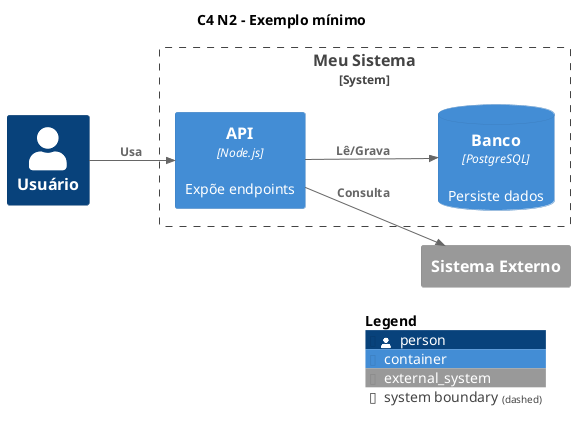

# Expert PlantUML — Diagramas em PlantUML e C4

## Propósito

Crie diagramas em notação PlantUML (UML clássico e modelo C4 via C4-PlantUML) e gere imagens PNG a partir desse código. Gere diagramas tanto a partir de arquivos `.puml` quanto **a partir de trechos selecionados** (texto escolhido pelo utilizador ou bloco markdown) — neste caso, use o fluxo canônico "a partir de trecho" (seção "Geração e renderização em PNG"): arquivo temporário para renderizar e **exclusão dos temporários** após obter o PNG.

Princípio: **O código `.puml` é a fonte da verdade. Imagens são derivadas.**

## Quando Usar

- Documentação de arquitetura (`plan.md`, ADRs)
- Fase 2 do Spec-Driven Development (diagramas C4 Nível 3 e Sequência no `plan.md`)
- `tasks.md` quando uma tarefa exigir diagrama de fluxo ou componentes
- Fluxos que anexam imagens (ex.: ClickUp via skill /scrapup:expert-clickup — produzir blocos PlantUML válidos para renderização posterior)

**Gatilhos:** "diagrama PlantUML", "diagrama C4", "diagrama de sequência", "diagrama de classe/componente/arquitetura", "renderizar diagrama em PNG", "gerar imagem deste diagrama", "gerar PNG deste trecho", ou quando a skill /scrapup:blueprint exigir "Diagramas de solução (C4 Nível 3 e Sequência em PlantUML)". Para gatilhos sobre trechos selecionados, siga o fluxo canônico "a partir de trecho" (seção "Geração e renderização em PNG").

## Escolha do Tipo de Diagrama

| Tipo | Quando usar |
|------|-------------|
| **Sequência** | Fluxo de mensagens entre atores/sistemas ao longo do tempo; caminho de sucesso e falha (SDD Fase 2). |
| **Caso de uso** | Atores e funcionalidades do sistema (use cases, include/extends). |
| **Classe** | Estrutura de classes, interfaces, relações (herança, composição, dependência). |
| **Objeto** | Instâncias e relações em um momento no tempo. |
| **Atividade** | Fluxos de processo, decisões, paralelismo, swimlanes. |
| **Componente** | Componentes e interfaces (UML). |
| **Deployment** | Nós, containers, artefatos de deploy. |
| **Estado** | Máquina de estados, transições. |
| **Timing** | Sinais ao longo do tempo (robust, binary, clock). |
| **C4 Context** | Atores e sistemas no contexto (visão mais alta). |
| **C4 Container** | Containers dentro de um sistema. |
| **C4 Component** | Componentes dentro de um container (SDD Fase 2 — Nível 3). |
| **C4 Deployment** | Deploy em nós/infra. |
| **C4 Dynamic / Sequence** | Fluxos dinâmicos ou sequência estilizada C4. |

**Para SDD Fase 2:** usar **C4 Nível 3 (Componentes)** + **Diagrama de Sequência** (sucesso + falha).

## Sintaxe Mínima por Tipo

Todo diagrama começa com `@startuml` e termina com `@enduml`.

- **Sequência:** `participant` ou `actor`, mensagens `->` (sólido) e `-->` (tracejado), blocos `alt`/`opt`/`loop` com `end`.
- **Caso de uso:** `(usecase)`, `:ator:`, setas `-->`; `.>` include, `<|--` extends.
- **Classe:** `class Nome { }`, relações `<|--` (herança), `*--` (composição), `o--` (agregação), `-->` (dependência); visibilidade `+` `-` `#`.
- **Componente:** `[componente]`, `() interface`, `..>` use, `--` link.
- **Deployment:** `node`, `cloud`, `database`, `artifact`, aninhamento com `{ }`.
- **Estado:** `[*]` início/fim, `state Nome { }`, transições `-->` com rótulo.
- **Atividade (beta):** `:ação;`, `start`/`stop`, `if`/`then`/`else`/`endif`, `fork`/`end fork`, `partition`, swimlanes `|nome|`.
- **Timing:** `concise`/`robust`/`binary`/`clock`, `@0`/`@100`, `is Estado`.

Detalhes e exemplos por tipo em [reference.md](reference.md) e em [examples/](examples/).

## C4-PlantUML

### Inclusão

- **Stdlib (recomendado, sem internet):** `!include <C4/C4_Context>` ou `C4_Container` ou `C4_Component` ou `C4_Deployment` ou `C4_Dynamic` ou `C4_Sequence`.
- **URL (sempre atualizado):** `!include https://raw.githubusercontent.com/plantuml-stdlib/C4-PlantUML/master/C4_Container.puml` (trocar pelo arquivo desejado).

### Níveis C4 (atalho prático)

- **N1 (Context):** `!include <C4/C4_Context>` + `Person`, `System`, `System_Ext`, `Rel`.
- **N2 (Container):** `!include <C4/C4_Container>` + `Container`, `ContainerDb`, `System_Boundary`, `Rel`.
- **N3 (Component):** `!include <C4/C4_Component>` + `Component`, `Container_Boundary`, `Rel`.
- **N4 (Code):** normalmente não usar C4-PlantUML; preferir UML de classe/sequence para nível de código.

### Boilerplates validados

**C4 N2 (Container) mínimo:**



### Macros principais

| Elemento | Macro (exemplo) |
|----------|------------------|
| Pessoa | `Person(alias, "Label", "?descrição")` |
| Sistema | `System(alias, "Label", "?descrição")` |
| Sistema externo | `System_Ext(...)` |
| Fronteira de sistema | `System_Boundary(alias, "Label") { ... }` |
| Container | `Container(alias, "Label", "?tecnologia", "?descrição")` |
| Container DB | `ContainerDb(alias, "Label", "?tecnologia", "?descrição")` |
| Fronteira de container | `Container_Boundary(alias, "Label") { ... }` |
| Componente | `Component(alias, "Label", "?tecnologia", "?descrição")` |
| Relação | `Rel(from, to, "label", "?tecnologia")` |
| Relação direcional | `Rel_R`, `Rel_L`, `Rel_U`, `Rel_D` |

Layout e legenda: `LAYOUT_WITH_LEGEND()` ou `SHOW_LEGEND()` quando fizer sentido.

Regras úteis para evitar erro em C4:
- Use aliases únicos (`api`, `db`, `ext`) e reutilize nas relações.
- Não misture macros C4 e sintaxe UML estrutural no mesmo bloco (`rectangle`, `node`, etc.) sem necessidade.
- Em C4, prefira `Rel(...)` em vez de setas manuais (`-->`) para consistência de estilo.

## Formato de Saída

- **Em documento:** código em bloco markdown com linguagem `plantuml`:
  ` ```plantuml ... ``` `
- **Em repositório:** arquivo `.puml` em pasta previsível (ex.: `docs/diagrams/nome.puml`).

**Regra:** Nunca gerar links para imagens externas. O código é a fonte; imagens são geradas por renderização.

## Geração e renderização em PNG

Gere diagramas a partir de trechos de código (texto selecionado, bloco markdown `plantuml` ou conteúdo colado pelo utilizador) e renderize em PNG, criando e removendo arquivos temporários quando necessário. Este é o ponto canônico do fluxo "a partir de trecho" — os demais gatilhos remetem a ele.

**Toda renderização passa pelo script [scripts/render-puml.py](scripts/render-puml.py).** Ele encapsula as regras desta seção: conta os elementos do diagrama, decide o `PLANTUML_LIMIT_SIZE` (16384 / 32768), renderiza no caminho exato pedido e nunca executa `plantuml` sem o limite. Não montar comandos `plantuml` manuais — invocar o script.

### Render automático via hook (caminho padrão)

O plugin registra um hook `PostToolUse` (`hooks/hooks.json` → `hooks/scripts/render-puml-on-change.py`) que dispara em `Edit`/`Write`/`MultiEdit`. Ao criar ou alterar um arquivo `.puml`, o hook **re-gera o PNG correspondente automaticamente** (mesmo nome/pasta) chamando `render-puml.py`. O resultado volta como `additionalContext`.

**Consequência:** não é preciso comandar o render após editar um `.puml` persistido — o hook garante o `.png` sincronizado de forma determinística. Invocar `render-puml.py` diretamente fica reservado para:

- **Override de parâmetros:** `--limit N`, ou `--check` antes de persistir.
- **Destino diferente** do padrão (segundo argumento `saida.png`).
- **Preview de trecho** sem arquivo persistido (base64, ver fluxo abaixo).
- **Falha sinalizada pelo hook** (`additionalContext` reportando erro de sintaxe) ou **ambiente sem o hook** (plugin não ativo, plantuml ausente).

### Script de renderização

```bash
python3 <skill>/scripts/render-puml.py <entrada.puml> [saida.png] [--limit N] [--check] [--quiet]
```

| Argumento / flag | Efeito |
|------------------|--------|
| `<entrada.puml>` | Arquivo PlantUML de entrada (obrigatório). |
| `[saida.png]` | Caminho do PNG. **Se omitido:** gera ao lado do `.puml`, mesmo nome com extensão `.png`. Cria o diretório se faltar. |
| `--limit N` | Força o `PLANTUML_LIMIT_SIZE`, ignorando a contagem. |
| `--check` | Valida a sintaxe (`plantuml -checkonly`) antes de renderizar. |
| `--quiet` | Imprime apenas o caminho do PNG (sem o relatório de contagem). |

**Contagem e limite (automáticos no script):** classifica declarações (nós/atores/classes/macros C4), relações `Rel`/`BiRel`, setas UML, blocos de controle e ações de atividade; `> 100` elementos → `32768`, senão → `16384`. Se a imagem ainda sair cortada, forçar `--limit 32768` (ou mais).

**Exit codes:** `0` sucesso · `2` erro de uso/arquivo · `3` `plantuml` ausente no PATH · `4` falha de render/sintaxe (PNG vazio é removido). Em `3`, avisar o utilizador e entregar apenas o código (não falhar a tarefa).

### Quando renderizar

- Utilizador pede imagem PNG do diagrama (visualizar, anexar, incorporar em doc).
- Fluxo exige PNG (ex.: documentação, anexo em ferramenta).
- Utilizador seleciona um trecho PlantUML e pede para gerar o diagrama ou a imagem.

### Fluxo a partir de arquivo .puml existente

1. Criar/editar o `.puml` com Write/Edit — o hook re-gera o PNG ao lado, mesmo nome, automaticamente.
2. Invocar `render-puml.py` diretamente só nos casos reservados acima (override `--limit`/`--check`, destino específico via `saida.png`, ou hook indisponível).

### Fluxo a partir de trecho (sem arquivo .puml persistido)

1. **Obter o código:** do trecho selecionado pelo utilizador, de um bloco ` ```plantuml ... ``` ` no contexto, ou do conteúdo que o utilizador colou. Garantir que tenha `@startuml` e `@enduml`; se faltar, envolver o trecho.
2. **Escrever em arquivo temporário:** `mkdir -p /tmp/expert-plantuml` e gravar em `/tmp/expert-plantuml/<identificador>.puml` (nome único por timestamp ou hash).
3. **Renderizar:** `python3 <skill>/scripts/render-puml.py /tmp/expert-plantuml/<identificador>.puml --check` (o PNG sai no mesmo diretório).
4. **Entregar o PNG:** informar o caminho, exibir inline se o contexto permitir, ou gerar base64 para anexar noutra ferramenta: `base64 -i /tmp/expert-plantuml/<identificador>.png | tr -d '\n'`.
5. **Limpeza obrigatória:** excluir o `.puml` temporário (`rm /tmp/expert-plantuml/<identificador>.puml`). Se o PNG foi apenas para visualização/anexo único, excluir também o `.png`; se o utilizador pediu para guardar o PNG, mover/copiar para o destino antes de remover o temporário.

### Limite de tamanho da imagem

O PlantUML tem um limite padrão de **4096 pixels** de largura/altura. Diagramas grandes (activity flows longos, diagramas C4 com muitos elementos) são **cortados silenciosamente** sem erro. O script sempre aplica `-DPLANTUML_LIMIT_SIZE` (nunca renderiza sem) e escolhe o valor pela contagem:

| Cenário | Limite aplicado |
|---------|-------------------|
| Diagramas simples / médios (≤ 100 elementos) | 16384 |
| Diagramas muito grandes (> 100 elementos) | 32768 |

**Critério observável de corte:** após renderizar, inspecione a dimensão do PNG (ex.: `sips -g pixelWidth -g pixelHeight <png>` no macOS, ou `identify` do ImageMagick). Se a largura **ou** a altura igualar exatamente o `PLANTUML_LIMIT_SIZE` aplicado, o diagrama foi truncado no limite — re-renderize forçando `--limit 32768` (ou maior). Para um trecho ainda não persistido, valide a sintaxe com `--check` antes de gravar o PNG final.

### Regras

- **PNG sempre sincronizado:** o `.png` deve estar atualizado com o `.puml` em todos os momentos. Em sessão com o plugin ativo, o hook `PostToolUse` garante isso automaticamente ao editar o `.puml` — não comandar render manual. Só renderizar explicitamente (via `scripts/render-puml.py`) nos casos reservados na subseção "Render automático via hook" (override, destino diferente, trecho, ou hook indisponível).
- **ClickUp:** não implementar lógica específica de anexo no ClickUp; a skill /scrapup:expert-clickup é responsável por renderizar blocos e anexar nas tasks. Garanta apenas que o código seja válido e renderizável, gerando o PNG a partir de trechos com arquivos temporários e exclusão posterior (fluxo "a partir de trecho").
- **Sempre limpar:** ao usar `/tmp/expert-plantuml/`, excluir o `.puml` temporário após a renderização; excluir o `.png` temporário quando não for persistido noutro lugar.

## Troubleshooting C4 (atualizado)

Quando aparecer `Some diagram description contains errors`:

1. Confirmar que o include combina com o nível (`C4_Context`, `C4_Container`, `C4_Component`).
2. Rodar `plantuml -checkonly arquivo.puml` para localizar linha exata.
3. Verificar se todas as relações `Rel` usam aliases existentes.
4. Reduzir para boilerplate mínimo C4 e reintroduzir elementos aos poucos.
5. Se a stdlib local falhar, testar include por URL do C4-PlantUML e renderizar novamente.

Checklist rápido de compatibilidade:
- `!include <C4/C4_*>` disponível no ambiente atual.
- Macros corretas para o nível escolhido (N1/N2/N3).
- `@startuml` e `@enduml` presentes.
- Nenhum alias duplicado.

## Integração

- **/scrapup:blueprint:** na Fase 2 (`plan.md`), seguir o padrão do plan-template de /scrapup:blueprint — Diagrama C4 Nível 3 (Componentes) e Diagrama de Sequência (sucesso + falha). Invocar /scrapup:blueprint para obter o template canônico; usar os exemplos da sua seção "Dicas para Diagramas PlantUML" como referência. Sintaxe adicional em [reference.md](reference.md) e [examples/](examples/).
- **expert-clickup:** produzir blocos ` ```plantuml ... ``` ` válidos (com `@startuml`/`@enduml`) para que a skill expert-clickup possa extrair, renderizar e anexar no ClickUp.

## Referências

- Documentação oficial: [plantuml.com](https://plantuml.com/) (Sequence, Use Case, Class, Component, Deployment, State, Activity, Timing).
- C4-PlantUML: [plantuml-stdlib.github.io/C4-PlantUML](https://plantuml-stdlib.github.io/C4-PlantUML/).
- Sintaxe detalhada por tipo: [reference.md](reference.md).
- Exemplos mínimos: [examples/](examples/).
- Diagrama de atividade desta skill (exemplo `.puml` + PNG renderizado): [diagrams/](diagrams/).
