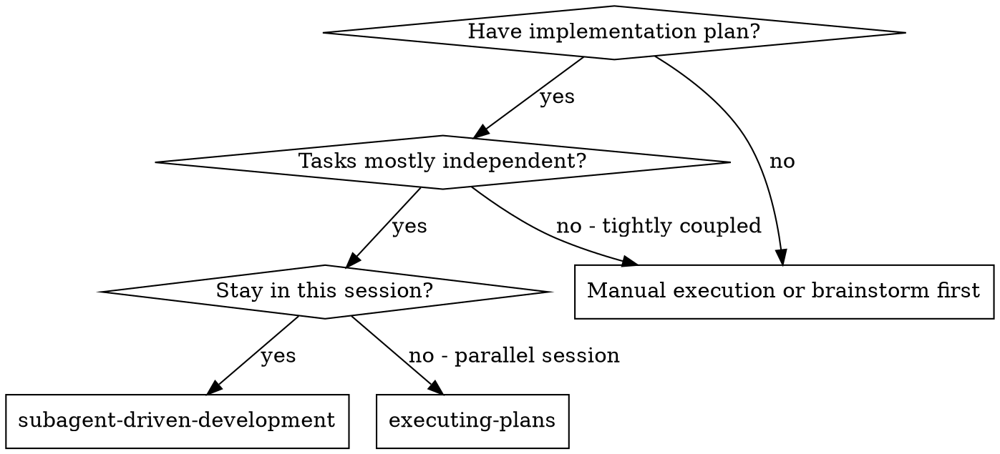
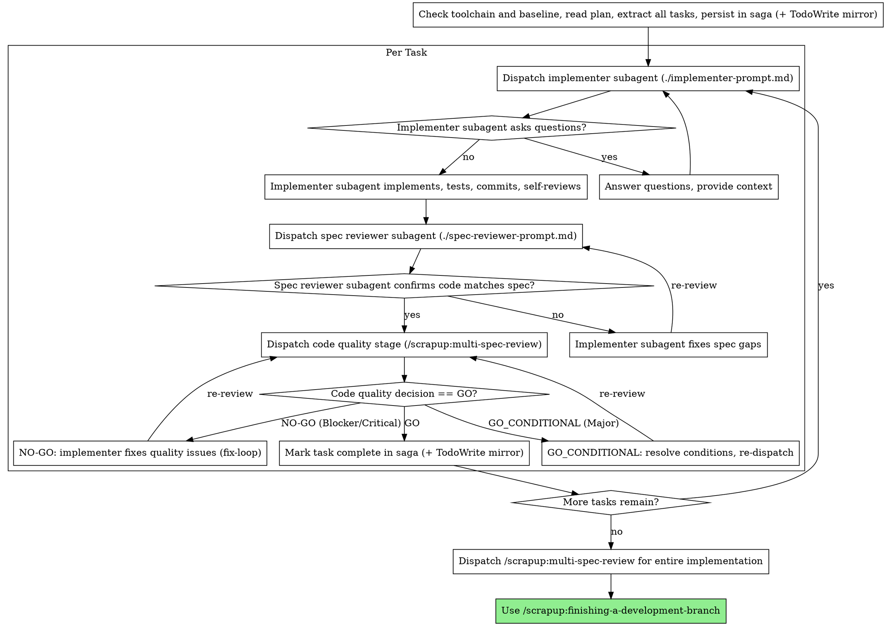

# Subagent-Driven Development

Execute plan by dispatching fresh subagent per task, with two-stage review after each: spec compliance review first, then code quality review.

**Core principle:** Fresh subagent per task + two-stage review (spec then quality) = high quality, fast iteration

## Alinhamento ao ecossistema scrapup (autoritativo)

No ecossistema scrapup, esta skill segue a governança canônica abaixo, que **sobrepõe** os prompts genéricos das secções seguintes:

- **Readiness:** antes de despachar o primeiro implementer, verificar o toolchain e o baseline: ler `package.json` (scripts `test` e `lint`), rodar ambos uma vez no estado limpo e registrar o resultado no saga (nota `baseline`, tipo `context`); não implementar se estiver vermelho sem decisão do utilizador.
- **Implementação:** o implementer subagent segue /scrapup:test-driven-agentic-development (IMPACT → VERIFY → CORRECT → cobertura), **não** TDD genérico.
- **Review de qualidade:** usar /scrapup:multi-spec-review (9 lentes) como etapa de qualidade — por tarefa quando o escopo justificar e como review final consolidado. A revisão de **spec compliance** por tarefa permanece (confirma a fatia do plano). O multi-spec-review emite `decision = GO | GO_CONDITIONAL | NO-GO` (não `approve`/`request_changes`); o controlador mapeia: **GO** → fecha a tarefa; **GO_CONDITIONAL** (há Major) → resolver as condições e re-despachar antes de marcar completa; **NO-GO** (há Blocker/Critical) → fix-loop obrigatório até GO.
- **Estado:** progresso, decisões e handoffs persistem no `mcp-saga` (fonte canônica via /scrapup:saga-session); `TodoWrite` é espelho local opcional, nunca a verdade.
- **Fronteira:** para TF/US do fluxo SDD, preferir /scrapup:forge (que executa cada TF em contexto limpo). Esta skill é para **planos escritos genéricos** executados na sessão atual.

## When to Use



**vs. Executing Plans (parallel session):**
- Same session (no context switch)
- Fresh subagent per task (no context pollution)
- Two-stage review after each task: spec compliance first, then code quality
- Faster iteration (no human-in-loop between tasks)

## The Process

**Precondition — plan must be sliceable (abstain otherwise):** after reading the plan, confirm it yields discrete tasks that are independent enough to dispatch one per subagent. If the plan has no extractable tasks, or its steps are too tightly coupled to run in isolation, **stop** — do not invent a slicing. Refer back to /scrapup:writing-plans to produce a properly sliced plan, then resume.



## Prompt Templates

- `./implementer-prompt.md` — **[active]** Dispatch implementer subagent (follows /scrapup:test-driven-agentic-development)
- `./spec-reviewer-prompt.md` — **[active]** Dispatch spec compliance reviewer subagent (per-task stage, always kept)
- `./code-quality-reviewer-prompt.md` — **[conditional]** Generic code-quality reviewer. Superseded inside the scrapup ecosystem by /scrapup:multi-spec-review; use only outside it.

**Selection criterion (code quality stage) — observable, not by preference:**

| Condition (check it, do not guess) | Code-quality reviewer to dispatch |
|------------------------------------|-----------------------------------|
| The repo is the scrapup plugin, OR `/scrapup:multi-spec-review` is invocable (skill resolves), OR canonical governance applies | `/scrapup:multi-spec-review` (9 lenses) — `./code-quality-reviewer-prompt.md` is NOT used |
| Running this skill standalone outside the plugin AND `/scrapup:multi-spec-review` does not resolve | `./code-quality-reviewer-prompt.md` |

If unsure whether `/scrapup:multi-spec-review` resolves, attempt it first; fall back to the generic template only on a hard unavailability.

## Example Workflow

```
You: I'm using Subagent-Driven Development to execute this plan.

[Read plan file once: docs/plans/feature-plan.md]
[Extract all 5 tasks with full text and context]
[Create TodoWrite with all tasks]

Task 1: Hook installation script

[Get Task 1 text and context (already extracted)]
[Dispatch implementation subagent with full task text + context]

Implementer: "Before I begin - should the hook be installed at user or system level?"

You: "User level (~/.config/superpowers/hooks/)"

Implementer: "Got it. Implementing now..."
[Later] Implementer:
  - Implemented install-hook command
  - Added tests, 5/5 passing
  - Self-review: Found I missed --force flag, added it
  - Committed

[Dispatch spec compliance reviewer]
Spec reviewer: ✅ Spec compliant - all requirements met, nothing extra

[Get git SHAs, dispatch /scrapup:multi-spec-review for the task diff]
multi-spec-review: decision=GO. Strengths: good test coverage, clean. No blocking findings.

[Mark Task 1 complete]

Task 2: Recovery modes

[Get Task 2 text and context (already extracted)]
[Dispatch implementation subagent with full task text + context]

Implementer: [No questions, proceeds]
Implementer:
  - Added verify/repair modes
  - 8/8 tests passing
  - Self-review: All good
  - Committed

[Dispatch spec compliance reviewer]
Spec reviewer: ❌ Issues:
  - Missing: Progress reporting (spec says "report every 100 items")
  - Extra: Added --json flag (not requested)

[Implementer fixes issues]
Implementer: Removed --json flag, added progress reporting

[Spec reviewer reviews again]
Spec reviewer: ✅ Spec compliant now

[Get git SHAs, dispatch /scrapup:multi-spec-review for the task diff]
multi-spec-review: decision=GO_CONDITIONAL. Finding (Major): magic number (100). Condition: extract constant.

[Implementer resolves the condition before marking the task complete]
Implementer: Extracted PROGRESS_INTERVAL constant

[Re-dispatch /scrapup:multi-spec-review]
multi-spec-review: decision=GO

[Mark Task 2 complete]

...

[After all tasks]
[Dispatch final /scrapup:multi-spec-review for the entire implementation]
multi-spec-review: decision=GO. All requirements met, ready to merge

Done!
```

## Advantages

**vs. Manual execution:**
- Subagents follow TDAD naturally (/scrapup:test-driven-agentic-development)
- Fresh context per task (no confusion)
- Parallel-safe (subagents don't interfere)
- Subagent can ask questions (before AND during work)

**vs. Executing Plans:**
- Same session (no handoff)
- Continuous progress (no waiting)
- Review checkpoints automatic

**Efficiency gains:**
- No file reading overhead (controller provides full text)
- Controller curates exactly what context is needed
- Subagent gets complete information upfront
- Questions surfaced before work begins (not after)

**Quality gates:**
- Self-review catches issues before handoff
- Two-stage review: spec compliance, then code quality
- Review loops ensure fixes actually work
- Spec compliance prevents over/under-building
- Code quality ensures implementation is well-built

**Cost:**
- More subagent invocations (implementer + 2 reviewers per task)
- Controller does more prep work (extracting all tasks upfront)
- Review loops add iterations
- But catches issues early (cheaper than debugging later)

## Red Flags

**Never:**
- Start implementation on main/master branch without explicit user consent (a worktree is REQUIRED to keep the branch isolated and recoverable)
- Skip reviews (spec compliance OR code quality) (each gate catches a distinct class of defect; skipping one ships it)
- Proceed with unfixed issues (an open finding is an unmet requirement, not a deferral)
- Dispatch multiple implementation subagents in parallel (conflicts — concurrent writes corrupt shared files and commits)
- Make subagent read plan file (provide full text instead — file reads pollute context and cost a round-trip)
- Skip scene-setting context (subagent needs to understand where task fits, or it solves the wrong problem)
- Ignore subagent questions (answer before letting them proceed — an unanswered question becomes a guessed assumption)
- Accept "close enough" on spec compliance (spec reviewer found issues = not done)
- Skip review loops (reviewer found issues = implementer fixes = review again)
- Let implementer self-review replace actual review (both are needed — the author is blind to their own gaps)
- **Start code quality review before spec compliance is ✅** (wrong order — polishing code that solves the wrong problem wastes the loop)
- Move to next task while either review has open issues (an unfinished task compounds into the next one)

**If subagent asks questions:**
- Answer clearly and completely
- Provide additional context if needed
- Don't rush them into implementation

**If reviewer finds issues:**
- Implementer (same subagent) fixes them
- Reviewer reviews again
- Repeat until approved
- Don't skip the re-review

**If subagent fails task:**
- Dispatch fix subagent with specific instructions
- Don't try to fix manually (context pollution)

## Integration

**Required workflow skills:**
- **/scrapup:using-git-worktrees** - REQUIRED: Set up isolated workspace before starting
- **/scrapup:writing-plans** - Creates the plan this skill executes
- **/scrapup:multi-spec-review** - Canonical quality review (9 lentes); per-task quando o escopo justificar e como review final
- **/scrapup:saga-session** - Canonical state (tasks, decisões, handoffs) in `mcp-saga`
- **/scrapup:finishing-a-development-branch** - Complete development after all tasks

**Subagents should use:**
- **/scrapup:test-driven-agentic-development** - Implementer subagents follow TDAD (IMPACT → VERIFY → CORRECT → cobertura) for each task

**Alternative workflow:**
- **/scrapup:executing-plans** - Use for parallel session instead of same-session execution
