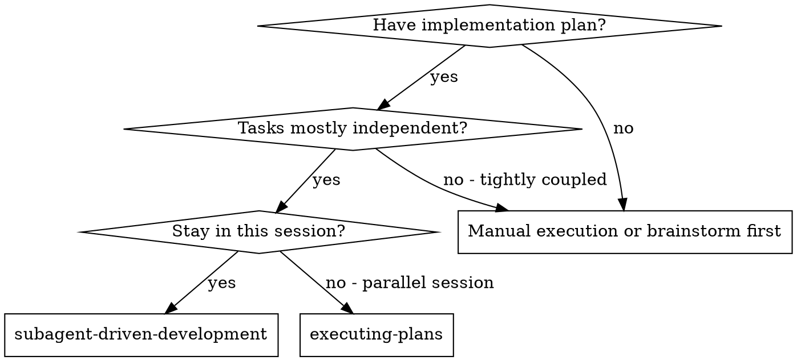
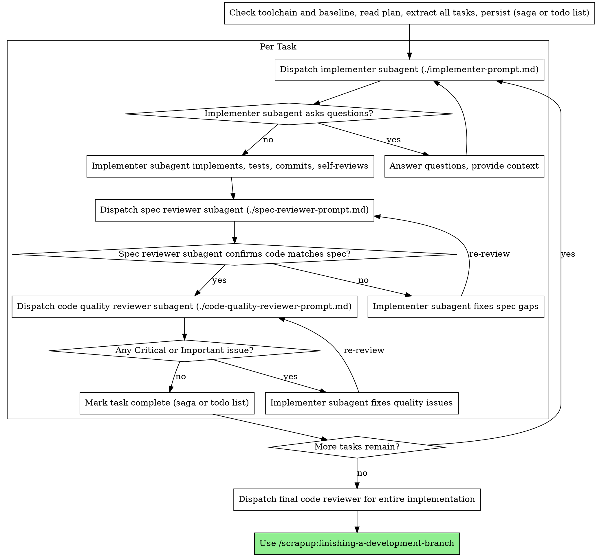

# Subagent-Driven Development

Execute plan by dispatching fresh subagent per task, with two-stage review after each: spec compliance review first, then code quality review.

**Core principle:** Fresh subagent per task + two-stage review (spec then quality) = high quality, fast iteration

**Scope:** generic written plans executed in the current session. For TF/US of the SDD flow, use /scrapup:forge (runs each TF in a clean context).

## When to Use


```dot
digraph when_to_use {
    "Have implementation plan?" [shape=diamond];
    "Tasks mostly independent?" [shape=diamond];
    "Stay in this session?" [shape=diamond];
    "subagent-driven-development" [shape=box];
    "executing-plans" [shape=box];
    "Manual execution or brainstorm first" [shape=box];

    "Have implementation plan?" -> "Tasks mostly independent?" [label="yes"];
    "Have implementation plan?" -> "Manual execution or brainstorm first" [label="no"];
    "Tasks mostly independent?" -> "Stay in this session?" [label="yes"];
    "Tasks mostly independent?" -> "Manual execution or brainstorm first" [label="no - tightly coupled"];
    "Stay in this session?" -> "subagent-driven-development" [label="yes"];
    "Stay in this session?" -> "executing-plans" [label="no - parallel session"];
}
```

**vs. Executing Plans (parallel session):**
- Same session (no context switch)
- Fresh subagent per task (no context pollution)
- Two-stage review after each task: spec compliance first, then code quality
- Faster iteration (no user checkpoint between tasks unless BLOCKED or escalated)

## The Process

**Readiness (before the first implementer):** read `package.json` (`test` and `lint` scripts), run both once on the clean tree and record the result as the `baseline`. Persist in saga via /scrapup:saga-session when available; otherwise track in the agent's todo list and record the baseline in the controller context. If the baseline is red, do not implement without a decision from the user (Architect-Validator).

**State:** task progress, decisions and handoffs follow the same rule — saga via /scrapup:saga-session when available; otherwise the agent's todo list plus the controller context.

**Precondition — plan must be sliceable (abstain otherwise):** after reading the plan, confirm it yields discrete tasks that are independent enough to dispatch one per subagent. If the plan has no extractable tasks, or its steps are too tightly coupled to run in isolation, **stop** — do not invent a slicing. Refer back to /scrapup:writing-plans to produce a properly sliced plan, then resume.


```dot
digraph process {
    rankdir=TB;

    subgraph cluster_per_task {
        label="Per Task";
        "Dispatch implementer subagent (./implementer-prompt.md)" [shape=box];
        "Implementer subagent asks questions?" [shape=diamond];
        "Answer questions, provide context" [shape=box];
        "Implementer subagent implements, tests, commits, self-reviews" [shape=box];
        "Dispatch spec reviewer subagent (./spec-reviewer-prompt.md)" [shape=box];
        "Spec reviewer subagent confirms code matches spec?" [shape=diamond];
        "Implementer subagent fixes spec gaps" [shape=box];
        "Dispatch code quality reviewer subagent (./code-quality-reviewer-prompt.md)" [shape=box];
        "Any Critical or Important issue?" [shape=diamond];
        "Implementer subagent fixes quality issues" [shape=box];
        "Mark task complete (saga or todo list)" [shape=box];
    }

    "Check toolchain and baseline, read plan, extract all tasks, persist (saga or todo list)" [shape=box];
    "More tasks remain?" [shape=diamond];
    "Dispatch final code reviewer for entire implementation" [shape=box];
    "Use /scrapup:finishing-a-development-branch" [shape=box style=filled fillcolor=lightgreen];

    "Check toolchain and baseline, read plan, extract all tasks, persist (saga or todo list)" -> "Dispatch implementer subagent (./implementer-prompt.md)";
    "Dispatch implementer subagent (./implementer-prompt.md)" -> "Implementer subagent asks questions?";
    "Implementer subagent asks questions?" -> "Answer questions, provide context" [label="yes"];
    "Answer questions, provide context" -> "Dispatch implementer subagent (./implementer-prompt.md)";
    "Implementer subagent asks questions?" -> "Implementer subagent implements, tests, commits, self-reviews" [label="no"];
    "Implementer subagent implements, tests, commits, self-reviews" -> "Dispatch spec reviewer subagent (./spec-reviewer-prompt.md)";
    "Dispatch spec reviewer subagent (./spec-reviewer-prompt.md)" -> "Spec reviewer subagent confirms code matches spec?";
    "Spec reviewer subagent confirms code matches spec?" -> "Implementer subagent fixes spec gaps" [label="no"];
    "Implementer subagent fixes spec gaps" -> "Dispatch spec reviewer subagent (./spec-reviewer-prompt.md)" [label="re-review"];
    "Spec reviewer subagent confirms code matches spec?" -> "Dispatch code quality reviewer subagent (./code-quality-reviewer-prompt.md)" [label="yes"];
    "Dispatch code quality reviewer subagent (./code-quality-reviewer-prompt.md)" -> "Any Critical or Important issue?";
    "Any Critical or Important issue?" -> "Implementer subagent fixes quality issues" [label="yes"];
    "Implementer subagent fixes quality issues" -> "Dispatch code quality reviewer subagent (./code-quality-reviewer-prompt.md)" [label="re-review"];
    "Any Critical or Important issue?" -> "Mark task complete (saga or todo list)" [label="no"];
    "Mark task complete (saga or todo list)" -> "More tasks remain?";
    "More tasks remain?" -> "Dispatch implementer subagent (./implementer-prompt.md)" [label="yes"];
    "More tasks remain?" -> "Dispatch final code reviewer for entire implementation" [label="no"];
    "Dispatch final code reviewer for entire implementation" -> "Use /scrapup:finishing-a-development-branch";
}
```

## Prompt Templates

- `./implementer-prompt.md` — **[active]** Dispatch implementer subagent (follows /scrapup:test-driven-agentic-development)
- `./spec-reviewer-prompt.md` — **[active]** Dispatch spec compliance reviewer subagent (per-task stage, always kept)
- `./code-quality-reviewer-prompt.md` — **[active]** Dispatch code quality reviewer subagent (fills /scrapup:requesting-code-review `code-reviewer.md`)

**Mapping the code-quality result:** any Critical or Important issue → implementer fixes, then re-review; otherwise (only Minor, or none) → mark the task complete. Treat `Ready to merge: Invalid range` as a dispatch error: fix the SHAs and re-dispatch.

**Spec-review result:** `verdict: COMPLIANT` → proceed to code quality; `ISSUES` → implementer fixes, then re-review; `CANNOT_VERIFY` → resolve the cause (wrong range, code not committed) before re-dispatching.

## Example Workflow

```
You: I'm using Subagent-Driven Development to execute this plan.

[Read plan file once: docs/plans/feature-plan.md]
[Extract all 5 tasks with full text and context]
[Persist all tasks (saga via /scrapup:saga-session, or the todo list)]

Task 1: Hook installation script

[Get Task 1 text and context (already extracted)]
[Dispatch implementation subagent with full task text + context]

Implementer: "Before I begin - should the hook be installed at user or system level?"

You: "User level (~/.config/<tool>/hooks/)"

Implementer: "Got it. Implementing now..."
[Later] Implementer:
  - Implemented install-hook command
  - Added tests, 5/5 passing
  - Self-review: Found I missed --force flag, added it
  - Committed

[Dispatch spec compliance reviewer]
Spec reviewer: verdict: COMPLIANT - all requirements met, nothing extra

[Get git SHAs, dispatch code quality reviewer (./code-quality-reviewer-prompt.md)]
Code reviewer: Strengths: good test coverage, clean. Issues: none. Ready to merge: Yes

[Mark Task 1 complete]

Task 2: Recovery modes

[Get Task 2 text and context (already extracted)]
[Dispatch implementation subagent with full task text + context]

Implementer: [No questions, proceeds]
Implementer:
  - Added verify/repair modes
  - 8/8 tests passing
  - Self-review: All good
  - Committed

[Dispatch spec compliance reviewer]
Spec reviewer: verdict: ISSUES
  - Missing: Progress reporting (spec says "report every 100 items") (recovery.ts:42)
  - Extra: Added --json flag (not requested) (cli.ts:17)

[Implementer fixes issues]
Implementer: Removed --json flag, added progress reporting

[Spec reviewer reviews again]
Spec reviewer: verdict: COMPLIANT

[Get git SHAs, dispatch code quality reviewer (./code-quality-reviewer-prompt.md)]
Code reviewer: Issues: Important (Should Fix): magic number (100) (recovery.ts:42). Ready to merge: With fixes

[Implementer fixes the Important issue before the task is marked complete]
Implementer: Extracted PROGRESS_INTERVAL constant

[Re-dispatch code quality reviewer]
Code reviewer: Issues: none. Ready to merge: Yes

[Mark Task 2 complete]

...

[After all tasks]
[Dispatch final code reviewer for the entire implementation]
Code reviewer: All requirements met. Ready to merge: Yes

Done!
```

## Advantages

- Fresh context per task (no confusion); the controller provides full task text, so subagents do not read the plan file
- Subagents can ask questions before and during work
- Two-stage review (spec compliance, then code quality) catches over/under-building and poor implementation early
- Cost: implementer + 2 reviewers per task, plus review loops — cheaper than debugging later

## Red Flags

**Never:**
- Start implementation on main/master branch without explicit user consent (a worktree is REQUIRED to keep the branch isolated and recoverable)
- Skip reviews (spec compliance OR code quality) (each gate catches a distinct class of defect; skipping one ships it)
- Proceed with unfixed issues (an open finding is an unmet requirement, not a deferral)
- Dispatch multiple implementation subagents in parallel (conflicts — concurrent writes corrupt shared files and commits)
- Make subagent read plan file (provide full text instead — file reads pollute context and cost a round-trip)
- Skip scene-setting context (subagent needs to understand where task fits, or it solves the wrong problem)
- Ignore subagent questions (answer before letting them proceed — an unanswered question becomes a guessed assumption)
- Accept "close enough" on spec compliance (spec reviewer found issues = not done)
- Skip review loops (reviewer found issues = implementer fixes = review again)
- Let implementer self-review replace actual review (both are needed — the author is blind to their own gaps)
- **Start code quality review before spec compliance is `COMPLIANT`** (wrong order — polishing code that solves the wrong problem wastes the loop)
- Move to next task while either review has open issues (an unfinished task compounds into the next one)

**If subagent asks questions:**
- Answer clearly and completely
- Provide additional context if needed
- Don't rush them into implementation

**If reviewer finds issues:**
- Implementer (same subagent) fixes them
- Reviewer reviews again
- Repeat until approved
- Don't skip the re-review
- After 3 fix cycles without convergence, stop and escalate to the user (Architect-Validator) with the open issues

**If implementer reports BLOCKED:**
- Report to the user (Architect-Validator) with the blocker reason; do not proceed to the next task

**If subagent fails task (not BLOCKED):**
- Dispatch fix subagent with specific instructions
- Don't try to fix manually (context pollution)

## Integration

**Required workflow skills:**
- **/scrapup:using-git-worktrees** - REQUIRED: Set up isolated workspace before starting
- **/scrapup:writing-plans** - Creates the plan this skill executes
- **/scrapup:requesting-code-review** - Code-quality review template (`code-reviewer.md`), per task and as the final review
- **/scrapup:saga-session** - State (tasks, decisions, handoffs) when available; otherwise the agent's todo list
- **/scrapup:finishing-a-development-branch** - Complete development after all tasks

**Subagents should use:**
- **/scrapup:test-driven-agentic-development** - Implementer subagents follow TDAD for each task

**Alternative workflow:**
- **/scrapup:executing-plans** - Use for parallel session instead of same-session execution
