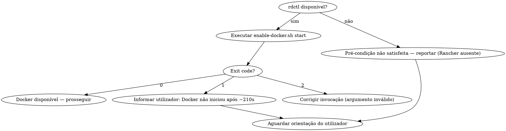

# Enable Docker Server

Garanta que o Docker daemon está disponível, iniciando o Rancher Desktop via `rdctl start` quando necessário.

**Pré-condição de plataforma:** macOS com Rancher Desktop instalado (binário `rdctl` no PATH). Em outras plataformas ou sem Rancher, o `rdctl start` falha silenciosamente e a skill não tem como iniciar o daemon — ver tratamento em "Fluxo do Agente".

## Quando Usar

- Antes de qualquer operação que dependa do Docker (build, compose, pull, run)
- Quando um comando falhar por Docker daemon indisponível
- Na **inicialização da demanda**, orquestrada pela skill /scrapup:baseline-assessment (que avalia readiness do ambiente). A skill /scrapup:scrapup-forge **não** invoca esta skill diretamente — delega à baseline-assessment
- Ao iniciar containers de teste ou desenvolvimento

## Quando NÃO Usar

- Docker já confirmado como online na sessão atual (não re-verificar a cada comando)
- Ambiente CI/CD onde Docker é gerido externamente
- Plataforma sem Rancher Desktop / sem `rdctl` (Linux, macOS com Docker Desktop ou colima): o modo `start` não consegue iniciar o daemon

## Modos de Operação

Nas tabelas e exemplos abaixo, `./enable-docker.sh` é abreviação do caminho absoluto do script (o cwd reseta entre chamadas; sempre invocar pelo caminho absoluto — ver "Execução"):

`~/.claude/plugins/local/scrapup/skills/utilitarios/enable-docker-server/enable-docker.sh`

| Modo | Comando | Comportamento |
|------|---------|---------------|
| **check** | `./enable-docker.sh check` | Retorna `DOCKER_STATUS=online` (exit 0) ou `DOCKER_STATUS=offline` (exit 1). Não tenta iniciar. |
| **start** | `./enable-docker.sh start` | Verifica; se offline, executa `rdctl start` + polling até Docker responder ou esgotar tentativas. |

Sem argumento, o modo padrão é `start`. Argumento inválido (qualquer valor ≠ `check`/`start`) imprime o uso e retorna **exit 2**.

## Configuração

Variáveis de ambiente com valores padrão no script. Alterar apenas no script se o padrão não servir.

| Variável | Padrão | Descrição |
|----------|--------|-----------|
| `DOCKER_INITIAL_WAIT` | `60` | Segundos de espera inicial após `rdctl start`, antes do primeiro polling |
| `DOCKER_MAX_RETRIES` | `5` | Máximo de tentativas de polling após `rdctl start` |
| `DOCKER_POLL_INTERVAL` | `30` | Segundos entre cada tentativa |

Tempo máximo de espera: `INITIAL_WAIT + MAX_RETRIES × POLL_INTERVAL` (padrão: `60 + 5 × 30` = 210s / ~3.5 min).

## Execução

### Verificar disponibilidade

```bash
~/.claude/plugins/local/scrapup/skills/utilitarios/enable-docker-server/enable-docker.sh check
```

Exit code 0 = Docker disponível. Exit code 1 = Docker indisponível. Exit code 2 = argumento inválido.

### Garantir Docker disponível (com auto-start)

```bash
~/.claude/plugins/local/scrapup/skills/utilitarios/enable-docker-server/enable-docker.sh start
```

Exit code 0 = Docker disponível (já estava ou foi iniciado). Exit code 1 = Docker não iniciou após espera inicial + todas as tentativas (~210s no padrão). Exit code 2 = argumento inválido (modo ≠ `check`/`start`); o script imprime o uso.

## Fluxo do Agente



Antes de invocar o modo `start`, confirmar a pré-condição de plataforma para distinguir "Docker offline" de "Rancher não instalado":

```bash
command -v rdctl >/dev/null 2>&1 || echo "rdctl ausente"
```

1. Se `rdctl` (ou `docker`) ausente: **pré-condição não satisfeita** — reportar ao utilizador que o Rancher Desktop não está instalado/no PATH e que esta skill não consegue iniciar o daemon nesta plataforma. Não executar o modo `start` (evita ~210s de espera inútil seguidos de diagnóstico enganoso).
2. Executar `~/.claude/plugins/local/scrapup/skills/utilitarios/enable-docker-server/enable-docker.sh start`
3. Se exit 0: Docker disponível, prosseguir com a operação
4. Se exit 1: informar utilizador que Docker não iniciou após a espera inicial + tentativas (~210s no padrão) e aguardar orientação. Se houver **tracking ativo** (skill /scrapup:saga-session) ou troubleshooting **prolongado**, considerar registar sintoma, tentativas e próximos passos numa note via saga-mcp (`note_save`) — ver secção seguinte.
5. Se exit 2: argumento inválido — corrigir a invocação (usar `check` ou `start`).

Para apenas verificar o estado sem tentar iniciar (ex.: gate de readiness), usar o modo `check`:

```bash
~/.claude/plugins/local/scrapup/skills/utilitarios/enable-docker-server/enable-docker.sh check
```

## Lições aprendidas (opcional — saga-mcp)

Persistir troubleshooting no **MCP `mcp-saga`** apenas quando fizer sentido; o núcleo desta skill continua a ser o script [`enable-docker.sh`](enable-docker.sh).

| Fazer | Não fazer |
|-------|-----------|
| Gravar note quando o utilizador declarou sessão rastreada (/scrapup:saga-session) | Chamar o MCP após cada `start` bem-sucedido |
| Gravar após diagnóstico multi-passo com causa e resolução (ou falha final documentada) | Usar saga em falhas óbvias e pontuais (ex.: Rancher ainda a arrancar) |
| Incluir na note: sintoma, causa ou hipótese, comandos/passos que resolveram (ou o que não funcionou), SO / Rancher Desktop se relevante | Duplicar o mesmo conteúdo em várias notas sem necessidade |

**Skill de referência:** /scrapup:saga-session. Tools típicas: `note_save` (upsert de lição aprendida); se o trabalho já estiver em task, `comment_add` na task em vez de nota solta.

## Integração com Outras Skills

| Skill | Como integra |
|-------|-------------|
| /scrapup:baseline-assessment | Orquestradora na inicialização da demanda — invoca esta skill ao avaliar readiness do ambiente (descoberta de Docker), antes da classificação e persistência do baseline |
| /scrapup:scrapup-forge | **Não invoca diretamente.** Delega à /scrapup:baseline-assessment na seção 0; esta skill é acionada por dentro da baseline-assessment |
| Qualquer skill que use `docker-compose` | Chamar a skill /scrapup:enable-docker-server antes de `docker-compose up` |
| /scrapup:saga-session | Opcional: durante troubleshooting longo ou com tracking explícito, persistir lições com `note_save` / comentários em tasks (MCP `mcp-saga`) |

## Script

O script [`enable-docker.sh`](enable-docker.sh) está neste diretório: `~/.claude/plugins/local/scrapup/skills/utilitarios/enable-docker-server/enable-docker.sh`
